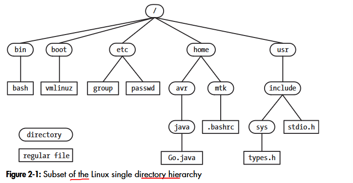

# Chapter 2: Fundamental conepts
## 2.1. The core operating system: The kernel
The kernel refers to the central software that manages and allocates computer resources (i.e.., the CPU, RAM, and devices)

**Tasks performed by the kernel**
- Process scheduling
- Memory management
- Provision of a file system
- Creation and termination of processes
- Access to devices
- Networking
- Provision of a system call application programming interface

**Kernel mode and user mode**

**Process versus kernel views of the system**

## 2.2. The shell
A shell-command interpreter is a special-purpose program designed to read commands typed by a user and execute apporpriate in response to those commands. 

## 2.3. Users and groups 
Each user on the system is uniquely identified, and users may belong to groups.
**Users**
Several features of a user are stored in /etc/passwd file: login name, user ID (UID), group ID (UID), home directory, login shell.
For security reasons, the password is often stored in the separate shadow password file, which is only readable by privileged users.  
**Groups**
Several features of a group are stored in /etc/group: group name, group ID, user list...  
**Superuser**
Superuser has user ID 0, normally has the login name root.  

## 2.4. Single directory hierachy, directories, links and files
<p align="center">

</p>

**File types**  
The term file is commonly used to denote a file of any type, not just a regular file.  

**Directories and link**  
A directory is a special file whose contents take the form of a table of filenames coupled with reference to the correspoding files.  
The filename-plus-reference association is called a link (hard link), and files may have multiple links, and thus multiple names, in the same or different directories.  

**Symbolic links**  
A symbolic link (hard link) is a specially marked file containing the name of another file.  

**Filenames**  
Filenames can be up to 255 characters long. Filenames may contain any characters except slashes (/) and null characters (\0).  

**Pathnames**  
A pathname is a string consisting of an optional initial slash (/) followed by a series of filenames separated by slashes/. There are 2 types of pathnames:
- Absolute pathname
- Relative pathname  

**Current working directory**  

**File ownership and permissions** 
For the purpose of accessing a file, the system divides users into three categories: the owner of the file, users who are members of ther group matching the file's group ID (group), and the rest of the word (other).   

## 2.5. File I/O model
One of the distinguishing features of the I/O model on UNIX systems is the concept of universality of I/O. This means that the same system calls (open(), read(), write(), close() and so on) are used to perform I/O on all types of files, including devices.  
**File descriptors**  
The I/O system calls refer to open files using a file descriptor, a non negative integer.  
**The stdio library**  
The standard C library includes fopen(), fclose(), scanf(), printf(), fgets(), fputs()... The stdio functions are layered on top of the I/O system calls (open(), close(), read(), write()...)

## 2.6. Programs
Prgrams exits in two forms: source code and binary maching-language instructions.  
**Filters**  
A filter is the name often applied to a program that reads its input from stdin, performs transformation of that input, and writes the tranformed data to stdout. Examples of filters include cat, grep, tr, sort, wc, sed and awk.  
**Command-line arguments**  
To access command line arguments, the main() function of the program is declared as follows:  
```
int main(int argc, char* argv[])
```
argc is the total number of command-line arguments, while argv is the array that stores individual arguments. The first of these string, argv[0] identifies the name of the program itself.

## 2.7. Processes
A process is an instance of an executing program.  
**Process memory layout**  
A process usually contains following segments:
-Text: source code
-Data: static variables
-Heap: dynamically allocated variables
-Stack: grow and shrink as functions are called and return  
**Process creation and program execution**  
A process (parent process) can create new process (child process) using the fork system call.  The child inherits copies of the parent's data, stack and heap segments. The child process goes on either to execute a different set of functions in the same code as the parent, or, frequently, to use the execve() system call to load and execute an entirely new program.  
**Process ID and parent process ID**  
Each process has a unique integer process identifier (PID) and parent PID.  
**Process termination and termination status**  
A process can terminate in one of two ways: 
-Requesting its own termination using _exit() system call
-Being killed by the delivery of a signal
By convention, a termination status of 0 indicates that the process succeeded, and a nonzero status indicates that some error occur.  
**Process user and group identifiers**  
Each process has a number of associated user IDs (UIDs) and group IDs (GIDs). These include:
- Real user ID and real group ID
- Effective user ID and effective group ID
- Supplementary group IDs

**Privileged processes**  
A process may be privileged because it was created by another privileged process - for example, by a login shell started by root (superuser).  
**The init process**  
The init process which is derived from the program file /sbin/init. All processes on the system are created using fork() either by init or its descendants. This process can't be killed, and only terminates only when the system is shut down.  
**Daemon processes**  
A daemon is distinguished by the following characteristics:
- It is long-lived. A daemon process is often started at system boot and remains in existence until the system is shut down.
- It runs in the background, and has no controlling terminal from which it can read input or to which it can write output.

Examples of daemon processes include: syslogd, httpd...   

**Environment list**  
Each process has an environment list. Environment variables are created with export command:
```
export MYVAR='Hello world'
```
**Resource limits**  
setrlimit() call establishes upper limits on its consumption of various resources. 

## 2.8. Memory mappings
mmap() system call creates a new memory mapping in the calling process's virtual address space.  
Mapping fall into two categories:
- A file mappng maps a region of a file into the calling process's virtual memory. Onced mapped the file's content can be accssed by operations on the bytes in the corresponding memory region.
- An anonymous mapping doesn't have a corresponding file. Instead, the pages of the mapping are initialized to 0.

## 2.9. Static and shared libraries
An object library is a file containing the compiled object code for a set of functions that may be called from application programs.
**Static libraries**  
The linker extracts copies of the required object modules from the library and copies these into the resulting executable file. We say that such a program is statically linked.  
**Shared libraries**
If a program is linked against a shared library, then, instead of copying object modules from the library into the executable, the linker just writes a record into the executable to indicate that at run time the executable needs to use that shared library.

## 2.10. Interprocess communication and synchronization
A set of mechanisms for interprocess communication (IPC):
- signals, which are used to indicate that an event has ocurred.
- pipes and FIFOs, which can be used to transfer data between processes.
- sockets, which can be used to transfer data from one process to another, either on the same host computer or on different hosts connected by a network.
- file locking, which allows a process to lock regions of a file in order to prevent other processes from reading or updating file contents
- message queues, which are used to exchange messages (packets of data) between processes.
- semaphores, which are used to synchronize the actions of processes, and
- shared memory, which allows two or more processes to share a piece of memory. When one process changes the contents of the shared emory, all of the other process can immediately see the changes.

## 2.11. Signals
The kernel may send a signal to a process when one of the following occurs:
- the user typed the interrupt character (Ctrl C) on the keyboard.
- one of the process's children has terminated.
- a timer (alarm clock) set by the process has expired; or 
- the process attempted to access an invalid memory address.

A process receives a signal, it takes one of the following actions, depending on the signal:
- it ignores the signal;
- it is killed by the signal;
- it is suspended until later being resumed by receipt of a special-purpose signal.
We can write a signal hander which is a programmer-defined function that is automatically invoked when the signal is delivered to the process.

## 2.12. Threads
Each process can have multiple threads of execution. One way of envisaging threads is as a set of processes that share the same virtual memory, as well ass a range of other attributes. Every thread has the same data, heap area but has its own stack.  
The main advantages of using threads are that they make it easy to share data (via global variables) betwwen cooperation threads and can transparently take advantage of the possibilities for parallel processing on multiprocessor hardware.

## 2.13. Process groups and shell job control
Each program executed by the shell is started in a new process. For example, the shell creates three processes to execute the folloing pipeline of commands:
```
ls -l | sort -k5n | less
```

## 2.14. Sessions, controlling terminals and controlling processes
A session is a collection of process groups (jobs). All of the processes in a session have the same session identifier. A session leader is the process that created the session, and its process ID becomes the session ID.

## 2.15. Pseudoterminals
A pseudoterminal (PTY) is a pair of software-based virtual devices—a master and a slave—that emulates a physical hardware terminal in Linux. The master end is controlled by terminal emulation software (like SSH or GNOME Terminal), while the slave end (/dev/pts/N) presents itself to command-line applications (like bash or vim) as a real terminal, enabling full text interaction, color output, and keyboard shortcut handling over software channels.

## 2.16. Date and time
Two type of time are interest to a process:
- Real time
- Process time

## 2.17. Client-server architecture
A client-server application is one that is broken into two component processes:
- a client, which asks the server to carry out some service by sending it a request message
- a server, which examines the client's request, performs appropriate actions, and then sends a response message back to the client.

## 2.18. Realtime
Realtime applications are those that need to respond in a timely fashion to input. 

## 2.19. The /proc file system
The /proc file system is a virtual file system that provides an interface to kernel data structures in a form that looks like files and directories. In addition, a set of directories with names of the form /proc/PID, where PID is a process ID, allows us to view information about each process running on the system.
