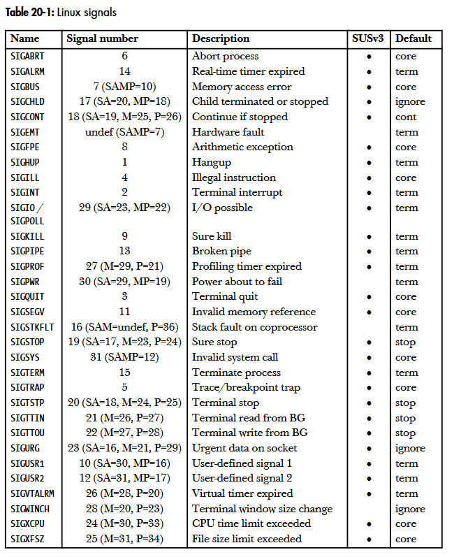
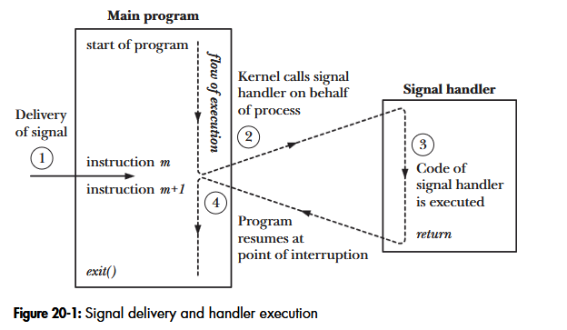
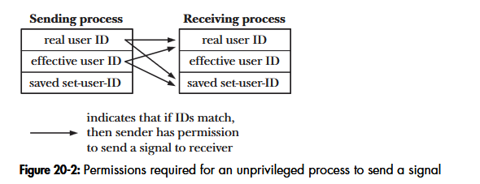

# Chapter 20: Signal: Fundamental concepts
## 20.1. Concepts and overview
A signal is a notification to a process that an event has occured. The usual source of many signals sent to a process is the kernel. Among the types of events that cause the kernel to generate a signal for a process are the following:
- A hardware exception occured: malformed machine-language instruction, dividing by 0, or reference a part of memory that is inaccessible.
- The user typed one of the terminal special characters that generate signals: interrupt character (Ctrl - C), the suspend character (Ctrl - Z).
- A software event occured: input became available, the terminal window was resized, a timer went off...

Each signal is defined as a unique small integer, starting sequentially from 1. These integers are defined in <signal.h> with symbolic names of the form SIGNxxxx.

A signal is said to be generated by some event. Once generated, a signal is later 
delivered to a process, which then takes some action in response to the signal. 
Between the time it is generated and the time it is delivered, a signal is said to be pending. 

Mặc định, một tín hiệu đang chờ xử lý (pending signal) sẽ được chuyển đến process ngay khi process được CPU xếp lịch chạy lượt tiếp theo. Nếu process đang chạy sẵn (ví dụ: nó tự gửi signal cho chính nó), signal sẽ được gửi ngay lập tức. Trong thực tế, có những đoạn code quan trọng (critical section) cần phải chạy liên tục và không được phép bị ngắt giữa chừng bởi bất kỳ signal nào. Signal Mask: Là một danh sách (tập hợp) các signal mà process đang tạm thời chặn (block). Cơ chế hoạt động: Khi một signal bị thêm vào Signal Mask, nếu signal đó xuất hiện, nó không bị hủy mà sẽ rơi vào trạng thái "chờ" (pending). Chỉ khi process bỏ chặn signal đó (xóa khỏi Signal Mask), signal mới thực sự được gửi đến để xử lý. Lập trình viên có thể dùng các System Call (như sigprocmask()) để chủ động thêm hoặc xóa signal khỏi Signal Mask này.

Ví dụ trực quan:  
📱 Điện thoại reo (Signal phát ra)  
       │
       ▼  
 🛑 Anh thợ bật chế độ "Không làm phiền" (Thêm signal vào Signal Mask - BLOCK)  
       │  
       ▼  
 🔧 Bật chế độ chờ (Signal rơi vào trạng thái PENDING - Chuông vẫn báo nhưng không nghe)  
       │  
       ▼  
 🛠️ Làm xong việc nguy hiểm (Chạy xong Critical Section)  
       │  
       ▼  
 🟢 Tắt "Không làm phiền" (Xóa signal khỏi Signal Mask - UNBLOCK)  
       │  
       ▼  
 📞 Nhấc máy trả lời cuộc gọi (Delivery Signal & Chạy Signal Handler)

 Upon delivery of a signal, a process carries out one of the following default actions, depending on the signal:
 - The signal is ignored.
 - The process is terminated (killed) - abnormal process termination.
 - A core dump file is generated.
 - The process is stopped.
 - Execution of the process is resumed after previously being stopped.

 Instead of accepting the default for a particular signal, a program can change the action, the following are behaviors that a process can perform:
 - The default cation should occur.
 - The signal is ignored.
 - A signal handler is executed.

A singal handler is a function, written by the programmer, that performs appropriate tasks in response to the delivery of a signal. Note that it isn't possible to set the disposition of a signal to terminate or dump core. The nearest we can get to this is to install a handler for the signal that then calls either exit() or abort(). The abort() function generates a SIGABRT signal for the process, which causes it to dump core and terminate.

## 20.2. Signal types and default actions
The following list describes the various signals:
- SIGABRT: A process is sent this signal when it calls the abort() function. By default, this signal terminates the process with a core dump. This 
achieves the intended purpose of the abort() call: to produce a core dump 
for debugging. 
- SIGALRM: The kernel generates this signal upon the expiration of a real-time timer set by a call to alarm() or setitimer(). A real-time timer is one that counts according to wall clock time (i.e., the human notion of elapsed time).
- SIGBUS: This signal (“bus error”) is generated to indicate certain kinds of memory-access errors. One such error can occur when using memory mappings cre-
ated with mmap(), if we attempt to access an address that lies beyond the end of the underlying memory-mapped file.
- SIGCHLD: This signal is sent (by the kernel) to a parent process when one of its children terminates (either by calling exit() or as a result of being killed by a signal). It may also be sent to a process when one of its children is stopped or resumed by a signal. 
- SIGCLD: This is a synonym for SIGCHLD. 
- SIGCONT: When sent to a stopped process, this signal causes the process to resume (i.e., to be rescheduled to run at some later time). When received by a process that is not currently stopped, this signal is ignored by default. A process may catch this signal, so that it carries out some action when it resumes. 
- SIGEMT: In UNIX systems generally, this signal is used to indicate an implementation-dependent hardware error. On Linux, this signal is used only in the Sun SPARC implementation. The suffix EMT derives from emulator trap, an assem-
bler mnemonic on the Digital PDP-11. 
- SIGFPE: This signal is generated for certain types of arithmetic errors, such as divide-by-zero. The suffix FPE is an abbreviation for floating-point exception, although this signal can also be generated for integer arithmetic errors. The precise details of when this signal is generated depend on the hardware architecture and the settings of CPU control registers. For example, on x86-32, integer divide-by-zero always yields a SIGFPE, but the handling of 
floating-point divide-by-zero depends on whether the FE_DIVBYZERO exception has been enabled. If this exception is enabled (using feenableexcept()), then a floating-point divide-by-zero generates SIGFPE; otherwise, it yields the IEEE-standard result for the operands (a floating-point representation of infinity). See the fenv(3) manual page and <fenv.h> for further information. 
- SIGHUP: When a terminal disconnect (hangup) occurs, this signal is sent to the controlling process of the terminal. We describe the concept of a controlling 
process and the various circumstances in which SIGHUP is sent in Section 34.6. 
A second use of SIGHUP is with daemons (e.g., init, httpd, and inetd). Many 
daemons are designed to respond to the receipt of SIGHUP by reinitializing 
themselves and rereading their configuration files. The system administrator triggers these actions by manually sending SIGHUP to the daemon, either by using an explicit kill command or by executing a program or 
script that does the same. 
- SIGILL: This signal is sent to a process if it tries to execute an illegal (i.e., incorrectly formed) machine-language instruction.
- SIGINFO: On Linux, this signal name is a synonym for SIGPWR. On BSD systems, the 
SIGINFO signal, generated by typing Control-T, is used to obtain status information about the foreground process group.
- SIGINT: When the user types the terminal interrupt character (usually Control-C), the 
terminal driver sends this signal to the foreground process group. The 
default action for this signal is to terminate the process. 
- SIGIO: Using the fcntl() system call, it is possible to arrange for this signal to be 
generated when an I/O event (e.g., input becoming available) occurs on certain types of open file descriptors, such as those for terminals and sockets. This feature is described further in Section 63.3. 
- SIGIOT: On Linux, this is a synonym for SIGABRT. On some other UNIX implementa-
tions, this signal indicates an implementation-defined hardware fault. 
- SIGKILL: This is the sure kill signal. It can’t be blocked, ignored, or caught by a handler, and thus always terminates a process. 
- SIGLOST: This signal name exists on Linux, but is unused. On some other UNIX 
implementations, the NFS client sends this signal to local processes hold-
ing locks if the NSF client fails to regain locks held by the those processes 
following the recovery of a remote NFS server that crashed. (This feature is 
not standardized in NFS specifications.) 
- SIGPIPE: This signal is generated when a process tries to write to a pipe, a FIFO, or a socket for which there is no corresponding reader process. This normally occurs because the reading process has closed its file descriptor for the IPC channel. See Section 44.2 for further details. 
- SIGPOLL: This signal, which is derived from System V, is a synonym for SIGIO on 
Linux. 
- SIGPROF: The kernel generates this signal upon the expiration of a profiling timer 
set by a call to setitimer() (Section 23.1). A profiling timer is one that counts 
the CPU time used by a process. Unlike a virtual timer (see SIGVTALRM 
below), a profiling timer counts CPU time used in both user mode and ker-
nel mode. 
- SIGPWR: This is the power failure signal. On systems that have an uninterruptible 
power supply (UPS), it is possible to set up a daemon process that monitors the backup battery level in the event of a power failure. If the battery power is about to run out (after an extended power outage), then the monitoring process sends SIGPWR to the init process, which interprets this signal as a request to shut down the system in a quick and orderly fashion.
- SIGQUIT: When the user types the quit character (usually Control-\) on the keyboard, this signal is sent to the foreground process group. By default, this signal terminates a process and causes it to produce a core dump, which can then 
be used for debugging. Using SIGQUIT in this manner is useful with a program that is stuck in an infinite loop or is otherwise not responding. By typing Control-\ and then loading the resulting core dump with the gdb 
debugger and using the backtrace command to obtain a stack trace, we can find out which part of the program code was executing. ([Matloff, 2008] describes the use of gdb.) 
- SIGSEGV: This very popular signal is generated when a program makes an invalid memory reference. A memory reference may be invalid because the referenced 
page doesn’t exist (e.g., it lies in an unmapped area somewhere between 
the heap and the stack), the process tried to update a location in read-only 
memory (e.g., the program text segment or a region of mapped memory marked read-only), or the process tried to access a part of kernel memory while running in user mode (Section 2.1). In C, these events often result from dereferencing a pointer containing a bad address (e.g., an uninitial-
ized pointer) or passing an invalid argument in a function call. The name of this signal derives from the term segmentation violation. 
- SIGSTKFLT: Documented in signal(7) as “stack fault on coprocessor,” this signal is 
defined, but is unused on Linux. 
- SIGSTOP: This is the sure stop signal. It can’t be blocked, ignored, or caught by a handler; thus, it always stops a process. 
- SIGSYS: This signal is generated if a process makes a “bad” system call. This means that the process executed an instruction that was interpreted as a system call trap, but the associated system call number was not valid (refer to Section 3.1). 
- SIGTERM: This is the standard signal used for terminating a process and is the default 
signal sent by the kill and killall commands. Users sometimes explicitly 
send the SIGKILL signal to a process using kill –KILL or kill –9. However, 
this is generally a mistake. A well-designed application will have a handler 
for SIGTERM that causes the application to exit gracefully, cleaning up tem-
porary files and releasing other resources beforehand. Killing a process 
with SIGKILL bypasses the SIGTERM handler. Thus, we should always first 
attempt to terminate a process using SIGTERM, and reserve SIGKILL as a last 
resort for killing runaway processes that don’t respond to SIGTERM. 
- SIGTRAP: This signal is used to implement debugger breakpoints and system call 
tracing, as performed by strace(1) (Appendix A). See the ptrace(2) manual 
page for further information. 
- SIGTSTP: This is the job-control stop signal, sent to stop the foreground process 
group when the user types the suspend character (usually Control-Z) on the 
keyboard. Chapter 34 describes process groups (jobs) and job control in 
detail, as well as details of when and how a program may need to handle 
this signal. The name of this signal derives from “terminal stop.” 
- SIGTTIN: When running under a job-control shell, the terminal driver sends this signal 
to a background process group when it attempts to read() from the termi-
nal. This signal stops a process by default. 
- SIGTTOU: This signal serves an analogous purpose to SIGTTIN, but for terminal output 
by background jobs. When running under a job-control shell, if the TOSTOP 
(terminal output stop) option has been enabled for the terminal (perhaps via 
the command stty tostop), the terminal driver sends SIGTTOU to a background 
process group when it attempts to write() to the terminal (see Section 34.7.1). 
This signal stops a process by default. 
- SIGUNUSED: As the name implies, this signal is unused. On Linux 2.4 and later, this signal 
name is synonymous with SIGSYS on many architectures.
In other words, 
this signal number is no longer unused on those architectures, although 
the signal name remains for backward compatibility. 
- SIGURG: This signal is sent to a process to indicate the presence of out-of-band (also 
known as urgent) data on a socket (Section 61.13.1). 
- SIGUSR1: This signal and SIGUSR2 are available for programmer-defined purposes. 
The kernel never generates these signals for a process. Processes may use 
these signals to notify one another of events or to synchronize with each 
other. In early UNIX implementations, these were the only two signals that 
could be freely used in applications. (In fact, processes can send one 
another any signal, but this has the potential for confusion if the kernel 
also generates one of the signals for a process.) Modern UNIX implemen-
tations provide a large set of realtime signals that are also available for 
programmer-defined purposes (Section 22.8).
- SIGUSR2: See the description of SIGUSR1. 
- SIGVTALRM: The kernel generates this signal upon expiration of a virtual timer set by a 
call to setitimer() (Section 23.1). A virtual timer is one that counts the user-
mode CPU time used by a process. 
- SIGWINCH:  
In a windowing environment, this signal is sent to the foreground process 
group when the terminal window size changes (as a consequence either of 
the user manually resizing it, or of a program resizing it via a call to ioctl(), 
as described in Section 62.9). By installing a handler for this signal, pro-
grams such as vi and less can know to redraw their output after a change in 
window size. 
- SIGXCPU: This signal is sent to a process when it exceeds its CPU time resource limit 
(RLIMIT_CPU, described in Section 36.3). 
- SIGXFSZ: This signal is sent to a process if it attempts (using write() or truncate()) to 
increase the size of a file beyond the process’s file size resource limit 
(RLIMIT_FSIZE, described in Section 36.3). 

The table below describes a range of information about signals on Linux:
<p align="center">

</p>

## 20.3. Changing signal dispositions: signal()
Because of portability issues, sigactions() is the preferred API for establishing a signal handler. After being explained, signaction() will always be employed in examples.  
Although documented in seciton 2 of the linux manual pages, signal() is actually implemented in glibc as a library function layered on top of the sigaction() system call.
```
#include <signal.h>
void (*signal(int sig, void (*handler))) (int);
Return previous signal disposition on success, or SIG_ERR on error.
```
The first argument sig, identifies the signal whose disposition we wish to change. The second argument, handler, is the address of the function that should be called when this signal is delivered. This function returns nothing (void) and takes one integer argument. Thus a signal handler has the following geneeral form:
```
void handler(int sig) {
    /* Code for the handler */
}
```

The return value of signal() is the previous disposition of the signal. Like the handler argument, this is a pointer to a function returning nothing and taking one integer argument. In other words, we could write code such as the following temporarily establish a handler for a signal, and then reset the disposition of the signal to whatever it was previously:
```
void (*oldHandler)(int);
oldHandler = signal(SIGINT, newHandler);
if (oldHanlder == SIG_ERR)
    errExit("signal");

/* Do something else here, during this time, if SIGINT is delivered, newHandler will be used to handle the signal */

if (signal(SIGINT, oldHanlder) == SIG_ERR)
    errExit("Signal");
```

## 20.04. Introduction to signal handlers
A signal handler is a function that is called when a special signal is delivered to a process. The sequence of a signal handler is illustrated in the following figure:
<p align="center">

</p>

The following example install a handler for SIGINT:
```
#include <signal.h>
#include <tlpi_hdr.h>

static void sigHandler(int sig) {
    printf("Ouch!\n"); // Unsafe
}

int main(int argc, char* argv[]) {
    int j;

    if (signal(SIGINT, sigHandler) == SIG_ERR)
        errExit("signal");

    for (j = 0; ; j++) {
        printf("%d\n", j);
        sleep(3); //  Loop slowly
    }
}
```

Output:
```
$ ./ouch
0 
Type Control-C
Ouch!
1
2
Type Control-C again
Ouch!
3
Type Control-\ (the terminal quit character)
Quit (core dumped)
```
The following program establishes the same handler for SIGINT and SIGQUIT. The code of handler distinguishes the two signals by examining the sig argument, and takes different actions for each signal.

```
#include <signal.h>
#include <tlpi_hdr.h>

static void sigHandler(int sig) {
    static int count = 0;
    /* Unsafe */
    if (sig == SIGINT) {
        count++;
        printf("Caught SIGINT (%d)\n", count);
        return; // Resume execution at point of interruption
    }
    /* Must be SIGQUIT */
    printf("Caught SIQQUIT - that's all folks!\n");
    exit(EXIT_SUCCESS);
}

int main(int argc, char *argv[]) {
    if (signal(SIGINT, sigHandler) == SIG_ERR) {
        errExit("signal");
    }
    if (signal(SIGQUIT, sigHandler) == SIG_ERR)
        errExit("signal");
    for (;;)
        pause() // Block until a signal is caught
}
```

Output:
```
$ ./intquit
Type Control - C
Caught SIGINT (1)
Type Control - C again
Caught SIGNINT (2)
and again
Caught SIGINT (3)
Type Control-\
Caught SIGQUIT - that's all folks!
```

## 20.5. Sending signals: kill()
One process can send a signal to another process using the kill system call:
```
#include <signal.h>
int kill(pid_t pid, int sig);
```

The pid argument identifies one or more processes to which the signal specified by sig to be sent. Four different cases determine how pid is interpreted:
- If pid is greater than 0, the signal is sent to the process with the process ID specified by pid.
- If pid equals 0, the signal is sent to every process in the same process group as the calling process, including the calling process.
- If pid is less than -1, the signal is sent to all of the processes in the process group whose ID equals the absolute value of pid.
- If pid equals -1, the signal is sent to all of the processes in the process group whose ID equals the absolute value of pid.

If no process matches the specified pid, kill() fails and sets errno to ESRCH (No such process)

A process needs appropriate permissions to be able send a signal to another process. The permission rules are as follows:
- A privileged (CAP_KILL) process may send a signal to any process.
- The init process (PID 1) can be sent only signals for which it has a handler installed. This prevents the system administrator from accidentally killing init.
- An unprivileged process can send a signal to another process if the real or 
effective user ID of the sending process matches the real user ID or saved set-
user-ID of the receiving process. 
<p align="center">

</p>

- The SIGCONT signal is treated specially. An unprivileged process may send this signal to any other proces in the same session, regardless of user ID checks.

If a process doesn't have permissions to send a signal to the request pid, then kill() fails, setting errno to EPERM. When pid specifies a set of processes, kill() succeeds if at least one of them could be signaled.

## 20.6. Checking for the existence of a process
If the sig argument is specified as 0, then no signal is sent. Instread, kill() merely performs error checking to see if the process can be signaled. IF sending a null signal fails with the error ESRCH, then we know the process doesn't exist. If the call fails with the error EPERM (meaning the process exists, but we don't have permission to send a signal to it) or succeeds (meaning we do have permission to send a signal to the process), then we know the process exists.

Various other techniques can also be used to check whether a particular process is running, including the following:
- The wait() system calls
- Semaphores and exclusive file locks: If the process that is being monitored contin-
uously holds a semaphore or a file lock, then, if we can acquire the semaphore 
or lock, we know the process has terminated.
- IPC channels such as pipes and FIFOs: We set up the monitored process so that it 
holds a file descriptor open for writing on the channel as long as it is alive. 
Meanwhile, the monitoring process holds open a read descriptor for the chan-
nel, and it knows that the monitored process has terminated when the write 
end of the channel is closed (because it sees end-of-file). The monitoring pro-
cess can determine this either by reading from its file descriptor or by monitor-
ing the descriptor using one of the techniques described in Chapter 63. 
- The /proc/PID interface: For example, if a process with the process ID 12345 
exists, then the directory /proc/12345 will exist, and we can check this using a 
call such as stat(). 

## 20.7. Other ways of sending signals: raise() and killpg()
The raise() function sends a signal to itself:
```
#include <signal.h>
int raise(int sig);
Returns 0 on success, or nonzero on error
```
In a single-threaded program, a call to raise() is equivalent to the following call to kill().
On a system that supports threads, raise(sig) is implemented as:
```
pthread_kill(pthread_self(), sig)
```
The signal will be delivered to the specific thread that called raise(). By contrast, the call kill(getpid(), sig) sends a signal to the calling process, and that signal may be delivered to any thread in the process.
```
#include <signal.h>
#include "tlpi_hdr.h

int main(int argc, char* argv[]) {
    int s, sig;

    if (argc != 3 || strcmp(argv[1], --"help") == 0)
        usageErr("%s sig-num pid\n", argv[0]);
        sig = getInt(argv[2], 0, "sig-num");
        s = kill(getLong(argv[1], 0, "pid"), sig)
    if (sig != 0) {
        if (s == -1)
            errExit("kill");
    } else {
        if (s == 0) {
            printf("Process exists, but we don't have permission to send it a signal \n");
        } else if {
            printf("Process does not exist\n");
        } else
            errExit("kill");
    }
    exit(EXIT_SUCCESS);
}
```

The killpg() fucntion sends a signal to all of the members of a process group.

```
#include <signal.h>
int killpg(pid_t  pgrp, int sig);
Returns 0 on success, or -1 on error.

```

## 20.8. Displying signal descriptions
Each signal has an associated printable description. These descriptions are listed in the array sys_siglist. For example, we can refer to sys_siglist[SIGPIPE] to get the description for SIGPIPE (broken pipe). However, rather than usign the sys_siglist array directly, the strsignal() function is preferable:
```
#define _BSD_SOURCE
#include <signal.h>

extern const char *const sys_siglist[];
#define _GNU_SOURCE
#include <string.h>

char *strsignal(int sig);
Return pointer to signal descriptions string
```
The psignal() function displays (on standard eror) the string given in its argument msg, followed by a colon, and then the signal description coresponding to sig. 
```
#include <signal.h>
void psignal(int sig, const char *msg);
```

## 20.9. Signal sets
Multiple signals are represented using a data structure called a signal set, provided by the system data type sigset_t.   
The sigemptyset() function initializes a signal set to contain no members. The sigfillset() function initializes a set to contain all signals:
```
#include <signal.h>

int sigemptyset(sigset_t *set);
int sigfillset(sigset_t *set);
Both return 0 on success, or -1 on error
```
After initialization, individual signals can be added to a set using sigaddset() and removed using sigdelset():
```
#include <signal.h>

int sigaddset(sigset_t *set, int sig);
int sigdelset(sigset_t *set, int sig);
Both return 0 on success, or -1 on error
```
The sigismember() function is used to test for membership of a test.
```
#include <signal.h>
int sigismember(const sigset_t *set, int sig);
Return 1 if sig is a member of set, otherwise 0
```
The GNU C library implements three nonstandard functions that perform tasks that are complementary to the standard singal set functions just described.
```
#define _GNU_SOURCE
#incude <signal.h>

int sigandset(sigset_t *set, sigset_t *left, sigset_t *right);
int sigorset(sigset_t *set, sigset_t *left, sigset_t *right);
Both return 0 on success, or -1 on error
int sigisemptyset(const sigset_t *set);
Return 1 if sig is empty, otherwise 0
```

- sigandset() places the intersection of the sets left and right in the set dest.  
- sigorset() places the union of the set left and right in the set dest; and 
- sigisemptyset() returns true if set contains no signals.


Example program:
```
#define _GNU_SOURCE 
#include <string.h> 
#include <signal.h> 
#include "signal_functions.h"  /* Declares functions defined here */ 
#include "tlpi_hdr.h" 

/* NOTE: All of the following functions employ fprintf(), which is not async-signal-safe (see Section 21.1.2). As such, these  functions are also not async-signal-safe (i.e., beware of indiscriminately calling them from signal handlers). */ 

void printSigset(FILE *of, const char *prefix, const sigset_t *sigset) /* Print list of signals within a signal set */ 
{
    int sig, cnt;
    cnt = 0;
    for (sig = 1; sig < NSIG; sig++) {
        if (sigismember(sigset, sig)) {
            cnt++;
            fprintf(of, "%s%d (%s)\n", prefix, sig, strsignal(sig));
        }
    }
    if (cnt == 0)
    fprintf(of, "%s<empty signal set>\n", prefix); 
} 

int printSigMask(FILE *of, const char *msg)  /* Print mask of blocked signals for this process */ 
{
    sigset_t currMask;
    if (msg != NULL)
        fprintf(of, "%s", msg);
    if (sigprocmask(SIG_BLOCK, NULL, &currMask) == -1)
    return -1;
    printSigset(of, "\t\t", &currMask);
    return 0; 
} 

int printPendingSigs(FILE *of, const char *msg) /* Print signals currently pending for this process */ 
{
    sigset_t pendingSigs;
    if (msg != NULL)
        fprintf(of, "%s", msg);
    if (sigpending(&pendingSigs) == -1)
        return -1;
    printSigset(of, "\t\t", &pendingSigs);
    return 0; 
} 
```

## 20.10. The signal mask (Blocking signal delivery)
```
#include <signal.h>

int sigprocmask(int how, const sigset_t *set, sigset_t *oldset);
Return 0 on success, or -1 on error
```
We can use sigprocmask() to change the process signal mask, to retrieve the existing mask, or both. The how argument determine the changes that sigprocmask() makes to the signal mask:
- SIG_BLOCK: The signals specified in the signal set pointed to by set are added to the signal mask. In other words, the signal mask is set to the union of its current 
value and set. 
- SIG_UNBLOCK: The signals in the signal set pointed to by set are removed from the signal mask. Unblocking a signal that is not currently blocked doesn’t cause an 
error to be returned. 
- SIG_SETMASK: The signal set pointed to by set is assigned to the signal mask. 

In each case, if the oldset argument is not NULL, it points to a sigset_t buffer that is used to return the previous signal mask.  
If we want to retrieve the signal mask without changing it, then we can specify NULL for the set argument, in wihch case the how argument is ignored.
To temporarily prevent delivery of a signal, we can use the series of calls shown in Listing 20-5 to block the signal, and then unblock it by resetting the signal mask to its previous state.

```
sigset_t blockSet, prevMask;

/* Initialize a signal set to contain SIGINT */
sigemptyset(&blockSet);
sigaddset(&blockSet, SIGINT);

/* Block SIGINT, save previous signal mask */
if (sigprocmask(SIG_BLOCK, &blockSet, &prevMask) == -1)
    errExit("sigprocmask1");

/* Code that should not be interrupted by SIGINT */
if (sigprocmask(SIG_SETMASK, &prevMask, NULL) == -1)
    errExit("sigprocmask2");
```
If we unblock a pending signal, it is delivered to the process immediately.

## 20.11. Pending signals
If a process receives a signal that it is currently blocking, that signal is added to the process's set of pending signals. When the signal is later unblocked, it is then delivered to the process. To determine which signals are pending for a process, we can call sigpending():
```
#include <signal.h>
int sigpending(sigset_t *set);
```
The sigpending() system call returns the set of signals that are pending for the calling process in the sigset_t structure pointed to by set.

## 20.12. Signals are not queued
The following programs can be used to observe that signals are note queued.

```
#include <signal.h> 
#include "tlpi_hdr.h" 
int main(int argc, char *argv[]) 
{
    int numSigs, sig, j;
    pid_t pid;
    if (argc < 4 || strcmp(argv[1], "--help") == 0)
        usageErr("%s pid num-sigs sig-num [sig-num-2]\n", argv[0]);
    pid = getLong(argv[1], 0, "PID");
    numSigs = getInt(argv[2], GN_GT_0, "num-sigs");
    sig = getInt(argv[3], 0, "sig-num");
    /* Send signals to receiver */
    printf("%s: sending signal %d to process %ld %d times\n",
        argv[0], sig, (long) pid, numSigs);
    for (j = 0; j < numSigs; j++)
        if (kill(pid, sig) == -1)
            errExit("kill");
    /* If a fourth command-line argument was specified, send that signal */
    if (argc > 4)
        if (kill(pid, getInt(argv[4], 0, "sig-num-2")) == -1)
            errExit("kill");
    printf("%s: exiting\n", argv[0]);
    exit(EXIT_SUCCESS); 
} 
```
Output:
```
$ ./sig_sender PID num-sigs sig-num [sig-num-2] 
```

```
#define _GNU_SOURCE 
#include <signal.h> 
#include "signal_functions.h"           /* Declaration of printSigset() */ 
#include "tlpi_hdr.h" 
static int sigCnt[NSIG];                /* Counts deliveries of each signal */ 
static volatile sig_atomic_t gotSigint = 0;
/* Set nonzero if SIGINT is delivered */ 
static void handler(int sig) 
{
    if (sig == SIGINT)
        gotSigint = 1;
    else
        sigCnt[sig]++; 
} 
int main(int argc, char *argv[]) 
{
    int n, numSecs;
    sigset_t pendingMask, blockingMask, emptyMask;
    printf("%s: PID is %ld\n", argv[0], (long) getpid()); 
    for (n = 1; n < NSIG; n++)          /* Same handler for all signals */
        (void) signal(n, handler);      /* Ignore errors */
    /* If a sleep time was specified, temporarily block all signals,
    sleep (while another process sends us signals), and then
    display the mask of pending signals and unblock all signals */ 
    if (argc > 1) {
        numSecs = getInt(argv[1], GN_GT_0, NULL);
        sigfillset(&blockingMask);
        if (sigprocmask(SIG_SETMASK, &blockingMask, NULL) == -1)
            errExit("sigprocmask");
        printf("%s: sleeping for %d seconds\n", argv[0], numSecs);
        sleep(numSecs);
        if (sigpending(&pendingMask) == -1)
            errExit("sigpending");
        printf("%s: pending signals are: \n", argv[0]);
        printSigset(stdout, "\t\t", &pendingMask);
        sigemptyset(&emptyMask);        /* Unblock all signals */
        if (sigprocmask(SIG_SETMASK, &emptyMask, NULL) == -1)
            errExit("sigprocmask");
    } 
    while (!gotSigint)                  /* Loop until SIGINT caught */
        continue; 
    for (n = 1; n < NSIG; n++)          /* Display number of signals received */
        if (sigCnt[n] != 0)
            printf("%s: signal %d caught %d time%s\n", argv[0], n,
            sigCnt[n], (sigCnt[n] == 1) ? "" : "s");
    exit(EXIT_SUCCESS); 
} 
```

Output:
```
$ ./sig_receiver 15 &                     Receiver blocks signals for 15 secs 
[1] 5368 
./sig_receiver: PID is 5368 
./sig_receiver: sleeping for 15 seconds
$ ./sig_sender 5368 1000000 10 2          Send SIGUSR1 signals, plus a SIGINT 
./sig_sender: sending signal 10 to process 5368 1000000 times 
./sig_sender: exiting 
./sig_receiver: pending signals are:
2 (Interrupt)
10 (User defined signal 1) 
./sig_receiver: signal 10 caught 1 time 
[1]+  Done                    ./sig_receiver 15 
$ ./sig_receiver & 
[1] 5393 
./sig_receiver: PID is 5393 
$ ./sig_sender 5393 1000000 10 2 
./sig_sender: sending signal 10 to process 5393 1000000 times 
./sig_sender: exiting 
./sig_receiver: signal 10 caught 52 times 
[1]+  Done                    ./sig_receiver 
```

## 20.13. Changing signal dispositions: sigaction()
Although sigaction() is somewhat more complex to use than signal(), in return it provides greater flexibility. In particular, sigaction() allows us to retrieve the disposition of a signal without changing it, and to set various attributes controlling precisely what happens when a signal handler is invoked. 
```
#include <signal.h>
int sigaction(int sig, const struct sigaction *act, struct sigaction *oldact)
Return 0 on success, or -1 on error
```
The sig argument identifies the signal whose disposition we want to retrieve or change. This argument can be any signal except SIGKILL or SIGSTOP. The act argument is a pointer to a structure specifying a new disposition for the signal. If we are interested only in finding the existing disposition of the signal, then we can specify NULL for this argument. The oldact argument is a pointer to a structure of the same type, and is used to return information about the signal's previous disposition. If we are not interested in this information, then we can specify NULL for this argument. The structures pointed to by act adn oldact are of the following type:
```
struct sigaction {
    void (*sa_handler)(int); // Address of handler
    sigset_t sa_mask;  // Signals blocked during handler invocation
    int sa_flags; // Flags controlling handler invocation
    void (*sa_restorer)(void); // Not for application use
};
```
The sa_handler field corresponds to the handler argument given to signal(). It specify the address of a signal handler, or one of the constatns SIG_IGN or SIG_DFL. sa_restorer is not intended for use in applications. The sa_mask field defines a set of signals that are to be blocked during invocation of the handler defined by sa_handler. When the signal handler is invoked, any signals in this set that are not currently part of the process signal mask are automatically added to the mask before the handler is called. These signals remain in the process signal mask until the signal handler returns, at which time they are automatically removed. The sa_mask field allows us to specify a set of signals that aren’t permitted to interrupt execution of this handler. In addition, the signal that caused the handler to be invoked is automatically added to the process signal mask. This means that a signal handler won’t recursively interrupt itself if a second instance of the same signal arrives while the handler is executing. Because blocked signals are not queued, if any of these signals are repeatedly generated during the execution of the handler, they are (later) delivered only once.  
The sa_flags field is a bit mask specifying various options controlling how the 
signal is handled. The following bits may be ORed (|) together in this field:  
- SA_NOCLDSTOP: If sig is SIGCHLD, don’t generate this signal when a child process is stopped or resumed as a consequence of receiving a signal. Refer to Section 26.3.2. 
- SA_NOCLDWAIT: (since Linux 2.6) If sig is SIGCHLD, don’t transform children into zombies when they terminate. For further details, see Section 26.3.3. 
- SA_NODEFER: When this signal is caught, don’t automatically add it to the process signal mask while the handler is executing. The name SA_NOMASK is provided as a 
historical synonym for SA_NODEFER, but the latter name is preferable because 
it is standardized in SUSv3. 
- SA_ONSTACK: Invoke the handler for this signal using an alternate stack installed by 
sigaltstack(). Refer to Section 21.3. 
- SA_RESETHAND: When this signal is caught, reset its disposition to the default (i.e., SIG_DFL) before invoking the handler. (By default, a signal handler remains established until it is explicitly disestablished by a further call to sigaction().) The name SA_ONESHOT is provided as a historical synonym for SA_RESETHAND, but the latter name is preferable because it is standardized in SUSv3. 
- SA_RESTART: Automatically restart system calls interrupted by this signal handler. See 
Section 21.5. 
- SA_SIGINFO:Invoke the signal handler with additional arguments providing further 
information about the signal. We describe this flag in Section 21.4. 

## 20.14. Waiting for a signal: pause()
Calling pause() suspends execution of the process until the call is interrupted by a signal handler (or until an unhandled signal terminates the process)
```
#include <unistd.h>
int pause(void);
Always returns -1 with errno set to EINTR
```
When a signal is handled, pause() is interrupted and always returns -1 with errno set to EINTR.