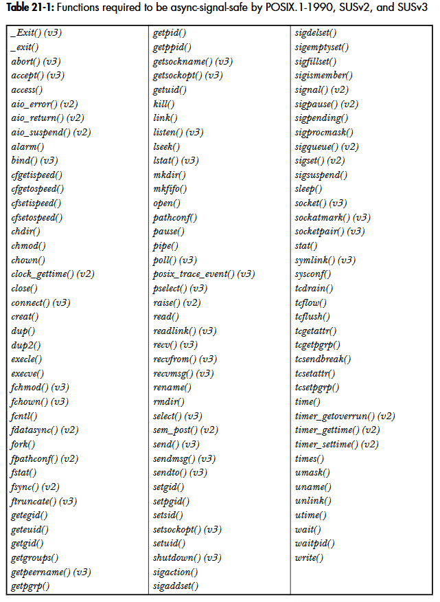

# Chapter 21: Signals: Signal handler
## 21.1. Designing signal handlers
- The signal handler sets a global flag and exits.
- The signal handler performs some type of cleanup and then either terminates the process or uses a nonlocal goto to unwind the stack and return contorl to a predetermined location in the main program.

### 21.1.1. Signals are not queued (revisited)
If the signal is generated more than once while the handler is executing, then it is still marked as pending, and it will later be delivered only once.

### 21.1.2. Reentrant and async-signal-safe functions (Hàm tái nhập và hàm async safe)
**Reentrant and nonreentrant functions**  
A function is said to be reentrant if it can safely be simultaneously executed by multiple threads of execution in the same process.  
Example of nonreentrant functions: crypt(), getPwnam(), gethostbyname(), and getservbyname(), printf(), scanf()...

Example program:
```
#define _XOPEN_SOURCE 600 
#include <unistd.h> 
#include <signal.h> 
#include <string.h> 
#include "tlpi_hdr.h" 
static char *str2;              /* Set from argv[2] */ 
static int handled = 0;         /* Counts number of calls to handler */ 

static void handler(int sig) 
{
    crypt(str2, "xx");
    handled++; 
}
int main(int argc, char *argv[]) 
{
    char *cr1;
    int callNum, mismatch;
    struct sigaction sa;

    if (argc != 3)
        usageErr("%s str1 str2\n", argv[0]);
    str2 = argv[2];                      /* Make argv[2] available to handler */
    cr1 = strdup(crypt(argv[1], "xx"));  /* Copy statically allocated string to another buffer */

    if (cr1 == NULL)
        errExit("strdup");

    sigemptyset(&sa.sa_mask);
    sa.sa_flags = 0;
    sa.sa_handler = handler;
    if (sigaction(SIGINT, &sa, NULL) == -1)
        errExit("sigaction");
    /* Repeatedly call crypt() using argv[1]. If interrupted by a
    signal handler, then the static storage returned by crypt()
    will be overwritten by the results of encrypting argv[2], and
    strcmp() will detect a mismatch with the value in 'cr1'. */
    for (callNum = 1, mismatch = 0; ; callNum++) {
        if (strcmp(crypt(argv[1], "xx"), cr1) != 0) {
            mismatch++;
            printf("Mismatch on call %d (mismatch=%d handled=%d)\n",
            callNum, mismatch, handled);
        }
    } 
} 
```

**Standard async-signal-safe functions**  
A function is async-signal-safe either because it is reentrant or because it is not interruptible by a signal handler. The following table lists the functions that various standards require to be async-signal-safe:

<p align="center">

</p>
When writing signal handlers, ensure that the code of the signal handler itself is reentrant and that it calls only sync-signal-safe functions.


**Use of errno inside signal handlers**  
The good practice is to save the value of errno on entry to a signal handler that uses any of the functions in the above table and restore the errno value on exit from the handler, as in the following example:
```
void handler(int sig) {
    int savedErrno;
    savedErrno = errno;
    /* Now we can execute a function that might modify errno */
    errno = savedErrno
}
```

### 21.1.3. Global variables and the sig_atomic_t data type
Reading and writing global variables may involve more than one machine-language instruction, and a signal handler may interrupt the main program in the middle of such an instruction sequence. We say that access to the variable is nonatomic. For this reason, the C language standards specify an integer data type, sig_atomic_t, for which reads and writes are guaranteed to be atomic.
Thus a global flag variable that is shared between the main program and a signal handler should be declared as follows:  
```
volatile sig_atomic_t flag;
```

## 21.2. Other methods of terminating a signal handler
There are various other ways of terminating a signal handler:
- Use _exit() to terminate the process. 
- Use kill() or raise() to send a signal that kills the process.
- Perform a nonlocal goto from the signal handler.
- Use the abort() function to terminate the process with a core dump.

### 21.2.1. Performing a nonlocal goto from a signal handler
This section desbribes the use of sigsetjmp() and siglongjmp().

### 21.2.2. Terminating a process abnormally: abort()
The abort() function terminates the calling process and causes it to produce a core dump.
```
#include <stdlib.h>

void abort(void);
```
The abort() function terminates the calling process by raising a SIGABRT signal. If abort() does successfully terminate the process, then it also flushes and closes stdio streams.

## 21.3. Handling a signal on an alternate stack: sigaltstack()
The sigaltstack() system call both establishes an alternate signal stack and returns information about any alternate signal stack that is already establishes:
```
#include <signal.h>
itn sigaltstack(const stack_t *sigstack, stack_t *old_sigstack);
Return 0 on success, or -1 on error.
```


## 21.4. The SA_SIGINFO flag
Setting the SA_SIGINFO flag when establishing a handler with sigaction() allows the handler to obtain additional information about a signal when it is delivered. In order to obtain this information, we must declare the handler as follows:
```
void handler(int sig, siginfo_t *siginfo, void *ucontext);
```
The first argument, sig, is the signal number, as for a standard signal handler. The second argument, siginfo, is a structure used to provide the additional information about the signal. 
In full the signaction structure is define as follow:
```
struct sigaction {
    union {
        void (*sa_handler)(int);
        void (*sa_handler)(int, siginfo_t *, void *);
    } __sigaction_handler;
    sigset_t sa_mask;
    int sa_flags;
    void (*sa_restorer)(void);
}
```