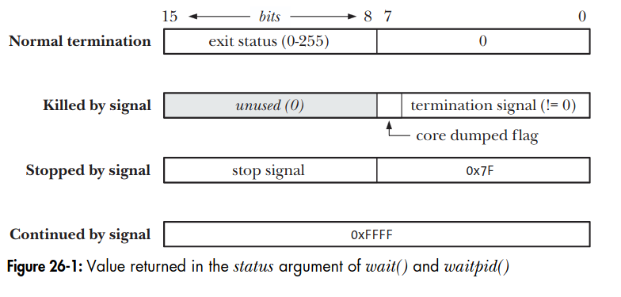

# Chapter 26: Monitoring child processes

## 26.1. Waiting on a child process
### 26.1.1. The wait() system call
The wait() system call waits for one of the children of the calling process to terminate and returns the termination status of that child in the buffer pointed to by status.
```
#include <sys/wait.h>
pid_t wait(int *status);
Return process ID of terminated child, or -1 on error.
```
The wait() system call does the following:
1. If no child of the calling process has yet terminated, the call blocks until one of the children terminates.
2. If status is not NULL, information about how the child terminated is returned in the integer to which status points. 
3. The kernel adds the process CPU times and resource usage statistics to running totals for all children of this parent process.
4. Wait() returns the process ID of the child that has terminated

We can use the following loop to wait for all children of the calling process to terminate:
```
while((childPid = wait(NULL)) != -1)
    continue;
if (errno != ECHILD)
    errExit("wait");
```

The following program demonstrates the use of wait():
```
#include <sys/wait.h> 
#include <time.h> 
#include "curr_time.h"              /* Declaration of currTime() */ 
#include "tlpi_hdr.h" 
int main(int argc, char *argv[]) 
{
    int numDead;       /* Number of children so far waited for */
    pid_t childPid;    /* PID of waited for child */
    int j;
    if (argc < 2 || strcmp(argv[1], "--help") == 0)
        usageErr("%s sleep-time...\n", argv[0]);
    setbuf(stdout, NULL);           /* Disable buffering of stdout */
    for (j = 1; j < argc; j++) {    /* Create one child for each argument */
        switch (fork()) {
            case -1:
                errExit("fork");
            case 0:                     /* Child sleep for a while then exits */
                printf("[%s] child %d started with PID %ld, sleeping %s " "seconds\n", currTime("%T"), j, (long) getpid(), argv[j]);
                sleep(getInt(argv[j], GN_NONNEG, "sleep-time"));
                _exit(EXIT_SUCCESS);
        default:                    /* Parent just continues around loop */
        break;
        }
    }
    numDead = 0;
    for (;;) {                      /* Parent waits for each child to exit */
    childPid = wait(NULL);
    if (childPid == -1) {
    if (errno == ECHILD) {
        printf("No more children - bye!\n");
        exit(EXIT_SUCCESS);
    } else {                /* Some other (unexpected) error */
            errExit("wait");
    }
    }
    numDead++;
    printf("[%s] wait() returned child PID %ld (numDead=%d)\n", currTime("%T"), (long) childPid, numDead);
    } 
}
```
Output:
```
./multi_wait 7 1 4
[13:41:00] child 1 started with PID 21835, sleep 7 seconds
[13:41:00] child 1 started with PID 21836, sleep 7 seconds
[13:41:00] child 3 started with PID 21837, sleep 4 seconds
[13:41:01] wait() returned child PID 21836 (numDead =1)
[13:41:04] wait() returned child PID 21837 (numDead =2)
[13:41:01] wait() returned child PID 21835 (numDead =3)
No more children - bye!
```

### 26.1.2. The waitpid() system call
```
#include <sys/wait.h>
pid_t waitpid(pid_t pid, int *status, int options);
Return process ID of child, 0, or -1 on error
```
The return value and status arguments of waitpid() are the same as for wait(). The pid argument enables the selection of the child to be waited for, as follows:
- If pid is greater than 0, wait for the child whose process ID equals pid.
- If pid equals 0, wait for any child in the same process group as the caller.
- If pid is less than -1, wait for any child whose process group identifier equals the absolute value of pid.
- If pid equals -1, wait for any child. The call wait(status) is equivalent to the call wait(-1, status, 0).  

The options argument is a bit mask that can include (OR) zero or more of the following flags:
- WUNTRACED: In addition to returning information about terminated children, also return information when a child is stopped by a signal.
- WCONTINUED: Also return status information about stopped children that have been resumed by delivery of a SIGCONT signal.
- WNOHANG: If no child specified by pid has yet changed state, then return immediately.

The following figure describe value returned in the status argument of wait() and waitpid(), only the bottom 2 bytes of the value pointed to by status are actually used:
<p align="center">

</p>

The <sys/wait.h> header file defines a standard set of macros that can be used to dissect a wait status value. The list of macros are:  
- WIFEXITED(status): This macro returns true if the child process exited normally.
- WIFSIGNALED(status): This macro returns true if the child process was killed by a signal.
- WIFSTOPPED(status): This macro returns true if the child process was stopped by a signal.
- WIFCONTINUED(status); This macro returns true if the child was resumed by delivery of SIGCONT.