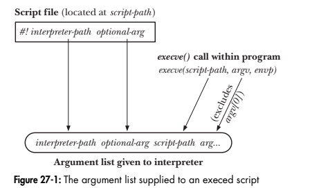
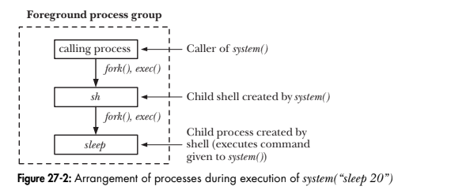

# Chapter 27: Program execution
## 27.1. Executing a new program: execve()
The execve() system call loads a new program into a process's memory.
```
#include <unistd.h>
int execve(const char *pathname, char* const argv[], char *const envp[]);
Never return on succes, return -1 on error.
```
The pathname argument contains the pathname of the new program to be loaded into the process's memory. The argv arguments specifies the command-line arguments to be passed to the new program. The final argument, envp, specifies the environment list for the new program. If the system call returns, it informs us that an error occured.
Among the errors that may be returned in errno are the following:
- EACCESS: The pathname arguments doesn't refer to a regular file, the file doesn't have execute permission enabled, or one of the directory components of pathname is not searchable.
- ENOENT: The file reffered to by pathname doesn't exitst.
- ENOEXEC: The file referred to by pathname is marked as being executable, but it is not in a recognizable executable format.
- ETXTBSY: The file reffered to by pathname is open for writing by another process.
- E2BIG: The total space required by the argument list and environment list exceeeds the allowed maximum.  

Various library functions, all with names begining with exec, are layered on top the execve() system call.

Example program:
```
t_execve.c
---------------------------------------------------------
#include "../lib/tlpi_hdr.h"

int main(int argc, char* argv[]) {
    char *argVec[10];
    char *envVec[] = {"GREET=salut", "BYE=adieu", NULL};

    if (argc != 2 || strcmp(argv[1], "--help") == 0)
        usageErr("%s pathname\n", argv[0]);

    argVec[0] = strrchr(argv[1], '/');

    if (argVec[0] != NULL)
        argVec[0]++;
    else 
        argVec[0] = argv[1];
    argVec[1] = "hello world";
    argVec[2] = "goodbye";
    argVec[3] = NULL;

    execve(argv[1], argVec, envVec);
    errExit("execve");
}
```

```
envargs.c
----------------------------------------
#include "../lib/tlpi_hdr.h"

extern char **environ;

int main(int argc, char* argv[]) {
    int j;
    char **ep;

    for (j = 0; j < argc; j++) {
        printf("argv[%d] = %s\n", j, argv[j]);
    }
    for (ep = environ; *ep != NULL; ep++) {
        printf("environ: %s\n", *ep);
    }
    exit(EXIT_SUCCESS);
}
```

Output:
```
./t_execve ./envargs
argv[0] = envargs
argv[1] = hello world
argv[2] = goodbye
environ: GREET=salut
environ: BYE=adieu
```

## 27.2. The exec() library functions
All of the following functions are layered on top of execve(), and they different from one another and from execve() only in the way in which the program name, argument list, and environment of the new program are specified.

```
#include <unistd.h>

int execle(const char *pathanme, const char *args, ... /* , (char *)NULL, char *const envp[] */);
int execlp(const char *filename, const char *arg, ... /* , (char *) NULL */);
int execvp(const char *filename, char *const argv[]);
int execv(const char* pathname, char *const argv[]);
int execl(const char *pathname, const char *arg, ... /* , (char *) NULL */);
None of the above returns on success, all return -1 on error
```
| Hàm | Loại tham số đường dẫn | Cách truyền danh sách đối số (I vs v) | Nguồn biến môi trường | Cách sử dụng |
| --- | --- | --- | --- | --- |
| execve() (System Call gốc) | Pathname (Cần đường dẫn đầy đủ/tương đối) | Array (v) (Mảng con trỏ char*[]) | envp (e) (Mảng biến môi trường riêng) | Hàm duy nhất là system call thực sự; truyền cả mảng đối số và môi trường custom. |
| execle() | Pathname (Cần đường dẫn đầy đủ/tương đối) | List (l) (Danh sách liệt kê phân tách bởi dấu phẩy) | envp (e) (Mảng biến môi trường riêng) | Truyền đối số dạng danh sách, tham số cuối cùng bắt buộc là NULL, sau đó là mảng envp. |
| execlp() | Filename (p) (Tự tìm trong biến môi trường PATH) | List (l) (Danh sách liệt kê phân tách bởi dấu phẩy) | environ (Dùng chung môi trường tiến trình cha) | Rất tiện khi gọi các lệnh hệ thống (như "ls", "grep") với tham số cố định. |
| execvp() | Filename (p) (Tự tìm trong biến môi trường PATH) | Array (v) (Mảng con trỏ char*[]) | environ (Dùng chung môi trường tiến trình cha) | Thường dùng nhất khi viết Shell/CLI parser vì các đối số đã được phân tích thành mảng argv[]. |
| execv() | Pathname (Cần đường dẫn đầy đủ/tương đối) | Array (v) (Mảng con trỏ char*[]) | environ (Dùng chung môi trường tiến trình cha) | Giống execve(), nhưng kế thừa toàn bộ biến môi trường hiện tại của tiến trình cha. |
| execl() | Pathname (Cần đường dẫn đầy đủ/tương đối) | List (l) (Danh sách liệt kê phân tách bởi dấu phẩy) | enviro (Dùng chung môi trường tiến trình cha) | Cách viết đơn giản nhất khi biết rõ đường dẫn file và số lượng đối số cố định. |


Để phân biệt sự khác biệt giữa các library function trên, ta cần chú ý các điểm sau:
- p (Path): Hàm sẽ nhận vào tên file (Filename, ví dụ "ls"). Nếu không có dấu /, hệ điều hành sẽ tự động tìm file đó trong các thư mục định nghĩa ở biến môi trường PATH. Nếu không có p, bạn bắt buộc phải truyền đường dẫn cụ thể (Pathname, ví dụ "/bin/ls" hoặc "./my_app").

- l (List): Các đối số dòng lệnh được truyền trực tiếp thành danh sách phân tách bằng dấu phẩy trong lời gọi hàm (ví dụ: execl(path, arg0, arg1, arg2, NULL);). Phần tử cuối cùng bắt buộc phải là NULL.

- v (Vector / Array): Các đối số dòng lệnh được đóng gói sẵn vào một mảng các con trỏ char *argv[] (giống như ví dụ argVec trong bài trước). Phần tử cuối cùng của mảng cũng phải là NULL.

- e (Environment): Cho phép bạn truyền một mảng biến môi trường tùy chỉnh char *envp[] (e xịn). Nếu tên hàm không có chữ e, hàm đó sẽ mặc định kế thừa biến môi trường toàn cục environ của tiến trình hiện tại.

### 27.2.1. The PATH environment variable

```
#include "tlpi_hdr.h"

int main(int argc, char *argv[]) {
    if (argc != 2 || strcmp(argv[1]), "--help" == 0)
        usageErr("%s pathname\n", argv[0]);
    execlp(argv[1], argv[1], "hello world", (char *) NULL);
    errExit("exelp");
}
```
Output:
```
$ which echo
/bin/echo
$ ls -l /bin/echo
-rwxr-xr-x    1 root      15428 Mar 19 21:28 /bin/echo 
$ echo $PATH
/home/mtk/bin:/usr/local/bin:/usr/bin:/bin          /bin is in PATH 
$ ./t_execlp echo                 execlp() uses PATH to successfully find echo 
hello world 
```

Cơ chế tìm kiếm file của execlp() / execvp():
- Khi truyền tên file (không chứa dấu /, ví dụ "echo"): Hàm sẽ duyệt lần lượt qua các thư mục được định nghĩa trong biến môi trường PATH (phân tách bởi dấu :) để tìm file thực thi.
- Khi truyền đường dẫn (có chứa ít nhất 1 dấu /, ví dụ "/bin/echo" hoặc "./echo"): Hàm sẽ bỏ qua PATH và tìm chính xác theo đường dẫn đó.
- Nếu không tìm thấy file trong PATH, hàm thất bại và trả về lỗi ENOENT (No such file or directory).

### 27.2.2. Specifying program arguments as a list
```
#include "tlpi_hdr.h"

int main(int argc, char *argv[]) {
    char *envVec[] = {"GREET=salut", "BYE=adieu", NULL};
    char* filename;
    if (argc != 2 || strcmp(argv[1], "--help") == 0)
        usageErr("%s pathname\n", argv[0]);
    filename = strrchr(argv[1], '/');
    if (filename != NULL)
        filename++;
    else
        filename = argv[1];
    execle(argv[1], filename, "hello world", (char *) NULL, envVec);
    errExit("execle:);
}
```
When we know the number of arguments for an exec at the time we write a program, we can use execle(), execlp(), or execl() to specify the arguments as a list within the function call.

### 27.2.3. Passing the caller's environment to the new program
The execlp(), execvp(), execl(), and execv() functions don’t permit the programmer to explicitly specify an environment list; instead, the new program inherits its environment from the calling process. The following diagram first uses putenv() to make a change to the environment that it inherits from the shell as a result of fork() and then the printenv program is execed to display the values of the the USER and SHELL environment variables.
```
#include <stdlib.h>
#include "tlpi_hdr.h"

int main(int argc, char* argv[]) {
    printf("Initial value of USER: %s\n", getenv("USER"));
    if (putenv("USER=britta") != 0)
        errExit("putenv");
    execl("/usr/bin/printenv", "printenv", "USER", "SHELL", (char *) NULL);
    errExit("execl");
}
```

Output:
```
$ echo $USER $SHELL
blv /bin/bash
# ./t_execl
Initial value of USER: blv
britta
/bin/bash
```

### 27.2.4. Executing a file referred by a descriptor: fexecve()
fexecve() specifies the file to be execed via the open file descriptor fd, rather than as a pathname. Using fexecve() is useful for applications that want to open a file, verify its contents by performing a checksum, and then execute the file:
```
#define _GNU_SOURCE
#include <unistd.h>

int fexecve(int fd, char *const argv[], char *const rnvp());
```

## 27.3. Interpreter scripts
An interpreter is a program that reads commands in text form and executes them. Example of interpreters include the various UNIX shells and programs such as awk, sed, perl, python and ruby. Interpreters usually provide a facility to read and execute commands from a text file, referred to as a script. Interpreters can run if the two following requirements are met:
- First, execute permission must be enabled for the script file.
- Second, the file must contain an initial line that specifies the pathname of the interpreter to be used to run the script:
```
#! interpreter-path [optional-arg]
```
As an example, UNIX shell scripts usually begin with the following line, which specifies that the shell is to be used to execute the script:
``
#!/bin/sh
``

**`Execution of interpreter scripts`** 
execve() run the script with the following list of arguments:
```
interpreter-path [optional-arg] script-path arg...
```
Here, interpreter-path and optional-arg are taken from the #! line of the script, script path is the pathname given to execve(), and arg... is the list of any further arguments specified via the argv argument to execve().

<p align="center">

</p>

**`Using the script optional-arg`**
One use of the optional-arg in a script's initial #! line is to specify command-line options for the interpreter.
A script can be supplied to awk in two different ways. The default is to provide the script as the first command-line argument to awk:
```
awk 'script' input-file...
```
Alternatively, an awk script can reside inside a file, as in the following awk script, which prints out the length of the longest line of its input:
```
$ cat longest_line.awk
#!/usr/bin/awk
length > max { max = length; }
END { print max; }
```
Suppose that we try execing this script using the following C code:
```
execl("longest_line.awk", "longest_line.awk", "input.txt", (char *) NULL);
```

**`Executing scripts with execlp() and execvp()`**  
Normally, the absence of a #! line at the start of a script causes the exec() functions to fail. However, execlp() and execvp() do things somewhat differently. Recall that these are the functions that use the PATH environment variable to obtain a list of directories in which to search for a file to be executed. If either of these functions finds a file that has execute permission turned on, but is not a binary executable and does not start with a #! line, then they exec the shell to interpret the file. On Linux, this means that such files are treated as though they started with a line containing the string #!/bin/sh.

## 27.4. File descriptors and exec()
Normally, the absence of a #! line at the start of a script causes the exec() functions to fail. However, execlp() and execvp() do things somewhat differently. Recall that these are the functions that use the PATH environment variable to obtain a list of directories in which to search for a file to be executed. If either of these functions finds a file that has execute permission turned on, but is not a binary executable and does not start with a #! line, then they exec the shell to interpret the file. On Linux, this means that such files are treated as though they started with a line containing the string #!/bin/sh.  
The shell takes advantage of this feature to handle I/O redirection for the
programs that it executes. For example, suppose we enter the following shell
command: 
```
$ ls /tmp > dir.txt
```

The shell performs the following steps to execute this command:
1. A fork() is performed to create a child process that is also running a copy of the
shell (and thus has a copy of the command).
2. The child shell opens dir.txt for output using file descriptor 1 (standard output). This can be done in either of the following ways:
- The child shell closes descriptor 1 (STDOUT_FILENO) and then opens the file
dir.txt. Since open() always uses the lowest available file descriptor, and
standard input (descriptor 0) remains open, the file will be opened on
descriptor 1.
- The shell opens dir.txt, obtaining a new file descriptor. Then, if that file
descriptor is not standard output, the shell uses dup2() to force standard
output to be a duplicate of the new descriptor and closes the new descriptor,
since it is no longer required. (This method is safer than the preceding method, since it doesn’t rely on lower-numbered descriptors being open.)
The code sequence is something like the following:
```
fd = open("dir.txt", O_WRONLY | O_CREAT,
S_IRUSR | S_IWUSR | S_IRGRP | S_IWGRP | S_IROTH | S_IWOTH);
/* rw-rw-rw- */
if (fd != STDOUT_FILENO) {
    dup2(fd, STDOUT_FILENO);
    close(fd);
}
```
3. The child shell execs the ls program. The ls program writes its output to stan-
dard output, which is the file dir.txt.

**`The close-on-exec flag (FD_CLOEXEC)`**
Sometimes, it may be desirable to ensure that certain file descriptors are closed
before an exec(). the kernel provides a close-on-exec flag for each file descriptor. If this flag is set, then the file descriptor is automatically closed during a successful exec(), but left open if the exec() fails. The close-on-exec flag for a file descriptor can be accessed using the fcntl() system call (Section 5.2). The fcntl() F_GETFD operation retrieves a copy of the file descriptor flags:
```
int flags;
flags = fcntl(fd, F_GETFD);
if (flags == -1)
    errExit("fcntl");
```
After retrieving these flags, we can modify the FD_CLOEXEC bit and use a second fcntl() call specifying F_SETFD to update the flags:
```
flags |= FD_CLOEXEC;
if (fcntl(fd, F_SETFD, flags) == -1)
    errExit("fcntl");
```
When dup(), dup2(), or fcntl() is used to create a duplicate of a file descriptor, the close-on-exec flag is always cleared for the duplicate descriptor. Listing 27-6 demonstrates the manipulation of the close-on-exec flag. Depending on the presence of a command-line argument (any string), this program first sets the close-on-exec flag for standard output and then execs the ls program.
```
$ ./closeonexec Exec ls without closing standard output
-rwxr-xr-x 1 mtk users 28098 Jun 15 13:59 closeonexec
$ ./closeonexec n Sets close-on-exec flag for standard output
ls: write error: Bad file descriptor
```
In the second run shown above, ls detects that its standard output is closed and prints an error message on standard error.
```
#include <fcntl.h>
#include "tlpi_hdr.h"
int
main(int argc, char *argv[])
{
    int flags;

    if (argc > 1) {
        flags = fcntl(STDOUT_FILENO, F_GETFD); /* Fetch flags */
        if (flags == -1)
            errExit("fcntl - F_GETFD");
        flags |= FD_CLOEXEC; /* Turn on FD_CLOEXEC */
        if (fcntl(STDOUT_FILENO, F_SETFD, flags) == -1) /* Update flags */
        errExit("fcntl - F_SETFD");
    }
    execlp("ls", "ls", "-l", argv[0], (char *) NULL);
    errExit("execlp");
}
```

## 27.5. Signals and exec()
During an exec(), the text of the existing process is discarded. During an exec(), the text of the existing process is discarded. This text may include
signal handlers established by the calling program. Because the handlers disappear, the kernel resets the dispositions of all handled signals to SIG_DFL. The dispositions of all other signals (i.e., those with dispositions of SIG_IGN or SIG_DFL) are left unchanged by an exec().

## 27.6. Executing a shell command: system()
The system() function allows the calling program to execute an arbitrary shell command.
```
#include <stdlib.h>
int system(const char *command);

See main text for a description of return value
```
The system() function creates a child process that invokes a shell to execute
command. Here is an example of a call to system():
```
system("ls | wc");
```
The principal advantages of system() are simplicity and convenience:
- We don’t need to handle the details of calling fork(), exec(), wait(), and exit().
- Error and signal handling are performed by system() on our behalf.
- Because system() uses the shell to execute command, all of the usual shell processing, substitutions, and redirections are performed on command before it is executed. This makes it easy to add an “execute a shell command” feature to an application. (Many interactive applications provide such a feature in the form of a ! command.)
The main cost of system() is inefficiency. Executing a command using system() requires the creation of at least two processes—one for the shell and one or more for the command(s) it executes—each of which performs an exec(). If efficiency or speed is a requirement, it is preferable to use explicit fork() and exec() calls to execute the desired program.
The return value of system() is as follows:
- If command is a NULL pointer, then system() returns a nonzero value if a shell is available, and 0 if no shell is available. This case arises out of the C programming language standards, which are not tied to any operating system, so a shell might not be available if system() is running on a non-UNIX system. Furthermore, even though all UNIX implementations have a shell, this shell might not be available if the program called chroot() before calling system(). If command is non-NULL, then the return value for system() is determined according to the remaining rules in this list.
- If a child process could not be created or its termination status could not be retrieved, then system() returns –1.
- If a shell could not be execed in the child process, then system() returns a value as though the child shell had terminated with the call _exit(127).
- If all system calls succeed, then system() returns the termination status of the child shell used to execute command. (The termination status of a shell is the termination status of the last command it executes.)  

In the last two cases, the value returned by system() is a wait status of the same form returned by waitpid(). This means we should use the functions described in Section 26.1.3 to dissect this value, and we can display the value using our printWaitStatus() function (Listing 26-2, on page 546).

**`Example program`**  
Listing 27-7 demonstrates the use of system(). This program executes a loop that reads a command string, executes it using system(), and then analyzes and displays the value returned by system(). Here is a sample run:
```
$ ./t_system
Command: whoami
mtk
system() returned: status=0x0000 (0,0)
child exited, status=0
Command: ls | grep XYZ Shell terminates with the status of...
system() returned: status=0x0100 (1,0) its last command (grep), which...
child exited, status=1 found no match, and so did an exit(1)
Command: exit 127
system() returned: status=0x7f00 (127,0)
(Probably) could not invoke shell Actually, not true in this case
Command: sleep 100
Type Control-Z to suspend foreground process group
[1]+ Stopped ./t_system
$ ps | grep sleep Find PID of sleep
29361 pts/6 00:00:00 sleep
$ kill 29361 And send a signal to terminate it
$ fg Bring t_system back into foreground
./t_system
system() returned: status=0x000f (0,15)
child killed by signal 15 (Terminated)
Command: ^D$ Type Control-D to terminate program
```

```
#include <sys/wait.h>
#include "print_wait_status.h"
#include "tlpi_hdr.h"
#define MAX_CMD_LEN 200
int
main(int argc, char *argv[])
{
    char str[MAX_CMD_LEN]; /* Command to be executed by system() */
    int status; /* Status return from system() */

    for (;;) { /* Read and execute a shell command */
        printf("Command: ");
        fflush(stdout);
        if (fgets(str, MAX_CMD_LEN, stdin) == NULL)
            break; /* end-of-file */

        status = system(str);
        printf("system() returned: status=0x%04x (%d,%d)\n",
        (unsigned int) status, status >> 8, status & 0xff);

        if (status == -1) {
            errExit("system");
        } else {
            if (WIFEXITED(status) && WEXITSTATUS(status) == 127)
                printf("(Probably) could not invoke shell\n");
            else /* Shell successfully executed command */
                printWaitStatus(NULL, status);
        }
    }
    exit(EXIT_SUCCESS);
}
```

**`Avoid using system() in set-user-ID and set-group-ID programs`**  
Set-user-ID and set-group-ID programs should never use system() while operating
under the program’s privileged identifier.

## 27.7. Implementing system()
**A simple implementation of system()** 
The –c option of the sh command provides an easy way to execute a string contain-
ing arbitrary shell commands:
```
$ sh -c "ls | wc"
38 38 444
```
Thus, to implement system(), we need to use fork() to create a child that then does an execl() with arguments corresponding to the above sh command:
```
execl("/bin/sh", "sh", "-c", command, (char *) NULL);
```

A simple implementation of system():
```
#include <unistd.h>
#include <sys/wait.h>
#include <sys/types.h>

int system(char *command)
{
    int status;
    pid_t childPid;

    switch (childPid = fork()) {
    case -1: /* Error */
        return -1;

    case 0: /* Child */
        execl("/bin/sh", "sh", "-c", command, (char *) NULL);
        _exit(127); /* Failed exec */

    default: /* Parent */
        if (waitpid(childPid, &status, 0) == -1)
            return -1;
        else
        return status;
    }
}
```

**Treating signals correctly inside system()**
Cần xem lại sau
<p align="center">

</p>

**An improved system() implementation**  
```
#include <unistd.h>
#include <signal.h>
#include <sys/wait.h>
#include <sys/types.h>
#include <errno.h>
int
system(const char *command)
{
    sigset_t blockMask, origMask;
    struct sigaction saIgnore, saOrigQuit, saOrigInt, saDefault;
    pid_t childPid;
    int status, savedErrno;

    if (command == NULL) /* Is a shell available? */
        return system(":") == 0;

    sigemptyset(&blockMask); /* Block SIGCHLD */
    sigaddset(&blockMask, SIGCHLD);
    sigprocmask(SIG_BLOCK, &blockMask, &origMask);

    saIgnore.sa_handler = SIG_IGN; /* Ignore SIGINT and SIGQUIT */
    saIgnore.sa_flags = 0;
    sigemptyset(&saIgnore.sa_mask);
    sigaction(SIGINT, &saIgnore, &saOrigInt);
    sigaction(SIGQUIT, &saIgnore, &saOrigQuit);

    switch (childPid = fork()) {
    case -1: /* fork() failed */
        status = -1;
        break; /* Carry on to reset signal attributes */

    case 0: /* Child: exec command */
        saDefault.sa_handler = SIG_DFL;
        saDefault.sa_flags = 0;
        sigemptyset(&saDefault.sa_mask);
        if (saOrigInt.sa_handler != SIG_IGN)
            sigaction(SIGINT, &saDefault, NULL);
        if (saOrigQuit.sa_handler != SIG_IGN)
            sigaction(SIGQUIT, &saDefault, NULL);
        sigprocmask(SIG_SETMASK, &origMask, NULL);

        execl("/bin/sh", "sh", "-c", command, (char *) NULL);
        _exit(127); /* We could not exec the shell */

    default: /* Parent: wait for our child to terminate */
        while (waitpid(childPid, &status, 0) == -1) {
            if (errno != EINTR) { /* Error other than EINTR */
                status = -1;
                break; /* So exit loop */
            }
        }
        break;
    }

    /* Unblock SIGCHLD, restore dispositions of SIGINT and SIGQUIT */
    savedErrno = errno; /* The following may change 'errno' */

    sigprocmask(SIG_SETMASK, &origMask, NULL);
    sigaction(SIGINT, &saOrigInt, NULL);
    sigaction(SIGQUIT, &saOrigQuit, NULL);
    errno = savedErrno;
    return status;
}
```

**Further details on system()**  
Portable applications should ensure that system() is not called with the disposition of SIGCHLD set to SIG_IGN, because it is impossible for the waitpid() call to obtain the status of the child in this case.