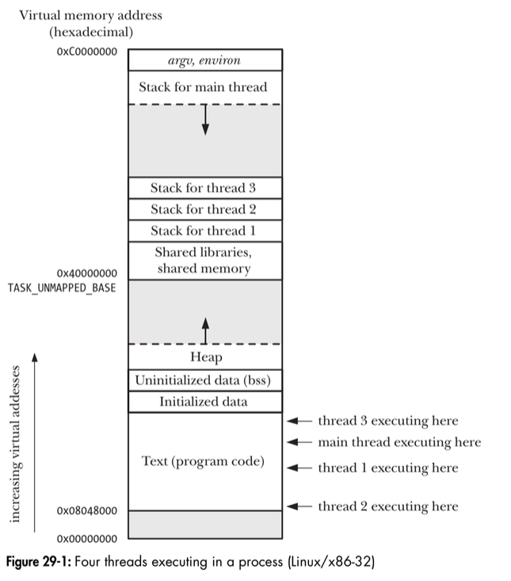

# Chapter 29: Threads: Introduction

## 29.1. Overview
The threads in a process can execute concurrently. On a multiprocessor system, multiple threads can execute parallel. If one thread is blocked on I/O, other threads are still eligible to execute. All of these threads are independently executing the same program, and they all share the same global memory, including initialized data, uninitialized data, and heap segments.
<p align="center">

</p>
Besides global memory, threads also share a number of other attributes:

- process ID and parent process ID;
- process group ID and session ID;
- controlling terminal;
- process credentials (user and group IDs);
- open file descriptors;
- record locks created using fcntl();
- signal dispositions;
- file system–related information: umask, current working directory, and root
-irectory;
- interval timers (setitimer()) and POSIX timers (timer_create());
- System V semaphore undo (semadj) values (Section 47.8);
- resource limits;
- CPU time consumed (as returned by times());
- resources consumed (as returned by getrusage()); and
- nice value (set by setpriority() and nice()).

Among the attributes that are distinct for each thread are the following:
- thread ID (Section 29.5);
- signal mask;
- thread-specific data (Section 31.3);
- alternate signal stack (sigaltstack());
- the errno variable;
- floating-point environment (see fenv(3));
- realtime scheduling policy and priority (Sections 35.2 and 35.3);
- CPU affinity (Linux-specific, described in Section 35.4);
- capabilities (Linux-specific, described in Chapter 39); and
- stack (local variables and function call linkage information).

## 29.2. Background details of the Pthread API
**Pthreads data type**  
| Data type | Description |
| --- | --- |
| pthread_t | Thread identifier |
| pthread_mutex_t | Mutex |
| pthread_mutexattr_t | Mutex attributes object |
| pthread_cond_t | Condition variable |
| pthread_condattr_t | Condition variable attributes object |
| pthread_key_t | Key for thread_specific data |
| pthread_once_t | One-time initialization control context |
| pthread_attr_t | Thread attributes object |

**Threads and errno**  
In threaded programs, each thread has its own errno value.

**Return value from Pthread functions**  
All Pthreads functions return 0 on success or a positive value on failure. The failure value is one of the same values that can be placed in errno by traditional UNIX system calls.  
Example:
```
pthread_t *thread;
int s;

s = pthread_create(&thread, NULL, func, &arg);
if (s != 0)
    errExitEN(s, "pthread_create");
```
**Compiling pthreads programs**  

On Linux, programs that use the Pthreads API must be compiled with the cc-pthread option. The effects of this option include the following:
- The _REENTRANT preprocessor macro is defined. The causes the declarations of a few reentrant functions to be exposed.
- The program is linked with the libpthread library. 

## 29.3. Thread creation

The pthread_create() fucntion creates a new thread.
```
#include <pthread.h>
int pthread_create(pthread_t *thread, const pthread_attr_t *attr, void *(*start)(void *), void *arg);
Return 0 on success, or a positive error number on error.
```
The new thread commences execution by calling the function identified by start with the argument arg (ie, start(arg)). The arg argument is declared as void *, meaning that we can pass a pointer to any type of object to the start function. Typically, arg points to a global or heap variable, but it can also be specified as NULL. If we need to pass multiple arguments to start, then arg can be specified as a pointer to a structure containing the arguments as seperate fields. The return value of start is likewise of type void *, and it can be employed in the same way as the arg argument.  
The thread argument points to a buffer of type pthread_t into which the unique identifier for this thread is copied before pthread_create() returns. This identifier can be used in later Pthreads calls to refer to the thread.   
The attr argument is a pointer to a pthread_attr_t object that specifies various attributes for the new thread. If attr is specified as NULL, then the thread is created with various default attributes, and this is what normally done.  
After a call to pthread_create(), a program has no guarantees about which thread will next be scheduled to use the CPU. Programs that implicitly rely on a particular order of scheduling are open to the same sorts of race conditions.

## 29.4. Thread termination
The execution of a thread terminates in one of the following ways:
- The thread's start function perform a return specifying a return value for the thread.
- The thread calls pthread_exit().
- The thread is canceled using pthread_cancel().
- Any of the threads call exit(), or the main thread perform a return.

The pthread_exit() function terminates the calling thread, and specifies a return value that can be obtained in another thread by calling pthread_join().
```
#include <pthread.h>
void pthread_exit(void *retval);
```
Call pthread_exit() is equivalent to performaing a return in the thread's start fucntion, with the difference that pthread_exit() can be called from any fucntion that has been called by the thread's start fucntion.  
The retval argument specifies the return value for the thread. The value pointed to by retval should not be located on the thread's stack, since the contents of that stack become undefined on thread termination.

## 29.5. Thread IDs
Thread's ID is returned to the caller of pthread_create(), and a thread can obtains its own ID using pthread_self().
```
#include <pthread.h>

pthread_t pthread_self(void);
```

The IDs are useful within applications for the following reasons:
- Various pthreads functions use thread IDs to identify the thread on which they are to act. Examples of such functions include: pthread_join(), pthread_detach(), pthread_cancel(), and pthread_kill().
- It can be useful to tag dynamic data structures with the ID of a particular thread. This can serve to identify the thread that created or "owns" a data structure.

The pthread_equal() function allows us check whether two thread IDs are the same:
```
#include <pthread.h>
int pthread_equal(pthread_t tl, pthread_t t2);
Return nonzero value if t1 and t2 are equal, otherwise 0.
```

## 29.6. Joining with a terminated thread
The pthread_join() function waits for the thread identified by thread to terminate. (If that thread has already terminated, pthread_join() returns immediately).

```
#include <pthread.h>
int thread_join(pthread_t thread, void **retval);
Returns 0 on success, or a positive error number on error.
```
If retval is a non-NULL pointer, then it receives a copy of the terminated thread's return value - that is, the value that was specified when the thread performed a return or called pthread_exit().  
The task that pthread_join() performs for the threads is similar to that performed by waitpid() for processes. However, there are some differences:
- Threads are peers.
- There is no way of saying "join with any thread".

Example program:
```
#include <pthread.h>
#include "tlpi_hdr.h"

static void *threadFunc(void *arg) {
    char *s = (char *)arg;
    printf("%s", s);
    return (void *) strlen(s);
}

int main(int argc, char *argv[]) {
    pthread_t t1;
    void *res;
    int s;

    s = pthread_create(&t1, NULL, threadFunc, "Hello world\n");
    if (s != 0)
        errExitEN(s, "pthread_join");
    
    printf("Thread returned %ld\n", (long) res);
    exit(EXIT_SUCCESS);
}
```

Output:   
```
$ ./simple_thread
Message form main()
Hello world
Thread return 12
```

## 29.7. Detaching a thread
Sometimes, we don't care about the thread's return status; we simply want the system to automatically clean up and remove the thread when it terminates. In this case, we can mark the thread as detached, by making a call to pthread_detach() specifying the thread's identifier in thread:
```
#include <pthread.h>
int thread_detach(pthread_t thread);
Return 0 on success, or a positive error number on error.
```
pthread_detach() controls what happens after a thread terminates, not how or when it terminates.

## 29.8. Thread attributes
pthread_attr_t includes information such as the location and size of the thread's stack, the thread's scheduling policy and prioriry, and whether the thread is joinable or detached.

 ## 29.9. Threads versus processes
This section briefly consider some of the factors that might influence our choice of whether to implement an application as a group of threads or a group of process, beginning by considering the advantages of a multithread approach:
- Sharing data between threads is easy. By contrast, sharing data between processes requires more work (e.g., creating a shared memory segment or using a pipe).
- Thread creation is faster than process creation; context-switch time may be
lower for threads than for processes.

Using threads can have some disadvantages compared to using processes:
- When programming with threads, we need to ensure that the functions we call
are thread-safe or are called in a thread-safe manner. (We describe the concept of thread safety in Section 31.1.) Multiprocess applications don’t need to beconcerned with this.
- A bug in one thread (e.g., modifying memory via an incorrect pointer) can dam-
age all of the threads in the process, since they share the same address space and other attributes. By contrast, processes are more isolated from one another.
- Each thread is competing for use of the finite virtual address space of the host process. In particular, each thread’s stack and thread-specific data (or thread-local storage) consumes a part of the process virtual address space, which is consequently unavailable for other threads. Although the available virtual address space is large (e.g., typically 3 GB on x86-32), this factor may be a significant limitation for processes employing large numbers of threads or threads that require large amounts of memory. By contrast, separate processes can each employ the full range of available virtual memory (subject to the limitations of RAM and swap space).

The following are some other points that may influence out choice of threads versus processes:
- Dealing with signals in a multithreaded application requires careful design. (As a general principle, it is usually desirable to avoid the use of signals in multithreaded programs.) We say more about threads and signals in Section 33.2.
- In a multithreaded application, all threads must be running the same program (although perhaps in different functions). In a multiprocess application, different processes can run different programs.
- Aside from data, threads also share certain other information (e.g., file descriptors, signal dispositions, current working directory, and user and group IDs). This may be an advantage or a disadvantage, depending on the application.