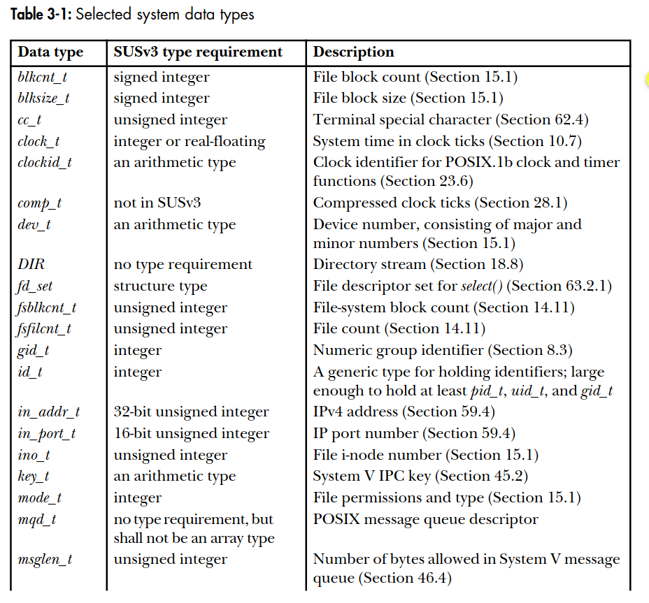

# Chapter 3: System programming concepts
## 3.1. System calls
A system call is a controlled entry point into the kernel, allowing a process to request that the kernel perform some action on the process's behalf.

### 3.6.2. System data types
For portability issues, various system data types are declared in <sys/types.h> header file.

<figure align="center">
    
    
</figure>
