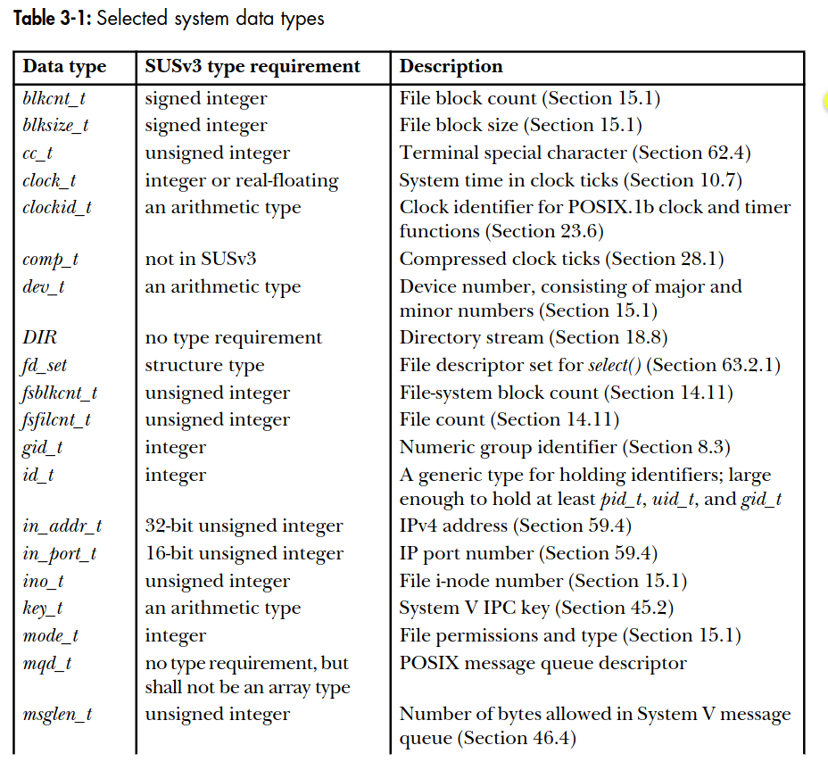
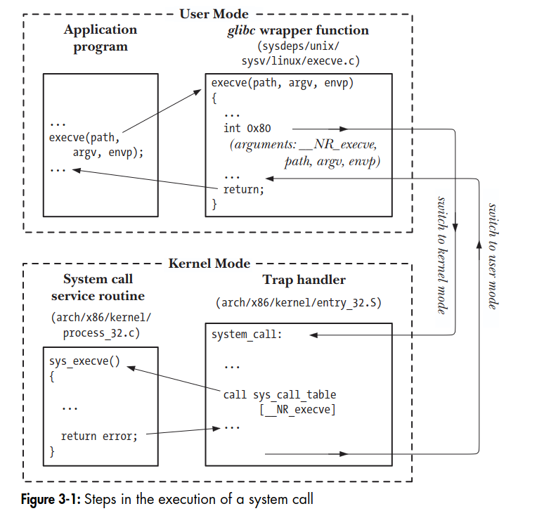

# Chapter 3: System programming concepts
## 3.1. System calls
A system call is a controlled entry point into the kernel, allowing a process to request that the kernel perform some action on the process's behalf.

### 3.6.1. Feature test macros
To make a program follow a particular standard, we define one or more of the feature test macros in one of two ways:
1. Defining the macro in the program source code before including any header.
```
#define _BSD_SOURCE 1
```
2. Use the -D option to the C compiler
```
cc -D_BSD_SOURCE prog.c
```


### 3.6.2. System data types
For portability issues, various system data types are declared in <sys/types.h> header file.

<figure align="center">
    
    
</figure>

Steps occur when calling a system call:
1. The application program makes a system call by invoking a wrapper function in the C library.
2. Arguments are passed to the wrapper via the stack, but the kernel expects them in specific registers. The wrapper function copies the arguments to these registers.
3. The kernel identifies the system call. To permit this, the wrapper function copies the system call number into a specific CPU register (%eax).
4. The wrapper function executes a trap machine instruction (int 0x80), which causes the  processor to switch from user to kernel mode and execute code pointed to by location 0x80 (128 decimal) of the trap vector.
5. In response to the trap to location 0x80, the kernel invokes its system_call() routine (located in the assembler file arch/i386/entry.S) to handle the trap.
6. If the return value of the system call service routine indicated an error, the wrapper function sets the global var errno using this value. The wrapper function then returns to the caller, providing an integer return value indicating the success or failure of the system call.

Take the execve() system call for example:
<figure align="center">
    
</figure>

