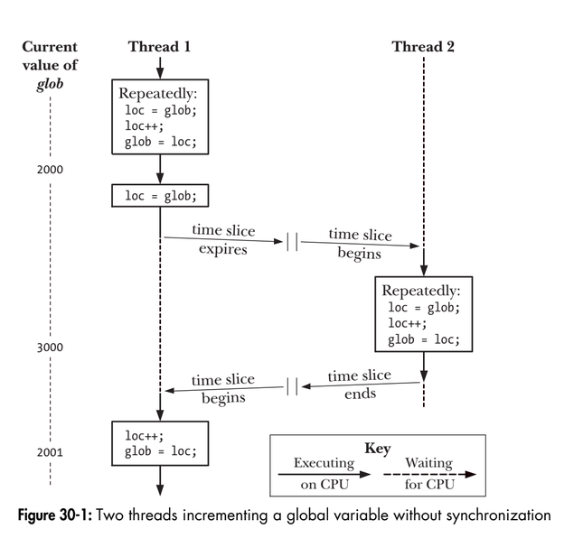
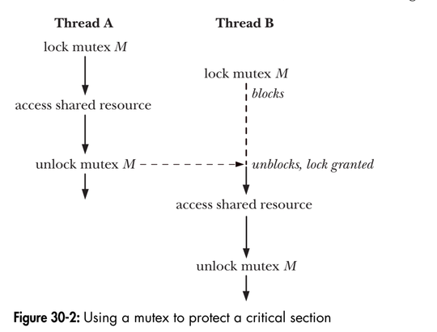
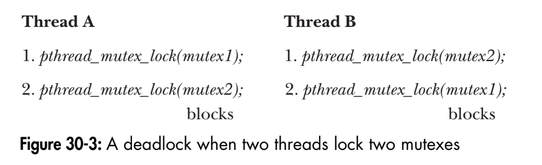

# Chapter 30: Threads: Thread synchronization

## 30.1. Protecting accesses to shared variables: Mutexes
The term critical section is used to refer to a section of code that accesses a shared resource and whose execution should be atomic.  
The following program provides a simple example of the kind of problems that can occur when shared resources are not accessed atomically.
```
#include <pthread.h>
#include "tlpi_hdr.h"

static int glob = 0;

/* Loop 'arg' times incrementing 'glob' */
static void *threadFunc(void *arg) {
    int loops = *((int *) arg);
    int loc, j;

    for (j = 0; j < loops; j++) {
        loc = glob;
        loc++;
        glob = loc;
    }
    return NULL;
}

int main(int argc, char* argv[]) {
    pthread_t t1, t2;
    int loops, s;

    loops = (argc > 1) ? getInt(argv[1], GN_GT_0, "num-loops") : 10000000;

    s = pthread_create(&t1, NULL, threadFunc, &loops);
    if (s != 0)
        errExitEN(s, "pthread_create");

    s = pthread_create(&t2, NULL, threadFunc, &loops);
    if (s != 0)
        errExitEN(s, "pthread_create");

    s = pthread_join(t1, NULL);
    if (s != 0)
        errExitEN(s, "pthread_join");
    s = pthread_join(t2, NULL);
    if (s != 0)
        errExitEN(s, "pthread_join");

    printf("glob = %d\n", glob);
    exit(EXIT_SUCCESS);
}
```
<p align="center">

</p>

To avoid the problems that can occur when threads try to update a shared variable, we must use a mutex (short for mutual exclusion) to ensure that only one thread at a time can access the variable.  
A mutex has two states: locked and unlocked. At any moment, at most one thread may hold the lock on a mutex. When a thread locks a mutex, it becomes the owner of that mutex and only mutex owner can unlock the mutex.  
The standard procedure to access shared resource:
- lock the mutex for the shared resource
- access the shared resource
- unlock the mutex

<p align="center">

</p>

### 30.1.1. Statically allocated mutexes
A mutex is a variable of the type pthread_mutex_t. Before it can be used, a mutex must always be initialized. For a statically allocated mutex, we can do this by assigning it the value PTHREAD_MUTEX_INITIALIZER:
```
pthread_mutex_t mtx = PTHREAD_MUTEX_INITIALIZER;
```

### 30.1.2. Locking and unlocking a mutex
After initialization, a mutex is unlocked. To lock and unlock a mutex, we use the pthread_mutex_lock() and pthread_mutex_unlock() functions:
```
#include <pthread.h>

int pthread_mutex_lock(pthread_mutex_t *mutex);
int pthread_mutex_unlock(pthread_mutex_t *mutex);
Both return 0 on success, or a positive error number on error.
```

The following program is a modified version of the above program:
Output:
```
$ ./thread_incr_mutex 100000000
glob = 20000000
```

```
#include <pthread.h>
#include "tlpi_hdr.h"

static int glob = 0;
static pthread_mutex_t mtx = PTHREAD_MUTEX_INITIALIZER;

static void * /* Loop 'arg' times incrementing 'glob' */
threadFunc(void *arg)
{
    int loops = *((int *) arg);
    int loc, j, s;
    for (j = 0; j < loops; j++) {
        s = pthread_mutex_lock(&mtx);
        if (s != 0)
            errExitEN(s, "pthread_mutex_lock");
        loc = glob;
        loc++;
        glob = loc;
        s = pthread_mutex_unlock(&mtx);
        if (s != 0)
        errExitEN(s, "pthread_mutex_unlock");
    }
    return NULL;
}

int main(int argc, char *argv[])
{
    pthread_t t1, t2;
    int loops, s;
    loops = (argc > 1) ? getInt(argv[1], GN_GT_0, "num-loops") : 10000000;
    s = pthread_create(&t1, NULL, threadFunc, &loops);
    if (s != 0)
        errExitEN(s, "pthread_create");
    s = pthread_create(&t2, NULL, threadFunc, &loops);
    if (s != 0)
        errExitEN(s, "pthread_create");
    s = pthread_join(t1, NULL);
    if (s != 0)
        errExitEN(s, "pthread_join");
    s = pthread_join(t2, NULL);
    if (s != 0)
        errExitEN(s, "pthread_join");
    printf("glob = %d\n", glob);
    exit(EXIT_SUCCESS);
}
```

**pthread_mutex_trylock() and pthread_mutex_timelock()**
The pthread_mutex_trylock() function is the same as pthread_mutex_lock(), except that if the mutex is currently locked, pthread_mutex_trylock() fails, return the error BUSY.  
The pthread_mutex_timedlock() function is the same as pthread_mutex_lock(), except that the caller can specify an additional argument, abstime, that places a limit on the time that the thread will sleep while waiting to acquire the mutex. 

### 30.1.3. Performance of Mutexes
The cost of mutex is cheap.

### 30.1.4. Mutex deadlocks
<p align="center">

</p>
To avoid deadlock, when threads lock the same set of mutexes, they should always lock them in the same order.

### 30.1.5. Dynamically initializing a mutex
The initializer value PTHREAD_MUTEX_INITIALIZER can be used only for initializzing a statically allocated mutex with default attributes. In all other cases, we must dynamically initialize the mutex using pthread_mutex_init():
```
#include <pthread.h>

int pthread_mutex_init(pthread_mutex_t *mutex, const pthread_mutexattr_t *attr);
Return 0 on success, or a positive error number on error.
```
The mutex argument identifies the mutex to be initialized. The attr argument is a pointer to a pthread_mutexattr_t object that has been previously been initialized to define the attributes for the mutex.  
Among the cases where we must use pthread_mutex_init() rather than a static initializer are the following:
- The mutex was dynamically allocated on the heap. For example, suppose that
we create a dynamically allocated linked list of structures, and each structure in
the list includes a pthread_mutex_t field that holds a mutex that is used to protect access to that structure.
- The mutex is an automatic variable allocated on the stack.
- We want to initialize a statically allocated mutex with attributes other than the defaults.

When a automatically or dynamically allocated mutex is no longer required, it should be destroyed using pthread_mutex_destroy().
```
#include <pthread.h>
int pthread_mutex_destroy(pthread_mutex_t *mutex);
Returns 0 on success, or a positive error number on error.
```
A mutex that has been destroyed with pthread_mutex_destroy() can subsequently be reinitialized by pthread_mutex_init().

### 30.1.6. Mutex attributes

### 30.1.7. Mutex types
SUSv3 defines the following mutex types:
- PTHREAD_MUTEX_NORMAL: (Self-)deadlock detection is not provided for this type of mutex. If a thread
tries to lock a mutex that it has already locked, then deadlock results.
Unlocking a mutex that is not locked or that is locked by another thread
produces undefined results. (On Linux, both of these operations succeed
for this mutex type.)

- PTHREAD_MUTEX_ERRORCHECK: Error checking is performed on all operations. All three of the above scenarios
cause the relevant Pthreads function to return an error. This type of mutex
is typically slower than a normal mutex, but can be useful as a debugging
tool to discover where an application is violating the rules about how a
mutex should be used.

- PTHREAD_MUTEX_RECURSIVE: A recursive mutex maintains the concept of a lock count. When a thread
first acquires the mutex, the lock count is set to 1. Each subsequent lock
operation by the same thread increments the lock count, and each unlock operation decrements the count. The mutex is released (i.e., made avail-
able for other threads to acquire) only when the lock count falls to 0. Unlocking an unlocked mutex fails, as does unlocking a mutex that is cur-
rently locked by another thread.

In addition to the above mutex types, SUSv3 defines the PTHREAD_MUTEX_DEFAULT type, which is the default type of mutex if we use PTHREAD_MUTEX_INITIALIZER or specify attr as NULL in a call to pthread_mutex_init().

The code shown below demonstates how to set the type of mutex, in this case to create an error-checking mutex:
```
pthread_mutex_t mtx;
pthread_mutexattr_t mtxAttr;
int s, type;

s = pthread_mutexattr_init(&mtxAttr);
if (s != 0) {
    errExitEN(s, "pthread_mutexattr_init");
}
s = pthread_mutexattr_settype(&mtxAttr, PTHREAD_MUTEX_ERRORCHECK);
if (s != 0)
    errExitEN(s, "pthread_mutexattr_settype");
s = pthread_mutex_init(mtx, &mtxAttr);
if (s != 0)
    errExitEN(s, "pthread_mutex_init");
s = pthread_mutexattr_destroy(&mtxAttr); /* No longer needed */
if (s != 0)
    errExitEN(s, "pthread_mutexattr_destroy");
```

## 30.2. Signaling changes of state: condition variables
A condition variable allows one thread to inform other threads about changes in the state of a shared variable and allows the other threads to wait for such notification. 

### 30.2.1. Statically allocated condition variables
A condition variable has the type pthread_cond_t. As with a mutex, a condition variable must be initialized before use. For a statically allocated condition variable, this is done by assigning the value PTHREAD_COND_INITIALIZER:
```
pthread_cond_t cond = PTHREAD_COND_INITIALIZER;
```

### 30.2.2. Signaling and waiting on condition variables
The principle condition variable operations are signal and wait.  
The pthread_cond_signal() and pthread_cond_broadcast() functions both signal the condition variable specified by cond. The pthread_cond_wait() function blocks a thread until the condition variable cond is signaled.
```
#include <pthread.h>

int pthread_cond_signal(pthread_cond_t *cond);
int pthread_cond_broadcast(pthread_cond_t *cond);
int pthread_cond_wait(pthread_cond_t *cond, pthread_mutex_t mutex);
All return 0 on success, or a positive error number on error.
```
The difference between pthread_cond_signal() and pthread_cond_broadcast() lies in what happens if multiple threads are blocked in pthread_cond_wait(). With pthread_cond_signal(), we are simply guaranteed that at least one of the blocked threads is woken up; with pthread_cond_broadcast(), all blocked threads are woken up.  
The pthread_cond_timedwait() function is the same as pthread_cond_wait(), except that the abstime argument speficies an upper limit on the time that the thread will sleep while waiting for the conditional variable to be signaled: 
```
#include <pthread.h>
int pthread_cond_timedwait(pthread_cond_t *condt, pthread_mutex_t *mutex, const struct timespec *abstime);
Return 0 on success, or a positive error number on error.
```
The abstime argument is a timespec structure specifying an absolute time expressed as seconds and nanoseconds since Epoch.

**Using a condition variable in the producer-consumer example: **  
The declaration of our global variable and associated mutex and condition variable are as follows:
```
static pthread_mutex_t mtx = PTHREAD_MUTEX_INITIALIZER;
static pthread_cond_t cond = PTHREAD_COND_INITIALIZER;

static int avail = 0;
```

Producer code:
```
s = pthread_mutex_lock(&mtx);
if (s != 0)
    errExitEN(s, "pthread_mutex_lock");
    avail++; /* Let consumer know another unit is available */
s = pthread_mutex_unlock(&mtx);
if (s != 0)
    errExitEN(s, "pthread_mutex_unlock");
s = pthread_cond_signal(&cond); /* Wake sleeping consumer */
if (s != 0)
    errExitEN(s, "pthread_cond_signal");
```
pthread_cond_wait() performs the following steps:
- unlock the mutex specified by mutex.
- block the calling thread until another thread signals the condition variable cond; and
- relock mutex

Consumer code:
```
for (;;) {
    s = pthread_mutex_lock(&mtx);
    if (s != 0)
        errExitEN(s, "pthread_mutex_lock");
    while(avail == 0) {
        s = pthread_cond_wait(&cond, &mtx);
        if (s != 0)
            errExitEN(s, "pthread_cond_wait");
    }
    while(avail > 0) {
        avail--;
    }
    s = pthread_mutex_unlock(&mtx);
    if (s != 0)
        errExitEN(s, "pthread_mutex_unlock");
}
```

### 30.2.3. Testing a condition variable's predicate
pthread_cond_wait() must be governed by a while loop rather than an if statement. On return from pthread_cond_wait(), there are no guarantees about the state of the predicate; therefor, we should immediately recheck the predicate and resume sleeping if it is not in the desired state.

### 30.2.4. Example program: Joining any terminated thread
The following program provides no mechanism for joining with any terminated thread:
```
#include <pthread.h>
#include "tlpi_hdr.h"

static pthread_cond_t threadDied = PTHREAD_COND_INITIALIZER;
static pthread_mutex_t threadMutex = PTHREAD_MUTEX_INITIALIZER;
/* Protects all of the following global variables */

static int totThreads = 0; /* Total number of threads created */
static int numLive = 0; /* Total number of threads still alive or
terminated but not yet joined */

static int numUnjoined = 0; /* Number of terminated threads that have not yet been joined */

enum tstate { /* Thread states */
    TS_ALIVE, /* Thread is alive */
    TS_TERMINATED, /* Thread terminated, not yet joined */
TS_JOINED /* Thread terminated, and joined */
};

static struct { /* Info about each thread */
pthread_t tid; /* ID of this thread */
enum tstate state; /* Thread state (TS_* constants above) */
int sleepTime; /* Number seconds to live before terminating */
} *thread;

static void *threadFunc(void *arg) /* Start function for thread */
{
    int idx = *((int *) arg);
    int s;
    sleep(thread[idx].sleepTime); /* Simulate doing some work */
    printf("Thread %d terminating\n", idx);

    s = pthread_mutex_lock(&threadMutex);
    if (s != 0)
        errExitEN(s, "pthread_mutex_lock");

    numUnjoined++;
    thread[idx].state = TS_TERMINATED;

    s = pthread_mutex_unlock(&threadMutex);
    if (s != 0)
        errExitEN(s, "pthread_mutex_unlock");
    s = pthread_cond_signal(&threadDied);
    if (s != 0)
        errExitEN(s, "pthread_cond_signal");
    return NULL;
}

int main(int argc, char *argv[])
{
    int s, idx;
    if (argc < 2 || strcmp(argv[1], "--help") == 0)
        usageErr("%s nsecs...\n", argv[0]);

    thread = calloc(argc - 1, sizeof(*thread));
    if (thread == NULL)
        errExit("calloc");
    /* Create all threads */
    for (idx = 0; idx < argc - 1; idx++) {
        thread[idx].sleepTime = getInt(argv[idx + 1], GN_NONNEG, NULL);
        thread[idx].state = TS_ALIVE;
        s = pthread_create(&thread[idx].tid, NULL, threadFunc, &idx);
        if (s != 0)
            errExitEN(s, "pthread_create");
    }
    totThreads = argc - 1;
    numLive = totThreads;

    /* Join with terminated threads */
    while (numLive > 0) {
        s = pthread_mutex_lock(&threadMutex);
        if (s != 0)
            errExitEN(s, "pthread_mutex_lock");
        while (numUnjoined == 0) {
            s = pthread_cond_wait(&threadDied, &threadMutex);
            if (s != 0)
                errExitEN(s, "pthread_cond_wait");
        }
        for (idx = 0; idx < totThreads; idx++) {
            if (thread[idx].state == TS_TERMINATED){
                s = pthread_join(thread[idx].tid, NULL);
            if (s != 0)
                errExitEN(s, "pthread_join");
            thread[idx].state = TS_JOINED;
            numLive--;
            numUnjoined--;
            printf("Reaped thread %d (numLive=%d)\n", idx, numLive);
        }
    }
    s = pthread_mutex_unlock(&threadMutex);
    if (s != 0)
        errExitEN(s, "pthread_mutex_unlock");
    }
    exit(EXIT_SUCCESS);
}
```