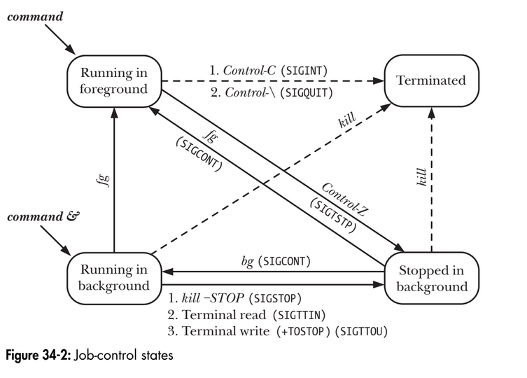

# Chapter 34: Process groups, sessions and job control
## 34.1. Overview
A process group is a set of one or more processes sharing the same process group identifier (PGID). A proces group has a process group leader, which is the process that creates the group leader, which is the process that creates the group and whose process ID becomes the proces group ID of the group. A new process inherits its parent's process group ID.  
A session is a collection of process groups. A process's membership is determined by its session identifier (SID). A session leader is the process that creates a new session and whose process ID becomes the session ID. A new process inherits its parent's session ID.  
All of the processes in a session share a single controlling terminal. The controlling terminal is establishes when the sesion leader first opens a terminal device.  
At any point in time, one of the process groups in a session is the foreground process group for the terminal, and the others are background process groups. Only processes in the foreground process group can read input from the controlling terminal. When the user types one of the signal-generating terminal characters on the controlling terminal, a signal is sent to all members of the foreground process group.  
As a sequence of establishing the connection to the controlling terminal, the session leader becomes the controlling process for the terminal. The principle significance of being the controlling process is that the kernel sends this process a SIGHUP signal if a terminal disconnect occurs.  
By inspecting the Linux-specific /proc/PID/stat files, we can determine the process group ID and session ID of any process. We can also determine the device ID of the process's controlling terminal and the process ID of the controlling process for that terminal.  
The main use of sessions and process groups is for shell job control. For an interactive login, the controlling terminal is the one on which the user logs in. The login shell becomes the session leader and the controlling process for the terminal, and is also made the sole member of its own process group. Each command or pipeline of commands started from the shell results in the creation of one or more processes and the shell places all of these proceses in a new process group. A command or pipeline is created as a background process group if it is terminated with an ampersand (&). Otherwise, it becomes the foreground process group. All processes created during the login session are part of the same session.  
In a windowing environment, the controlling terminal is a pseudoterminal, and there is a seperate session for each terminal window, with the window's startup shell being the session leader and controlling proess for ther terminal.
<p align="center">

</p>

```
$ echo $$ // Display the PID of the shell
400
$ find / 2> /dev/null | wc -l & // Create 2 processes in background group
[1] 659
$ sort < longlist | uniq -c  // Create 2 processes in foreground group
```

## 34.2. Process groups
Each process has a numeric process group ID that defines the process group to which it belongs. A process can obtain its process group ID using getpgrp().
```
#include <unistd.h>
pid_t getpgrp(void);
Always successfully returns process group ID of calling process.
```
If the value returned by getpgrp() matches the caller's process ID, this process is the leader of its process group.  
The setpgid() system call changes the process group of the process whose process ID is pid to the value specified in pgid.
```
#include <unistd.h>
int setpgid(pid_t pid, pid_t pgid);
Returns 0 on success, or -1 on error.
```
If the pid and gpid arguments specify the same process (gpid is 0 or matches the process ID of the process specified by pid), then a new process group is created, and the specified process is made the leader of the new group. If the two arguments specify different values, then setpgid() is being used to move a process between process groups.  
Several restrictions apply when calling setpgid():
- The pid argument may specify only the calling process or one of its children. Violation of this rule results in the error ESRCH.
- When moving a process between groups, the calling process and the process specified by pid, as well as the target process group, must all be part of the same session. Violation of this rule results in the error EPERM.
- A process may not change the process group ID of one of its children after that child has performed an exec().

**Using setpgid() in a job-control shell**  
The requirements of a login shell:
- All of the processes in a job (i.e., a command or a pipeline) must be placed in a single process group. (We can see the desired result by looking at the two process groups created by bash in Figure 34-1.) This step permits the shell to use killpg() (or, equivalently, kill() with a negative pid argument) to simultaneously
send job-control signals to all of the members of the process group. Naturally, this step must be carried out before any job-control signals are sent.
- Each of the child processes must be transferred to the process group before it execs a program, since the program itself is ignorant of manipulations of the process group ID.

Therefore, job-control shells are programmed so that the parent and the child process both call setpgid() to change the child’s process group ID to the same value immediately after a fork(), and the parent ignores any occurrence of the EACCES error on the setpgid() call. In other words, in a job-control shell, we’ll find code something like that shown below.

```
pid_t childPid;
pid_t pipelinePgid; /* PGID to which processes in a pipeline are to be assigned */

/* Other code */
childPid = fork();
switch (childPid) {
case -1: /* fork() failed */

/* Handle error */
case 0: /* Child */
if (setpgid(0, pipelinePgid) == -1)
/* Handle error */
/* Child carries on to exec the required program */
default: /* Parent (shell) */

if (setpgid(childPid, pipelinePgid) == -1 && errno != EACCES)
/* Handle error */
/* Parent carries on to do other things */
}
```

## 34.3. Sessions
The getsid() system call returns the session ID of the process specified by pid.
```
#define _XOPEN_SOURCE 500
#include <unistd.h>

pid_t getsid(pid_t pid);
Returns session ID of specified process, or (pid_t) -1 on error.
```
If pid is specified as 0, getsid() returns the session ID of the calling process. If the calling process is not a process group leader, setsid() creates a new session:
```
#include <unistd.h>
pid_t setsid(void);
Returns session ID of new session, or pid_t -1 on error.
```
The setsid() system call creates a new session as follows:
- The calling process becomes the leader of a new session, and is made theleader of a new process group within that session. The calling process’s process group ID and session ID are set to the same value as its process ID.
- The calling process has no controlling terminal. Any previously existing connection to a controlling terminal is broken.

Listing 34-2 demonstrates the use of setsid() to create a new session. To check that it no
longer has a controlling terminal, this program attempts to open the special file /dev/
tty (described in the next section). When we run this program, we see the following:

```
$ ps -p $$ -o 'pid pgid sid command' $$ is PID of shell
PID PGID SID COMMAND
12243 12243 12243 bash PID, PGID, and SID of shell
$ ./t_setsid
$ PID=12352, PGID=12352, SID=12352
ERROR [ENXIO Device not configured] open /dev/tty
```

```
Creating a new session
#define _XOPEN_SOURCE 500
#include <unistd.h>
#include <fcntl.h>
#include "tlpi_hdr.h"
int
main(int argc, char *argv[])
{
    if (fork() != 0) /* Exit if parent, or on error */
        _exit(EXIT_SUCCESS);
    if (setsid() == -1)
        errExit("setsid");
    printf("PID=%ld, PGID=%ld, SID=%ld\n", (long) getpid(),
    (long) getpgrp(), (long) getsid(0));
    if (open("/dev/tty", O_RDWR) == -1)
        errExit("open /dev/tty");
    exit(EXIT_SUCCESS);
}
```

## 34.4. Controlling terminals and controlling processes
All of the processes in a session may have a (single) controling terminal. A terminal may be the controlling terminal for at most one session. The controlling terminal is inherited by the child of a fork() and preserved across an exec().  
When a session leader opens a controlling terminal, it simultaneously becomes
the controlling process for the terminal. If a terminal disconnect subsequently
occurs, the kernel sends the controlling process a SIGHUP signal to inform it of this
event.  
If a process has a controlling terminal, opening the special file /dev/tty obtains a file descriptor for that terminal. This is useful if standard input and output are redirected, and a program wants to ensure that it is communicating with the controlling terminal. For example, the getpass() function described in Section 8.5 opens /dev/tty for this purpose. If the process doesn’t have a controlling terminal, opening /dev/tty fails with the error ENXIO.

**Removing a process's association with the controlling terminal**  
The ioctl(fd, TIOCNOTTY) operation can be used to remove a process's association with its controlling terminal, specified via the file descriptor fd. After this call, attempts to open /dev/tty will fail. If the calling process is the controlling process for the terminal, then as for the termination of the controlling process, the following steps occur:
1. All processes in the session lose their association with the controlling terminal.
2. The controlling terminal loses its association with the session, and can therefore be acquired as the controlling process by another session leader.
3. The kernel sends a SIGHUP signal (and a SIGCONT signal) to all members of the foreground process group, to inform them of the loss of the controlling terminal.

Obtaining a pathname that refers to the controlling terminal: ctermid()  
The ctermid() function returns a pathname referring to the controlling terminal.
```
#include <stdio.h>

char *ctermid(char **ttyname);
Return pointer to string containing pathanme of controlling terminal, or NULL if pathname could not be determined.
```
The ctermid() function returns the controlling terminal’s pathname in two different ways: via the function result and via the buffer pointed to by ttyname.  
If ttyname is not NULL, then it should be a buffer of at least L_ctermid bytes, and the pathname is copied into this array. In this case, the function return value is also a pointer to this buffer. If ttyname is NULL, ctermid() returns a pointer to a statically allocated buffer containing the pathname. When ttyname is NULL, ctermid() is not reentrant.  
On Linux and other UNIX implementations, ctermid() typically yields the string /dev/tty. The purpose of this function is to ease portability to non-UNIX systems.

## 34.5. Foreground and background process groups
The foreground process group is the only process group that can freely read and write on the controlling terminal. When one of the signal-generating terminal characters is typed on the controlling terminal, the terminal driver delivers the corresponding signal to the members of the foreground process group.  
The tcgetpgrp() and tcsetpgrp() function respectively retrieve and cahnge the process group of a terminal. These functions are used primarily by job-control shells.
```
#include <unistd.h>

pid_t tcgetpgrp(int fd);
Returns process group ID of terminal's foreground process group, or -1 on error.

int tcsetpgrp(int fd, pid_t pgid);
```

## 34.6. The SIGHUP signal
When a controlling process loses its terminal connection, the kernel sends it a SIGHUP signal to inform it of this fact. The default action of SIGHUP is to terminate a process. If the controlling process instead handles or ignores this signal, then further attemps to read from the terminal return end-of-file.

### 34.6.1. Handling of SIGHUP by the shell
In a login session, the shell is normally the controlling process for the terminal.
Most shells are programmed so that, when run interactively, they establish a handler
for SIGHUP. This handler terminates the shell, but beforehand sends a SIGHUP signal
to each of the process groups (both foreground and background) created by the
shell. (The SIGHUP signal may be followed by a SIGCONT signal, depending on the shell
and whether or not the job is currently stopped.) How the processes in these
groups respond to SIGHUP is application-dependent; if no special action is taken,they are terminated by default.
We can use the program in Listing 34-3 to demonstrate that when the shell receives

SIGHUP, it in turn sends SIGHUP to the jobs it has created. The main task of this pro-
gram is to create a child process, and then have both the parent and the child pause to catch SIGHUP and display a message if it is received. If the program is given an
optional command-line argument (which may be any string), the child places itself
in a different process group (within the same session). This is useful to show that the shell doesn’t send SIGHUP to a process group that it did not create, even if it is in the same session as the shell. (Since the final for loop of the program loops forever,
this program uses alarm() to establish a timer to deliver SIGALRM. The arrival of an
unhandled SIGALRM signal guarantees process termination, if the process is not other-
wise terminated.)

Catching SIGHUP signal:
```
#define _XOPEN_SOURCE 500
#include <unistd.h>
#include <signal.h>
#include "tlpi_hdr.h"
static void
handler(int sig)
{
}

int
main(int argc, char *argv[])
{
    pid_t childPid;
    struct sigaction sa;
    setbuf(stdout, NULL); /* Make stdout unbuffered */

    sigemptyset(&sa.sa_mask);

    sa.sa_flags = 0;
    sa.sa_handler = handler;
    if (sigaction(SIGHUP, &sa, NULL) == -1)
        errExit("sigaction");

    childPid = fork();
    if (childPid == -1)
        errExit("fork");
    if (childPid == 0 && argc > 1)
        if (setpgid(0, 0) == -1) /* Move to new process group */
            errExit("setpgid");
    printf("PID=%ld; PPID=%ld; PGID=%ld; SID=%ld\n", (long) getpid(), (long) getppid(), (long) getpgrp(), (long) getsid(0));

    alarm(60); /* An unhandled SIGALRM ensures this process will die if nothing else terminates it */

    for(;;) { /* Wait for signals */
        pause();
        printf("%ld: caught SIGHUP\n", (long) getpid());
    }
}
```

```
$ echo $$ PID of shell is ID of session
5533
$ ./catch_SIGHUP > samegroup.log 2>&1 &
$ ./catch_SIGHUP x > diffgroup.log 2>&1
```

When we look at samegroup.log, we see that it contains the following output,
indicating that both members of this process group were signaled by the shell:
```
$ cat samegroup.log
PID=5612; PPID=5611; PGID=5611; SID=5533 Child
PID=5611; PPID=5533; PGID=5611; SID=5533 Parent
5611: caught SIGHUP
5612: caught SIGHUP
```

When we examine diffgroup.log, we find the following output, indicating that when the
shell received SIGHUP, it did not send a signal to the process group that it did not create:
```
$ cat diffgroup.log
PID=5614; PPID=5613; PGID=5614; SID=5533 Child
PID=5613; PPID=5533; PGID=5613; SID=5533 Parent
5613: caught SIGHUP Parent was signaled, but not child
```

### 34.6.2. SIGHUP and termination of the controlling process
We can use the program in Listing 34-4 to demonstrate that termination of the con-
trolling process causes a SIGHUP signal to be sent to all members of the terminal’s foreground process group. This program creates one child process for each of its
command-line arguments w. If the corresponding command-line argument is the
letter d, then the child process places itself in its own (different) process group e; otherwise, the child remains in the same process group as its parent. (We use the
letter s to specify the latter action, although any letter other than d can be used.)
Each child then establishes a handler for SIGHUP r. To ensure that they terminate if
no event occurs that would otherwise terminate them, the parent and the children
both call alarm() to set a timer that delivers a SIGALRM signal after 60 seconds t.
Finally, all processes (including the parent) print out their process ID and process group ID y and then loop waiting for signals to arrive u. When a signal is deliv-
ered, the handler prints the process ID of the process and signal number q.

Catching SIGHUP when a terminal disconnect occurs:
```
#define _GNU_SOURCE /* Get strsignal() declaration from <string.h> */
#include <string.h>
#include <signal.h>
#include "tlpi_hdr.h"

static void /* Handler for SIGHUP */
handler(int sig)
{
    printf("PID %ld: caught signal %2d (%s)\n", (long) getpid(),
    sig, strsignal(sig));
    /* UNSAFE (see Section 21.1.2) */
}

int
main(int argc, char *argv[])
{
    pid_t parentPid, childPid;
    int j;
    struct sigaction sa;

    if (argc < 2 || strcmp(argv[1], "--help") == 0)
        usageErr("%s {d|s}... [ > sig.log 2>&1 ]\n", argv[0]);

    setbuf(stdout, NULL); /* Make stdout unbuffered */

    parentPid = getpid();
    printf("PID of parent process is: %ld\n", (long) parentPid);
    printf("Foreground process group ID is: %ld\n", (long) tcgetpgrp(STDIN_FILENO));
    for (j = 1; j < argc; j++) { /* Create child processes */
        childPid = fork();
        if (childPid == -1)
            errExit("fork");

        if (childPid == 0) { /* If child... */
            if (argv[j][0] == 'd') /* 'd' --> to different pgrp */
                if (setpgid(0, 0) == -1)
                    errExit("setpgid");
            sigemptyset(&sa.sa_mask);
            sa.sa_flags = 0;
            sa.sa_handler = handler;
            if (sigaction(SIGHUP, &sa, NULL) == -1)
                errExit("sigaction");
            break; /* Child exits loop */
}
}

/* All processes fall through to here */
    alarm(60); /* Ensure each process eventually terminates */

    printf("PID=%ld PGID=%ld\n", (long) getpid(), (long) getpgrp());
    for (;;)
        pause(); /* Wait for signals */
}
```

```
$ exec ./disc_SIGHUP d s s > sig.log 2>&1
```

The exec command is a shell built-in command that causes the shell to do an exec(),replacing itself with the named program. Since the shell was the controlling pro-
cess for the terminal, our program is now the controlling process and will receive SIGHUP when the terminal window is closed. After closing the terminal window, we
find the following lines in the file sig.log:
```
PID of parent process is: 12733
Foreground process group ID is: 12733
PID=12755 PGID=12755 First child is in a different process group
PID=12756 PGID=12733 Remaining children are in same PG as parent
PID=12757 PGID=12733
PID=12733 PGID=12733 This is the parent process
PID 12756: caught signal 1 (Hangup)
PID 12757: caught signal 1 (Hangup)
```
Closing the terminal window caused SIGHUP to be sent to the controlling process
(the parent), which terminated as a result. We see that the two children that were in
the same process group as the parent (i.e., the foreground process group for the
terminal) also both received SIGHUP. However, the child that was in a separate (background) process group did not receive this signal.

## 34.7. Job control
Job control is a feature that first appeared around 1980 in the C shell on BSD. Job
control permits a shell user to simultaneously execute multiple commands (jobs), one in the foreground and the others in the background. Jobs can be stopped and
resumed, and moved between the foreground and background, as described in the
following paragraphs.

### 34.7.1. Using job control with the shell
When we enter a command terminated by an ampersand (&), it is run as a back-
ground job, as illustrated by the following examples:
```
$ grep -r SIGHUP /usr/src/linux >x &
[1] 18932 // Job 1: process running grep has PID 18932
$ sleep 60 &
[2] 18934 // Job 2: process running sleep has PID 18934
```
Each job that is placed in the background is assigned a unique job number by the
shell. This job number is shown in square brackets after the job is started in the
background, and also when the job is manipulated or monitored by various job-
control commands. The number following the job number is the process ID of the
 process created to execute the command, or, in the case of a pipeline, the process
ID of the last process in the pipeline. In the commands described in the following
paragraphs, jobs can be referred to using the notation %num, where num is the
number assigned to this job by the shell.

The jobs shell built-in command lists all background jobs:
```
$ jobs
[1]- Running grep -r SIGHUP /usr/src/linux >x &
[2]+ Running sleep 60 &
```
Sometimes it is necessary to move a background job into the foreground. This is done using the fg shell built-in command:
```
$ fg %1
grep -r SIGHUP /usr/src/linux >x
```
As demonstrated in this example, the shell redisplays a job’s command line whenever
the job is moved between the foreground and the background.  
When a job is running in the foreground, we can suspend it using the terminal suspend character (normally Control-Z), which sends the SIGTSTP signal to the termi-
nal’s foreground process group:
```
Type Control-Z
[1]+ Stopped grep -r SIGHUP /usr/src/linux >x
```
After we typed Control-Z, the shell displays the command that has been stopped in
the background. If desired, we can use the fg command to resume the job in the
foreground, or use the bg command to resume it in the background. In both cases,
the shell resumes the stopped job by sending it a SIGCONT signal.
```
$ bg %1
[1]+ grep -r SIGHUP /usr/src/linux >x &
```
We can stop a background job by sending it a SIGSTOP signal:
```
$ kill -STOP %1
[1]+ Stopped grep -r SIGHUP /usr/src/linux >x
$ jobs
[1]+ Stopped grep -r SIGHUP /usr/src/linux >x
[2]- Running sleep 60 &
$ bg %1 // Restart job in background
[1]+ grep -r SIGHUP /usr/src/linux >x &
```
When a background job eventually completes, the shell prints a message prior to
displaying the next shell prompt:
```
Press Enter to see a further shell prompt
[1]- Done grep -r SIGHUP /usr/src/linux >x
[2]+ Done sleep 60
$
```
Only processes in the foreground job may read from the controlling terminal. This
restriction prevents multiple jobs from competing for terminal input. If a back-
ground job tries to read from the terminal, it is sent a SIGTTIN signal. The default
action of SIGTTIN is to stop the job:
```
$ cat > x.txt &
[1] 18947
$
Press Enter once more in order to see job state changes displayed prior to next shell prompt
[1]+ Stopped cat >x.txt
$
```
The various states of a job under job control, as well as the shell commands and terminal characters (and the accompanying signals) used to move a job between these
states, are summarized in Figure 34-2. This figure also includes a notional
terminated state for a job. This state can be reached by sending various signals to the
job, including SIGINT and SIGQUIT, which can be generated from the keyboard.

<p align="center">

</p>

### 34.7.2. Implementing job control
Example program: demonstrating the operation of job control. The program in Listing 34-5 performs the following steps:
- On startup, the program installs a single handler for SIGINT, SIGTSTP, and SIGCONT.
The handler carries out the following steps:
– Display the foreground process group for the terminal q. To avoid multiple
identical lines of output, this is done only by the process group leader.
– Display the ID of the process, the process’s position in the pipeline, and
the signal received w.
– The handler must do some extra work if it catches SIGTSTP, since, when
caught, this signal doesn’t stop a process. So, to actually stop the process,
the handler raises the SIGSTOP signal e, which always stops a process. (We
refine this treatment of SIGTSTP in Section 34.7.3.)
- If the program is the initial process in the pipeline, it prints headings for the
output produced by all of the processes y. In order to test whether it is the initial
(or final) process in the pipeline, the program uses the isatty() function
(described in Section 62.10) to check whether its standard input (or output) is
a terminal t. If the specified file descriptor refers to a pipe, isatty() returns
false (0).
- The program builds a message to be passed to its successor in the pipeline. This message is an integer indicating the position of this process in the pipe-
line. Thus, for the initial process, the message contains the number 1. If the program is the initial process in the pipeline, the message is initialized to 0. If it is not the initial process in the pipeline, the program first reads this message from its predecessor u. The program increments the message value before
proceeding to the next steps i.
- Regardless of its position in the pipeline, the program displays a line containing its pipeline position, process ID, parent process ID, process group ID, and
session ID.
- Unless it is the last command in the pipeline, the program writes an integer
message for its successor in the pipeline a.
- Finally, the program loops forever, using pause() to wait for signals.

```
#define _GNU_SOURCE /* Get declaration of strsignal() from <string.h> */
#include <string.h>
#include <signal.h>
#include <fcntl.h>
#include "tlpi_hdr.h"
static int cmdNum; /* Our position in pipeline */

static void /* Handler for various signals */
handler(int sig)
{
    /* UNSAFE: This handler uses non-async-signal-safe functions
    (fprintf(), strsignal(); see Section 21.1.2) */

    if (getpid() == getpgrp()) /* If process group leader */
        fprintf(stderr, "Terminal FG process group: %ld\n", (long) tcgetpgrp(STDERR_FILENO));
    fprintf(stderr, "Process %ld (%d) received signal %d (%s)\n", (long) getpid(), cmdNum, sig, strsignal(sig));
    /* If we catch SIGTSTP, it won't actually stop us. Therefore we raise SIGSTOP so we actually get stopped. */

    if (sig == SIGTSTP)
        raise(SIGSTOP);
    }
int main(int argc, char *argv[])
{
    struct sigaction sa;
    sigemptyset(&sa.sa_mask);
    sa.sa_flags = SA_RESTART;
    sa.sa_handler = handler;

    if (sigaction(SIGINT, &sa, NULL) == -1)
        errExit("sigaction");
    if (sigaction(SIGTSTP, &sa, NULL) == -1)
        errExit("sigaction");
    if (sigaction(SIGCONT, &sa, NULL) == -1)
        errExit("sigaction");
    /* If stdin is a terminal, this is the first process in pipeline:
    print a heading and initialize message to be sent down pipe */

    if (isatty(STDIN_FILENO)) {
        fprintf(stderr, "Terminal FG process group: %ld\n", (long) tcgetpgrp(STDIN_FILENO));
        fprintf(stderr, "Command PID PPID PGRP SID\n");
        cmdNum = 0;
    } else { /* Not first in pipeline, so read message from pipe */
        if (read(STDIN_FILENO, &cmdNum, sizeof(cmdNum)) <= 0)
            fatal("read got EOF or error");
    }

    cmdNum++;
    fprintf(stderr, "%4d %5ld %5ld %5ld %5ld\n", cmdNum, (long) getpid(), (long) getppid(), (long) getpgrp(), (long) getsid(0));

    /* If not the last process, pass a message to the next process */

    if (!isatty(STDOUT_FILENO)) /* If not tty, then should be pipe */
        if (write(STDOUT_FILENO, &cmdNum, sizeof(cmdNum)) == -1)
            errMsg("write");
    for(;;) /* Wait for signals */
        pause();
}
```
The following shell session demonstrates the use of the program in Listing 34-5.
We begin by displaying the process ID of the shell (which is the session leader, and
the leader of a process group of which it is the sole member), and then create a
background job containing two processes:
```
$ echo $$ Show PID of the shell
1204
$ ./job_mon | ./job_mon & Start a job containing 2 processes
[1] 1227
Terminal FG process group: 1204
Command PID PPID PGRP SID
1 1226 1204 1226 1204
2 1227 1204 1226 1204
```
From the above output, we can see that the shell remains the foreground process
for the terminal. We can also see that the new job is in the same session as the shell
and that all of the processes are in the same process group. Looking at the process
IDs, we can see that the processes in the job were created in the same order as the
commands were given on the command line. (Most shells do things this way, but
some shell implementations create the processes in a different order.) We continue, creating a second background job consisting of three processes:
```
$ ./job_mon | ./job_mon | ./job_mon &
[2] 1230
Terminal FG process group: 1204
Command PID PPID PGRP SID
1 1228 1204 1228 1204
2 1229 1204 1228 1204
3 1230 1204 1228 1204
```
We see that the shell is still the foreground process group for the terminal. We also see that the processes for the new job are in the same session as the shell, but are in a different process group from the first job. Now we bring the second job into the foreground and send it a SIGINT signal:
```
$ fg
./job_mon | ./job_mon | ./job_mon
Type Control-C to generate SIGINT (signal 2)
Process 1230 (3) received signal 2 (Interrupt)
Process 1229 (2) received signal 2 (Interrupt)
Terminal FG process group: 1228
Process 1228 (1) received signal 2 (Interrupt)
```
From the above output, we see that the SIGINT signal was delivered to all of the
processes in the foreground process group. We also see that this job is now the
foreground process group for the terminal. Next, we send a SIGTSTP signal to the job:
```
Type Control-Z to generate SIGTSTP (signal 20 on Linux/x86-32).
Process 1230 (3) received signal 20 (Stopped)
Process 1229 (2) received signal 20 (Stopped)
Terminal FG process group: 1228
Process 1228 (1) received signal 20 (Stopped)
[2]+ Stopped ./job_mon | ./job_mon | ./job_mon
```
Now all members of the process group are stopped. The output indicates that pro-
cess group 1228 was the foreground job. However, after this job was stopped, the
shell became the foreground process group, although we can’t tell this from the
output.
We then proceed by restarting the job using the bg command, which delivers a
SIGCONT signal to the processes in the job:

```
$ bg Resume job in background
[2]+ ./job_mon | ./job_mon | ./job_mon &
Process 1230 (3) received signal 18 (Continued)
Process 1229 (2) received signal 18 (Continued)
Terminal FG process group: 1204 The shell is in the foreground
Process 1228 (1) received signal 18 (Continued)
$ kill %1 %2 We’ve finished: clean up
[1]- Terminated ./job_mon | ./job_mon
[2]+ Terminated ./job_mon | ./job_mon | ./job_mon
```

Dưới đây là tổng hợp chi tiết về **Job Control (Quản lý tác vụ)** trong các hệ điều hành Unix/Linux:

---

### **1. WHAT - Job Control là gì?**

**Job Control** là một tính năng của các Shell trong hệ điều hành Unix/Linux (như Bash, Zsh) cho phép người dùng quản lý, điều khiển đồng thời nhiều tác vụ (Jobs/Processes) trong cùng một phiên làm việc (terminal session).

* **Khái niệm Job:** Một "Job" là một lệnh hoặc chuỗi lệnh (pipeline) do người dùng khởi chạy từ Shell. Một Job có thể bao gồm một hoặc nhiều tiến trình (Processes) nằm trong cùng một **Process Group** (Nhóm tiến trình).
* **Các trạng thái của một Job:**
* **Foreground (Tiền cảnh):** Job đang chạy trực tiếp và chiếm quyền tương tác với bàn phím/màn hình Terminal. Tại một thời điểm, chỉ có *duy nhất 1 Job* chạy ở Foreground.
* **Background (Hậu cảnh):** Job đang chạy ngầm bên dưới mà không chiếm quyền điều khiển Terminal, giải phóng dòng lệnh để người dùng tiếp tục nhập các lệnh khác.
* **Stopped / Suspended (Tạm dừng):** Job tạm thời bị đóng đóng băng trạng thái thực thi và chờ tín hiệu để tiếp tục.


---

### **2. WHY - Tại sao cần sử dụng Job Control?**

Trong thực tế quản trị hệ thống và phát triển phần mềm, Job Control mang lại những lợi ích quan trọng:

* **Tối ưu hóa năng suất làm việc:** Cho phép thực hiện nhiều công việc cùng lúc (Multitasking) trên một cửa sổ Terminal duy nhất mà không cần phải mở quá nhiều cửa sổ hoặc kết nối SSH mới.
* **Xử lý các tác vụ mất nhiều thời gian:** Khi cần chạy các lệnh tốn thời gian (như compile code, tải file dung lượng lớn, sao lưu dữ liệu), người dùng có thể đẩy tác vụ đó xuống Background để tiếp tục công việc khác.
* **Linh hoạt điều khiển tiến trình:** Cho phép chủ động tạm dừng (pause), khôi phục (resume) hoặc hủy bỏ (kill) bất kỳ tác vụ nào đang chạy mà không làm mất trạng thái công việc.
* **Cơ chế Pipeline & Grouping:** Giúp hệ điều hành gom nhóm các tiến trình liên kết với nhau qua đường ống (ví dụ: `cmd1 | cmd2 | cmd3`) để quản lý và gửi tín hiệu điều khiển đồng bộ tới toàn bộ nhóm.

---

### **3. HOW - Cơ chế hoạt động và cách sử dụng**

#### **A. Phía người dùng (Các phím tắt & Lệnh phổ biến)**

| Thao tác / Lệnh | Chức năng |
| --- | --- |
| **`Ctrl + C`** | Gửi tín hiệu `SIGINT` để ngắt/hủy hoàn toàn Job đang chạy ở Foreground. |
| **`Ctrl + Z`** | Gửi tín hiệu `SIGTSTP` để tạm dừng (Stop) Job ở Foreground và đẩy nó xuống Background. |
| **`command &`** | Thêm dấu `&` vào cuối lệnh để khởi chạy Job ngay từ đầu ở trạng thái Background. |
| **`jobs`** | Liệt kê danh sách tất cả các Job hiện có trong phiên Shell cùng với **Job ID** (ví dụ: `[1]`, `[2]`). |
| **`fg %job_id`** | Chuyển một Job từ Background/Stopped lên **Foreground** để tiếp tục tương tác. |
| **`bg %job_id`** | Đưa một Job đang bị Stopped tiếp tục chạy ngầm dưới **Background** (gửi tín hiệu `SIGCONT`). |
| **`kill %job_id`** | Gửi tín hiệu dừng/diệt một Job cụ thể. |

---

#### **B. Phía Hệ điều hành / Kernel (Cơ chế hoạt động bên trong)**

Sự phối hợp giữa Kernel và Shell để thực hiện Job Control dựa trên 3 trụ cột chính:

1. **Process Group & Session Management:**
* Mỗi Job được gán một **Process Group ID (PGRP)**. Khi người dùng chạy một lệnh (hoặc một pipeline), Kernel gom tất cả các tiến trình của lệnh đó vào chung một PGRP với tiến trình đầu tiên làm *Process Group Leader*.


2. **Terminal Foreground Process Group Control:**
* Terminal giữ thông tin về PGRP nào đang là Foreground thông qua hàm `tcsetpgrp()`.
* Chỉ có tiến trình thuộc Foreground PGRP mới có quyền đọc dữ liệu từ bàn phím (`STDIN`). Nếu một tiến trình ở Background cố gắng đọc từ `STDIN`, Kernel sẽ tự động gửi tín hiệu **`SIGTTIN`** để tạm dừng tiến trình đó lại.


3. **Cơ chế Tín hiệu (Signals Handling):**
* **`SIGTSTP` / `SIGSTOP`:** Làm tạm dừng tiến trình.
* **`SIGCONT`:** Khôi phục tiến trình tiếp tục chạy.
* **`SIGINT`:** Chấm dứt tiến trình.
* Shell sử dụng hàm `waitpid()` với cờ `WUNTRACED` hoặc `WCONTINUED` để theo dõi chính xác sự thay đổi trạng thái của các tiến trình con và cập nhật danh sách `jobs` cho người dùng.