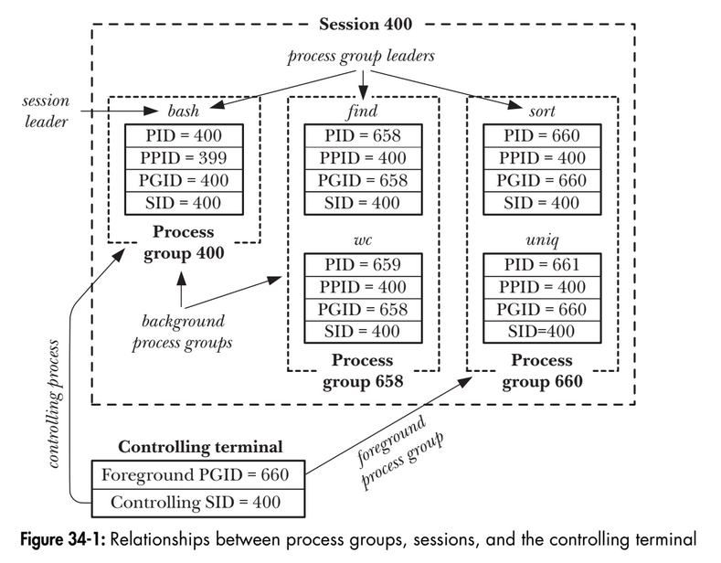

# Chapter 34: Process groups, sessions and job control
## 34.1. Overview
A process group is a set of one or more processes sharing the same process group identifier (PGID). A proces group has a process group leader, which is the process that creates the group leader, which is the process that creates the group and whose process ID becomes the proces group ID of the group. A new process inherits its parent's process group ID.  
A session is a collection of process groups. A process's membership is determined by its session identifier (SID). A session leader is the process that creates a new session and whose process ID becomes the session ID. A new process inherits its parent's session ID.
All of the processes in a session share a single controlling terminal. The controlling terminal is establishes when the sesion leader first opens a terminal device.  
At any point in time, one of the process groups in a session is the foreground process group for the terminal, and the others are background process groups. Only processes in the foreground process group can read input from the controlling terminal. When the user types one of the signal-generating terminal characters on the controlling terminal, a signal is sent to all members of the foreground process group.  
As a sequence of establishing the connection to the controlling terminal, the session leader becomes the controlling process for the terminal. The principle significance of being the controlling process is that the kernel sends this process a SIGHUP signal if a terminal disconnect occurs.  
By inspecting the Linux-specific /proc/PID/stat files, we can determine the process group ID and session ID of any process. We can also determine the device ID of the process's controlling terminal and the process ID of the controlling process for that terminal.  
The main use of sessions and process groups is for shell job control. For an interactive login, the controlling terminal is the one on which the user logs in. The login shell becomes the session leader and the controlling process for the terminal, and is also made the sole member of its own process group. Each command or pipeline of commands started from the shell results in the creation of one or more processes and the shell places all of these proceses in a new process group. A command or pipeline is created as a background process group if it is terminated with an ampersand (&). Otherwise, it becomes the foreground process group. All processes created during the login session are part of the same session.  
In a windowing environment, the controlling terminal is a pseudoterminal, and there is a seperate session for each terminal window, with the window's startup shell being the session leader and controlling proess for ther terminal.
<p align="center">

</p>

```
$ echo $$ // Display the PID of the shell
400
$ find / 2> /dev/null | wc -l & // Create 2 processes in background group
[1] 659
$ sort < longlist | uniq -c  // Create 2 processes in foreground group
```

## 34.2. Process groups
Each process has a numeric process group ID that defines the process group to which it belongs. A process can obtain its process group ID using getpgrp().
```
#include <unistd.h>
pid_t getpgrp(void);
Always successfully returns process group ID of calling process.
```
if the value returned by getpgrp() matches the caller's process ID, this process is the leader of its process group.  
The setpgid() system call changes the process group of the process whose process ID is pid to the value specified in pgid.
```
#include <unistd.h>
int setpgid(pid_t pid, pid_t pgid);
Returns 0 on success, or -1 on error.

```