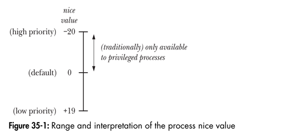

# Chapter 35: Process priorities and scheduling
## 35.1. Process priorities (Nice values) 
The nice value allows a process to indirectly influence the kernel's scheduling algorithm. Each process has a nice value in the range -20 (high priority) to +19 (low priority), the fault is 0.

<p align="center">

</p>

**Effect of the nice value**  
The nice value acts as weighting factor that causes the kernel scheduler  to favor processes with high priorities.

**Retrieving and modifying priorities**  
The getpriority() and setpriority() system calls allow a process to retrieve and change its own nice value or that of another process:
```
#include <sys/resource.h>

int getpriority(int which, id_t who);
    Returns (possibly negative) nice value of specified process on success, or -1 on error.

int setpriority(int which, id_t who, int prio);
    Returns 0 on success, or -1 on error.
```
Both system calls take the arguments which and who, identifying the process(es) whose priority is to be retrieved or modified. The which argument determines how who is interpreted. This argument takes one of the following values:
```
PIRO_PROCESS: Operate on the process whose process ID equals who. If who is 0, use the caller's process ID.

PRIO_PGRP: Operate on all of the member of the process group whose process group ID equals who. If who is 0, use the caller's process group.

PRIO_USER: Operate on all processes whose real user ID euqals who. If who is 0, use the caller's real user ID.
```
The getpriority() system call returns the nice value of the process specified by which and who. If multiple processes match the criteria specified (which may occur if which is PRIO_PGRP or PRIO_USER), the nthe nice value of the process with the highest priority is returned. Since getpriority() may legittimately return a value of -1 on successful call, we must test for an error by setting errno to 0 prior to the call, and then checking for a -1 return status and a nonzero errno value after the system call.  
The setpriority() system call sets the nice value of the processes specified by which and who to the value specified in prio. 