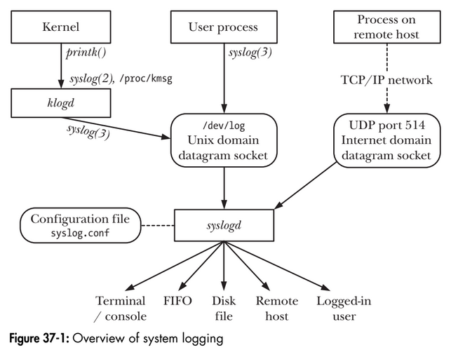
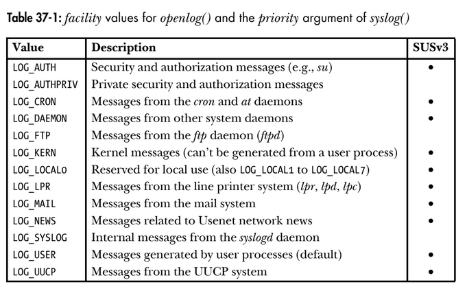
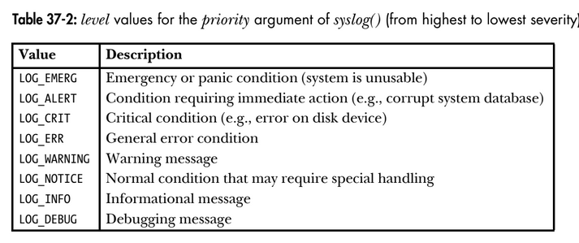

# Chapter 37: Daemons
## 37.1. Overview
A daemon is a process with the following characteristics:
- It is long-lived. Often, a daemon is created at system startup and runs until the system is shut down.
- It runs in the background and has no controlling terminal. 
Daemons are written to carry out specific tasks, as illustrated by the following examples:
- cron: a daemon that executes commands at a scheduled time.
- sshd: the secure daemon, which permits login from remote hosts using a secure communications protocol.
- httpd: the HTTP server daemon (Apache), which serves web pages.
- inetd: the Internet superserver daemon, which listen for incoming network connections on specified TCP/IP ports and launches appropriate server programs to handle these connections.  
It is a convention that daemons have names ending with the letter d.

## 37.2. Creating a Deamon
To become a daemon, a program performs the following steps:
1. Perform a fork(), after which the parent exits and the child continues. This step is done for two reasons:
- Assuming the daemon was started from the command line, the parent's termination is noticed by the shell, which then displays another prompt and leaves the child to continue in the background.
- The child process is guaranteed not to be a process group leader, since it inherited its process group ID from its parent and obtained its own nique process ID, which differs from the inherited process group ID. 

2. The child process calls setsid() (Section 34.3) to start a new session and free
itself of any association with a controlling terminal.

3. If the daemon never opens any terminal devices thereafter, then we don’t need
to worry about the daemon reacquiring a controlling terminal. If the daemon
might later open a terminal device, then we must take steps to ensure that the
device does not become the controlling terminal. We can do this in two ways:
- Specify the O_NOCTTY flag on any open() that may apply to a terminal device.
- Alternatively, and more simply, perform a second fork() after the setsid()
call, and again have the parent exit and the (grand)child continue. This
ensures that the child is not the session leader, and thus, according to the
System V conventions for the acquisition of a controlling terminal (which
Linux follows), the process can never reacquire a controlling terminal
(Section 34.4).

4. Clear the process umask (Section 15.4.6), to ensure that, when the daemon creates files and directories, they have the requested permissions.

5. Change the process’s current working directory, typically to the root directory(/). This is necessary because a daemon usually runs until system shutdown; if the daemon’s current working directory is on a file system other than the one containing /, then that file system can’t be unmounted (Section 14.8.2). Alternatively, the daemon can change its working directory to a location where it does its job or a location defined in its configuration file, as long as we know that the file system containing this directory never needs to be unmounted. For
example, cron places itself in /var/spool/cron.

6. Close all open file descriptors that the daemon has inherited from its parent. (A daemon may need to keep certain inherited file descriptors open, so this step is optional, or open to variation.) This is done for a variety of reasons.
Since the daemon has lost its controlling terminal and is running in the back-
ground, it makes no sense for the daemon to keep file descriptors 0, 1, and 2 open if these refer to the terminal. Furthermore, we can’t unmount any file sys-
tems on which the long-lived daemon holds files open. And, as usual, we should close unused open file descriptors because file descriptors are a finite resource.

7. After having closed file descriptors 0, 1, and 2, a daemon normally opens /dev/null and uses dup2() (or similar) to make all those descriptors refer to this device. This is done for two reasons:
- It ensures that if the daemon calls library functions that perform I/O on these descriptors, those functions won’t unexpectedly fail.
- It prevents the possibility that the daemon later opens a file using descriptor 1 or 2, which is then written to—and thus corrupted—by a library function that expects to treat these descriptors as standard output and standard error.

The becomeDaeomon() function takes a bit-mask argument, flags, that allows the caller to selectively inhibit some of the steps, as described in the comments in the following program:

```
#include <syslog.h>

int becomeDaemon(int flags);
Return 0 on success, or -1 on error.

```

```
become_daemon.h

#ifndef BECOME_DAEMON_H /* Prevent double inclusion */
#define BECOME_DAEMON_H

/* Bit-mask values for 'flags' argument of becomeDaemon() */

#define BD_NO_CHDIR 01 /* Don't chdir("/") */
#define BD_NO_CLOSE_FILES 02 /* Don't close all open files */

#define BD_NO_REOPEN_STD_FDS 04 /* Don't reopen stdin, stdout, and stderr to /dev/null */

#define BD_NO_UMASK0 010 /* Don't do a umask(0) */

#define BD_MAX_CLOSE 8192 /* Maximum file descriptors to close if sysconf(_SC_OPEN_MAX) is indeterminate */
int becomeDaemon(int flags);

#endif
```

The implementation of the becomeDaemon() functions:
```
#include <sys/stat.h>
#include <fcntl.h>
#include "become_daemon.h"
#include "tlpi_hdr.h"
int /* Returns 0 on success, -1 on error */
becomeDaemon(int flags)
{
    int maxfd, fd;
    switch (fork()) { /* Become background process */
    case -1: return -1;
    case 0: break; /* Child falls through... */
    default: _exit(EXIT_SUCCESS); /* while parent terminates */
    }

    if (setsid() == -1) /* Become leader of new session */
        return -1;

    switch (fork()) { /* Ensure we are not session leader */
    case -1: return -1;
    case 0: break;
    default: _exit(EXIT_SUCCESS);
    }

    if (!(flags & BD_NO_UMASK0))
        umask(0); /* Clear file mode creation mask */
    if (!(flags & BD_NO_CHDIR))
        chdir("/"); /* Change to root directory */
    if (!(flags & BD_NO_CLOSE_FILES)) { /* Close all open files */
        maxfd = sysconf(_SC_OPEN_MAX);
        if (maxfd == -1) /* Limit is indeterminate... */
            maxfd = BD_MAX_CLOSE; /* so take a guess */
        for (fd = 0; fd < maxfd; fd++)
            close(fd);
    }

    if (!(flags & BD_NO_REOPEN_STD_FDS)) {
        close(STDIN_FILENO); /* Reopen standard fd's to /dev/null */
        fd = open("/dev/null", O_RDWR);
        if (fd != STDIN_FILENO) /* 'fd' should be 0 */
            return -1;
        if (dup2(STDIN_FILENO, STDOUT_FILENO) != STDOUT_FILENO)
            return -1;
        if (dup2(STDIN_FILENO, STDERR_FILENO) != STDERR_FILENO)
            return -1;
    }
    return 0;
}
```

Output:
```
$ ./test_become_daemon
$ ps -C test_become_daemon -o "pid ppid pgid sid tty command"
PID PPID PGID SID TT COMMAND
24731 1 24730 24730 ? ./test_become_daemon
```

Logic of becomeDaemon() function:
```
[Tiến trình C ban đầu]
           │
           ├─► 1. Gọi fork() ──────────► Tiến trình cha thoát (Exit), tiến trình con chạy tiếp
           │
           ├─► 2. Gọi setsid() ────────► Tạo Session mới, tách khỏi Terminal điều khiển (TTY)
           │
           ├─► 3. Gọi chdir("/") ──────► Chuyển Working Directory về Root (tránh khóa USB/Folder)
           │
           ├─► 4. Gọi umask(0) ────────► Reset lại File Mode Creation Mask
           │
           ├─► 5. Đóng stdin/stdout/stderr ──► Chuyển hướng IO sang syslog (tránh in ra Terminal)
           │
           ▼
 [Hạ cánh thành DAEMON hoàn chỉnh chạy ngầm]
```

## 37.3. Guidelines for writing daemons

## 37.4. Using SIGHUP to reinitialize a daemon

## 37.5. Logging messages and errors using syslog

### 37.5.1. Overview
The syslog facility provides a single, centralized logging facility that can be used to log messages by all applications on the system. An overview of this facility is provided in the following figure:
<p align="center">

</p>

The syslog facility has two principle components:
- the syslogd daemon
- the syslog() library function

The input source of syslog is:
1. Cục bộ (Local): Qua Unix domain socket tại /dev/log (trên một số hệ thống UNIX khác là /var/run/log).
2. Mạng (Network - nếu bật): Qua Internet domain socket (UDP port 514) để nhận log từ các máy khác trong mạng TCP/IP.

syslog message attributes:
1. Facility: Xác định loại chương trình/dịch vụ tạo ra tin nhắn log.
2. Level: Xác định mức độ nghiêm trọng (độ ưu tiên) của tin nhắn.

Routing and destination:
syslogd đọc tập tin cấu hình /etc/syslog.conf để phân tích Facility và Level, sau đó chuyển tin nhắn log đến các điểm đích tương ứng:
- Terminal / Virtual console.

- File trên đĩa (Disk file).

- Đường ống FIFO.

- Một hoặc tất cả người dùng đang đăng nhập.

- Tiến trình syslogd trên một máy khác qua mạng TCP/IP (giúp tập trung hóa log từ nhiều máy về một nơi để dễ quản lý).

Một tin nhắn có thể được gửi tới nhiều điểm đích (hoặc không gửi đi đâu), và các kết hợp Facility/Level khác nhau có thể được hướng tới các file/console khác nhau.  

The syslog() library function can be used by any process to log a message. An alternative source of messages placed on /dev/log is the Kernel Log daemon, klogd, which collects kernel log messages (produced by kernel using its printk() function).

### 37.5.2. The syslog API
**Establishing a connection to the system log**
The openlog() function optionally establishes a connection to the system log facility and sets defaults that apply to subsequent syslog() calls:
```
#include <syslog.h>

void openlog(const char *ident, int log_options, int facility);
```
The indent argument is a pointer to a string that is included in each message written by syslog(). Typically, the program name is specified for this argument.  
The log_options argument to openlog() is a bit mask created by ORing together any of the following constants:
- LOG_CONS: If there is an error sending to the system logger, then write the message to
the system console (/dev/console).
- LOG_NDELAY: Open the connection to the logging system (i.e., the underlying UNIX domain socket, /dev/log) immediately. By default (LOG_ODELAY), the connec-
tion is opened only when (and if) the first message is logged with syslog(). The O_NDELAY flag is useful in programs that need to precisely control when the
file descriptor for /dev/log is allocated. One example of such a requirement
is in a program that calls chroot(). After a chroot() call, the /dev/log pathname
will no longer be visible, and so an openlog() call specifying LOG_NDELAY must be
performed before the chroot(). The tftpd (Trivial File Transfer) daemon is an
example of a program that uses LOG_NDELAY for this purpose.

- LOG_NOWAIT: Don’t wait() for any child process that may have been created in order to log the message. On implementations that create a child process for log-
ging messages, LOG_NOWAIT is needed if the caller is also creating and waiting
for children, so that syslog() doesn’t attempt to wait for a child that has
already been reaped by the caller. On Linux, LOG_NOWAIT has no effect, since
no child processes are created when logging a message.

- LOG_ODELAY: This flag is the converse of LOG_NDELAY—connecting to the logging system is delayed until the first message is logged. This is the default, and need not
be specified.

- LOG_PERROR: Write messages to standard error as well as to the system log. Typically, daemon processes close standard error or redirect it to /dev/null, in which
case, LOG_PERROR is not useful.

- LOG_PID: Log the caller’s process ID with each message. Employing LOG_PID in a server
that forks multiple children allows us to distinguish which process logged a
particular message.

The facility argument to openlog() specifies the default facility value to be used in
subsequent calls to syslog(). Possible values for this argument are listed for the following table:
<p align="center">

</p>

**Logging a message**
To write a log message, we call syslog().
```
#include <syslog.h>

void syslog(int priority, const char *format);
```
The priority argument is created by ORing together a facility value and a level value. 
- facility (Nguồn phát sinh log): Chỉ ra nhóm / loại ứng dụng tạo ra tin nhắn log. Nếu bỏ qua không truyền facility, giá trị mặc định sẽ lấy từ hàm openlog() đã gọi trước đó, hoặc mặc định là LOG_USER (nếu chưa từng gọi openlog()). Các giá trị facility phổ biến: LOG_USER (mặc định), LOG_DAEMON (các dịch vụ ngầm), LOG_AUTH (xác thực/bảo mật), LOG_LOCAL0 đến LOG_LOCAL7 (dành riêng cho người dùng tự định nghĩa),...
- level (Mức độ nghiêm trọng): Chỉ ra độ ưu tiên/mức độ nghiêm trọng của tin nhắn log, xếp từ cao xuống thấp:
<p align="center">

</p>
The remaining arguments to syslog() are a format string and corresponding arguments in the manner of printf(). One difference from printf() is that the format string doesn't need to include a terminating newline character. Also, the format string may include the 2-character sequence %m, which is replaced by the error string correspond-
ing to the current value of errno (i.e., the equivalent of strerror(errno)).

The following code demonstrates the use of openlog() and syslog():
```
openlog(argv[0], LOG_PID | LOG_CONS | LOG_NOWAIT, LOG_LOCALO);
syslog(LOG_ERROR, "Bad argument: %s", argv[1]);
syslog(LOG_USER | LOG_INFO, "Exiting");
```
Since no facility is specified in the first syslog() call, the default specified by openlog() (LOG_LOCAL0) is used. In the second syslog() call, explicitly specifying LOG_USER overrides the default established by openlog().
It is an error to use syslog() to write some user-supplied string in the following
manner:
```
syslog(priority, user_supplied_string);
```
The above code should be replaced by:
```
syslog(priority, "%s", user_supplied_string);
```

**Closing the log**
When we have finished logging, we can call closelog() to deallocate the file descrip-
tor used for the /dev/log socket.
```
#include <syslog.h>
void closelog(void);
```

**Filtering log messages**
The setlogmask() function sets a mask that filters the messages written by syslog().
```
#include <syslog.h>

int setlogmask(int mask_priority);
Returns previous log priority mask
```
Any message whose level is not included in the current mask setting is discarded.  
The macro LOG_MASK() converts the level values to bit values suitable for passing to setlogmask(). For example, to discard all messages except those with priorities of LOG_ERR and above, we could make the following call:
```
setlogmask(LOG_MASK(LOG_EMERG) | LOG_MASK(LOG_ALERT) | LOG_MASK(LOG_CRIT) | LOG_MASK(LOG_ERR));
```

### 37.5.3. The /etc/syslog.conf file
The /etc/syslog.conf configuration file controls the operation of the syslogd daemon.

Mỗi dòng quy tắc trong file /etc/syslog.conf bao gồm 2 phần chính được phân cách bởi khoảng trắng (whitespace/tab):
```
Selector Action
```
- Selector (Trình chọn): Kết hợp giữa Facility và Level (ví dụ: auth.notice). Nó dùng để lọc ra những tin nhắn log nào sẽ áp dụng quy tắc này.
- Action (Hành động): Chỉ định nơi gửi tin nhắn log đến (Console, file, người dùng, hoặc máy chủ khác trên mạng) sau khi tin nhắn đó khớp với Selector.
- Lưu ý về cấp độ (Level): Trong syslogd, khi bạn chỉ định một level, nó có nghĩa là chọn mức đó hoặc các mức cao hơn (ngHIÊM TRỌNG HƠN). Ví dụ: err sẽ bao gồm cả err, crit, alert, và emerg.

Example 1: *.err /dev/tty10
- Selector (*.err): Ký tự đại diện * đại diện cho tất cả các facility (auth, daemon, mail, user,...). err có nghĩa là lấy tất cả các log có mức độ từ LOG_ERR trở lên (err, crit, alert, emerg).
- Action (/dev/tty10): Gửi các tin nhắn log khớp điều kiện ra màn hình virtual console thứ 10 (/dev/tty10).

Example 2: auth.notice root
- Selector (auth.notice): Lọc các log thuộc facility LOG_AUTH (xác thực/bảo mật) có mức độ từ LOG_NOTICE trở lên.
- Action (root): Gửi trực tiếp tin nhắn log tới màn hình Terminal của tài khoản root nếu root đang đăng nhập.
- Tác dụng thực tế: Giúp quản trị viên root thấy ngay lập tức các thông báo khi có ai đó gõ sai mật khẩu khi dùng lệnh su hoặc đăng nhập thất bại.

Mỗi khi bạn chỉnh sửa xong tập tin /etc/syslog.conf, tiến trình syslogd sẽ không tự động áp dụng ngay. Bạn phải gửi tín hiệu SIGHUP để yêu cầu daemon nạp lại tập tin cấu hình:
```
$ killall -HUP syslogd
```