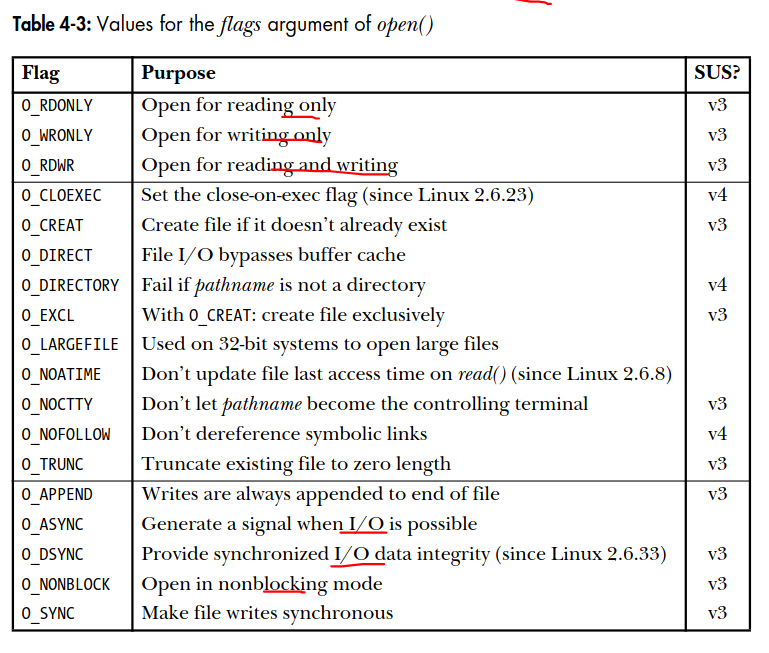

# Chapter 4: File I/O: the universal I/O model
## 4.3. Opening a file
The open() system call either opens an existing file or creates and opens a new file.
```
#include <sys/stat.h>
#include <fcntl.h>

int open(const char* pathname, int flags, ... /*mode_t mode*/);
Return file descriptor on success, or -1 on error
```
The file to be opened is identified by the pathname argument.  
**File descriptor number returned by open()**

### 4.3.1. The open() flags argument
The full set of contants that can be bit-wise ORed (|) in flags. 

<figure align="center">
    
</figure>

### 4.3.2. Errors from open()
If an error occurs while trying to open the file, open() returns -1, and errno identifies the cause of the error. The following are some possible errors that can occur:
- EACCES
- EISDIR
- EMFILE
- ENFILE
- ENOENT
- EROFS
- ETXTBSY

### 4.3.3. The create() system call
The create() system call was used to create and open a new file.
```
#include <fcntl.h>
int creat(const char* pathname, mode_t mode);
REturns file descriptor, or -1 on error.
```