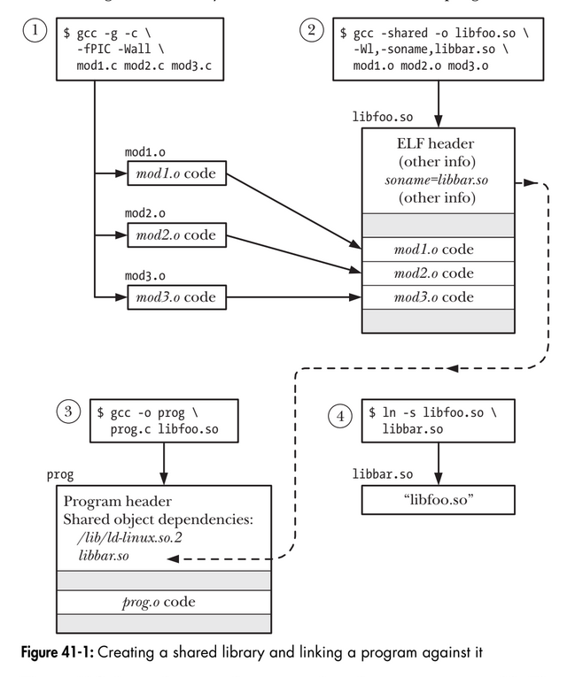
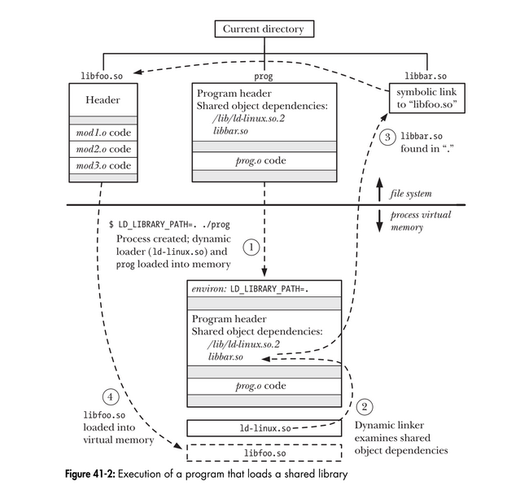
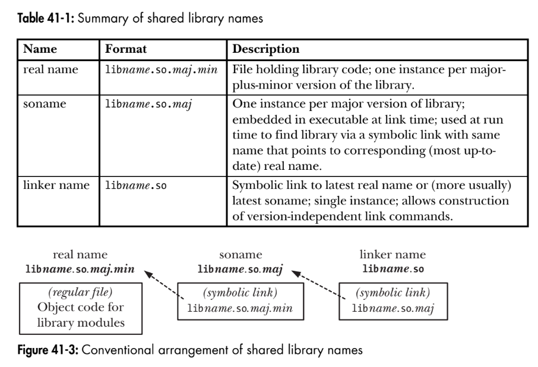

# Chapter 41: Fundamentals of shared library
## 41.1. Object libraries
Object libraries are of two types: static and shared. Shared libraries are the more modern type of object libray, and provide several advantages over static libraries.

## 41.2. Static libraries
Static libraries, also known as archies, were the first type of library to be provided on UNIX systems. They provide the following benefits:
- We can place a set of commonly used object files into a single library file that
can then be used to build multiple executables, without needing to recompile
the original source files when building each application.
- Link commands become simpler. Instead of listing a long series of object files
on the link command line, we specify just the name of the static library. The
linker knows how to search the static library and extract the objects required by
the executable.

** `Creating and maintaining a static library ` **
In effect, a static library is simply a file holding copies of all of the objects file added to it. By conventin, static libraries have names of the form libname.a.   
A static library is created and maintained using the ar(1) command, which has the following general form:
```
$ ar options archieve object-file...
```
The options argument consists of a series of letters, one of which is the operation code, while the others are modifiers that influence the way the operation is carried out. Some commonly used operation codes are the following:
- r (replace): Insert an object file into the archive, replacing any previous object
file of the same name. This is the standard method for creating and updating
an archive. Thus, we might build an archive with the following commands:
```
$ cc -g -c mod1.c mod2.c mod3.c
$ ar r libdemo.a mod1.o mod2.o mod3.o
$ rm mod1.o mod2.o mod3.o
```
- t (table of contents): Display a table of contents of the archive. By default, this
lists just the names of the object files in the archive. By adding the v (verbose)
modifier, we additionally see all of the other attributes recorded in the archive
for each object file, as in the following example:
```
$ ar tv libdemo.a
rw-r--r-- 1000/100 1001016 Nov 15 12:26 2009 mod1.o
rw-r--r-- 1000/100 406668 Nov 15 12:21 2009 mod2.o
rw-r--r-- 1000/100 46672 Nov 15 12:21 2009 mod3.o
```
The additional attributes that we see for each object are, from left to right, its
permissions when it was added to the archive, its user ID and group ID, its size,
and the date and time when it was last modified.
- d (delete): Delete a named module from the archive, as in this example:
```
$ ar d libdemo.a mod3.o
```
**` Using a static library`**  
We can link a program against a static library in two ways. The first is to name the
static library as part of the link command, as in the following:
```
$ cc -g -c prog.c
$ cc -g -o prog prog.o libdemo.a
```
Alternatively, we can place the library in one of the standard directories searched
by the linker (e.g., /usr/lib), and then specify the library name (i.e., the filename of the library without the lib prefix and .a suffix) using the –l option:
```
$ cc -g -o prog prog.o -ldemo
```
If the library resides in a directory not normally searched by the linker, we can
specify that the linker should search this additional directory using the –L option:
```
$ cc -g -o prog prog.o -Lmylibdir -ldemo
```

## 41.3. Overview of shared libraries
When a program is built by linking against a static library (or, for that matter, without
using a library at all), the resulting executable file includes copies of all of the
object files that were linked into the program. Thus, when several different execut-
ables use the same object modules, each executable has its own copy of the object
modules. This redundancy of code has several disadvantages:
- Disk space is wasted storing multiple copies of the same object modules. Such
wastage can be considerable.
- If several different programs using the same modules are running at the same
time, then each holds separate copies of the object modules in virtual memory,
thus increasing the overall virtual memory demands on the system.
- If a change is required (perhaps a security or bug fix) to an object module in a
static library, then all executables using that module must be relinked in order
to incorporate the change. This disadvantage is further compounded by the
fact that the system administrator needs to be aware of which applications were
linked against the library.

Shared libraries were designed to address these shortcomings. The key idea of a
shared library is that a single copy of the object modules is shared by all programs
requiring the modules. The object modules are not copied into the linked executable;
instead, a single copy of the library is loaded into memory at run time, when the
first program requiring modules from the shared library is started. When other
programs using the same shared library are later executed, they use the copy of the
library that is already loaded into memory. The use of shared libraries means that
executable programs require less space on disk and (when running) in virtual memory.

## 41.4. Creating and using shared libraries - A first pass
### 41.4.1. Creating a shared library
To build a shared library, we perform the following steps:
```
$ gcc -g -c -fPIC -Wall mod1.c mod2.c mod3.c
$ gcc -g -shared -o libfoo.so mod1.o mod2.o mod3.o
```
The first of these commands creates the three object modules that are to be put into the library. The cc –shared
command creates a shared library containing the three object modules. Creating a shared libraries are compiler-dependent.  
Unlike static libraries, it is not possible to add or remove individual object modules from a previously built shared library. 

### 41.4.2. Position-independent code
The cc –fPIC option specifies that the compiler should generate position-independent code. This changes the way that the compiler generates code for operations such as accessing global, static, and external variables; accessing string constants; and taking the addresses of functions. These changes allow the code to be located at any virtual address at run time. This is necessary for shared libraries, since there is no way of knowing at link time where the shared library code will be located in memory.  
In order to determine whether an existing object file has been compiled with the –fPIC option, we can check for the presence of the name _GLOBAL_OFFSET_TABLE_ in the object file’s symbol table, using either of the following commands:

```
$ nm mod1.o | grep _GLOBAL_OFFSET_TABLE_
$ readelf -s mod1.o | grep _GLOBAL_OFFSET_TABLE_
```

### 41.4.3. Using a shared library
In order to use a shared library, two steps must occur that are not required for programs that use static libraries:
- Since the executable file no longer contains copies of the object files that it requires, it must have some mechanism for identifying the shared library that it needs at run time. This is done by embedding the name of the shared library inside the executable during the link phase. (In ELF parlance, the library dependency is recorded in a DT_NEEDED tag in the executable.) The list of all of a program’s shared library dependencies is referred to as its dynamic dependency list.
- At run time, there must be some mechanism for resolving the embedded library name—that is, for finding the shared library file corresponding to the name specified in the executable file—and then loading the library into memory, if it is not already present.

Embedding the name of the library inside the executable happens automatically when we link our program with a shared library:
```
$ gcc -g -Wall -o prog prog.c libfoo.so
```
If we now attempt to run our program, we receive the following error message:
```
$ ./prog
./prog: error in loading shared libraries: libfoo.so: cannot
open shared object file: No such file or directory
```

**`The LD_LIBRARY_PATH environment variable`**  
One way of informing the dynamic linker that a shared library resides in a nonstandard directory is to specify that directory as part of a colon-separated list of directories in the LD_LIBRARY_PATH environment variable. (Semicolons can also be used to separate the directories, in which case the list must be quoted to prevent the shell from interpreting the semicolons.) If LD_LIBRARY_PATH is defined, then the dynamic linker searches for the shared library in the directories it lists before looking in the standard library directories. (Later, we’ll see that a production application should never rely on LD_LIBRARY_PATH, but for now, this variable provides us with a simple way of getting started with shared libraries.) Thus, we can run our program with the following command:
```
$ LD_LIBRARY_PATH=. ./prog
Called mod1-x1
Called mod2-x2
```

### 41.4.4. The shared library soname
In the example presented so far, the name that was embedded in the executable and sought by the dynamic linker at run time was the actual name of the shared library file. This is referred to as the library’s real name. However, it is possible—in fact, usual—to create a shared library with a kind of alias, called a soname (the DT_SONAME tag in ELF parlance).

The first step in using a soname is to specify it when the shared library is created:
```
$ gcc -g -c -fPIC -Wall mod1.c mod2.c mod3.c
$ gcc -g -shared -Wl,-soname,libbar.so -o libfoo.so mod1.o mod2.o mod3.o
```
The –Wl,–soname,libbar.so option is an instruction to the linker to mark the shared library libfoo.so with the soname libbar.so. If we want to determine the soname of an existing shared library, we can use either of the following commands:  
```
$ objdump -p libfoo.so | grep SONAME
SONAME libbar.so
$ readelf -d libfoo.so | grep SONAME
0x0000000e (SONAME) Library soname: [libbar.so]
```
Having created a shared library with a soname, we then create the executable as usual:
```
$ gcc -g -Wall -o prog prog.c libfoo.so
```
However, this time, the linker detects that the library libfoo.so contains the soname libbar.so and embeds the latter name inside the executable. Now when we attempt to run the program, this is what we see:
```
$ LD_LIBRARY_PATH=. ./prog
prog: error in loading shared libraries: libbar.so: cannot open
shared object file: No such file or directory
```
The problem here is that the dynamic linker can’t find anything named libbar.so. When using a soname, one further step is required: we must create a symbolic link from the soname to the real name of the library. This symbolic link must be created in one of the directories searched by the dynamic linker. Thus, we could run our program as follows:
```
$ ln -s libfoo.so libbar.so // Create soname symbolic link in current directory
$ LD_LIBRARY_PATH=. ./prog
Called mod1-x1
Called mod2-x2
```

<p align="center">

</p>

To find out which shared libraries a process is currently using, we can list the
contents of the corresponding Linux-specific /proc/PID/maps file (Section 48.5).

<p align="center">

</p>

## 41.5. Usefule tools for working with shared libraries
** The ldd command**  
The ldd(1) (list dynamic dependencies) command displays the shared libraries that
a program (or a shared library) requires to run. Here’s an example:
```
$ ldd prog
libdemo.so.1 => /usr/lib/libdemo.so.1 (0x40019000)
libc.so.6 => /lib/tls/libc.so.6 (0x4017b000)
/lib/ld-linux.so.2 => /lib/ld-linux.so.2 (0x40000000)
```
The `ldd` command resolves each library reference (employing the same search con-
ventions as the dynamic linker) and displays the results in the following form:
```
library-name => resolves-to-path
```
For most ELF executables, ldd will list entries for at least ld-linux.so.2, the dynamic linker, and libc.so.6, the standard C library.

**The objdump and readelf commands**  
The `objdump` command can be used to obtain various information—including disas-
sembled binary machine code—from an executable file, compiled object, or shared
library. It can also be used to display information from the headers of the various
ELF sections of these files; in this usage, it resembles readelf, which displays similar
information, but in a different format. Sources of further information about objdump
and readelf are listed at the end of this chapter.

**The nm command**
The `nm` command lists the set of symbols defined within an object library or executable program. One use of this command is to find out which of several libraries defines a symbol. For example, to find out which library defines the crypt() function, we could do the following:
```
$ nm -A /usr/lib/lib*.so 2> /dev/null | grep ' crypt$'
/usr/lib/libcrypt.so:00007080 W crypt
```
The –A option to nm specifies that the library name should be listed at the start of
each line displaying a symbol. This is necessary because, by default, nm lists the
library name once, and then, on subsequent lines, all of the symbols it contains,
which isn’t useful for the kind of filtering shown in the above example. In addition,
we discard standard error output in order to hide error messages about files in for-
mats unrecognized by nm. From the above output, we can see that crypt() is defined
in the libcrypt library.

## 41.6. Shared library versions and naming convention
** Real names, sonames, and linker names**  
Each incompatible version of a shared library is distinguished by a unique major
version identifier, which forms part of its real name. By convention, the major version
identifier takes the form of a number that is sequentially incremented with each
incompatible release of the library. In addition to the major version identifier, the
real name also includes a minor version identifier, which distinguishes compatible
minor versions within the library major version. The real name employs the format
convention libname.so.major-id.minor-id.

Like the major version identifier, the minor version identifier can be any
string, but, by convention, it is either a number, or two numbers separated by a
dot, with the first number identifying the minor version, and the second number
indicating a patch level or revision number within the minor version. Some exam-
ples of real names of shared libraries are the following:
```
libdemo.so.1.0.1
libdemo.so.1.0.2 Minor version, compatible with version 1.0.1
libdemo.so.2.0.0 New major version, incompatible with version 1.*
libreadline.so.5.0
```
The soname of the shared library includes the same major version identifier as its
corresponding real library name, but excludes the minor version identifier. Thus,
the soname has the form libname.so.major-id.
Usually, the soname is created as a relative symbolic link in the directory that
contains the real name. The following are some examples of sonames, along with
the real names to which they might be symbolically linked:
```
libdemo.so.1 -> libdemo.so.1.0.2
libdemo.so.2 -> libdemo.so.2.0.0
libreadline.so.5 -> libreadline.so.5.0
```
For a particular major version of a shared library, there may be several library files distinguished by different minor version identifiers. Normally, the soname corresponding to each major library version points to the most recent minor version within the major version (as shown in the above examples for libdemo.so).

<p align="center">

</p>

**Creating a shared library using standard conventions**  
Putting all of the above information together, we now show how to build our demon-
stration library following the standard conventions. First, we create the object files:
```
$ gcc -g -c -fPIC -Wall mod1.c mod2.c mod3.c
```
Then we create the shared library with the real name libdemo.so.1.0.1 and the
soname libdemo.so.1.
```
$ gcc -g -shared -Wl,-soname,libdemo.so.1 -o libdemo.so.1.0.1 \
mod1.o mod2.o mod3.o
```
Next, we create appropriate symbolic links for the soname and linker name:
```
$ ln -s libdemo.so.1.0.1 libdemo.so.1
$ ln -s libdemo.so.1 libdemo.so
```
We can employ ls to verify the setup (with awk used to select the fields of interest):
```
$ ls -l libdemo.so* | awk '{print $1, $9, $10, $11}'
lrwxrwxrwx libdemo.so -> libdemo.so.1
lrwxrwxrwx libdemo.so.1 -> libdemo.so.1.0.1
-rwxr-xr-x libdemo.so.1.0.1
```
Then we can build our executable using the linker name (note that the link com-
mand makes no mention of version numbers), and run the program as usual:
```
$ gcc -g -Wall -o prog prog.c -L. -ldemo
$ LD_LIBRARY_PATH=. ./prog
Called mod1-x1
Called mod2-x2
```

## 41.7. Installing shared libraries
A shared library and its associated symbolic links are installed in one of a number of standard library directories, in particular, one of the following:
- /usr/lib, the directory in which most standard libraries are installed;
- /lib, the directory into which libraries required during system startup should
be installed (since, during system startup, /usr/lib may not be mounted yet);
- /usr/local/lib, the directory into which nonstandard or experimental libraries
should be installed (placing libraries in this directory is also useful if /usr/lib is
- network mount shared among multiple systems and we want to install a
library just for use on this system); or
- one of the directories listed in /etc/ld.so.conf (described shortly).

After installation, the symbolic links for the soname and linker name must be
created, usually as relative symbolic links in the same directory as the library file.
Thus, to install our demonstration library in /usr/lib (whose permissions only allow
updates by root), we would do the following:
```
$ su
Password:
# mv libdemo.so.1.0.1 /usr/lib
# cd /usr/lib
# ln -s libdemo.so.1.0.1 libdemo.so.1
# ln -s libdemo.so.1 libdemo.so
```
The last two lines in this shell session create the soname and linker name sym-
bolic links.

**`ldconfig`**  
The ldconfig(8) program addresses two potential problems with shared libraries:
- Shared libraries can reside in a variety of directories. If the dynamic linker
needed to search all of these directories in order to find a library, then loading
libraries could be very slow.
- As new versions of libraries are installed or old versions are removed, the
soname symbolic links may become out of date.

The ldconfig program solves these problems by performing two tasks:
1. It searches a standard set of directories and creates or updates a cache file,
/etc/ld.so.cache, to contain a list of the (latest minor versions of each of the)
major library versions in all of these directories. The dynamic linker in turn
uses this cache file when resolving library names at run time. To build the
cache, ldconfig searches the directories specified in the file /etc/ld.so.conf and
then /lib and /usr/lib. The /etc/ld.so.conf file consists of a list of directory
pathnames (these should be specified as absolute pathnames), separated by
newlines, spaces, tabs, commas, or colons. In some distributions, the directory
/usr/local/lib is included in this list. (If not, we may need to add it manually.)
The command ldconfig –p displays the current contents of /etc/ld.so.cache.
2. It examines the latest minor version (i.e., the version with the highest minor
number) of each major version of each library to find the embedded soname
and then creates (or updates) relative symbolic links for each soname in the
same directory.