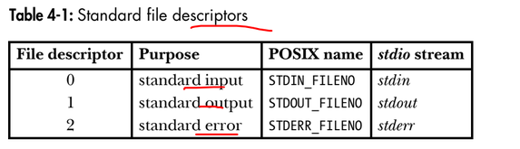
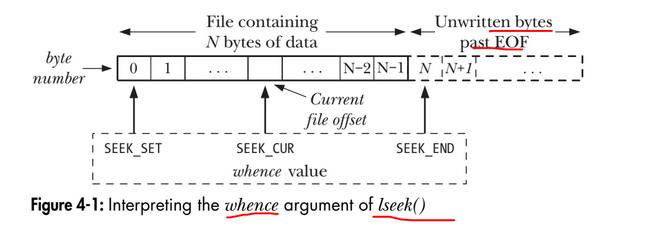

# Chapter 4: File I/O: the universal I/O model
## 4.1. Overview
All system calls for performing I/O refer to open files using a file descriptor, a (usually small) nonnegative integer. File descriptors are used to refer to all types of open files, including pipes, FIFOs, sockets, terminals, devices, and regular files.  
By convention, most programs expect to be able to use the three standard file descriptors listed in Table 4-1.
<figure align="center">
    
</figure>

The following are the four key system calls for performing file I/O (programming languages and software packages typically employ these calls only indirectly, via I/O libraries):
- fd = open(pathname, flags, mode) opens the file identified by pathname, returning a file descriptor used to refer to the open file in subsequent calls. If the file doesn’t exist, open() may create it, depending on the settings of the flags bitmask argument. The flags argument also specifies whether the file is to be opened for reading, writing, or both. The mode argument specifies the permissions to be placed on the file if it is created by this call. If the open() call is not being used to create a file, this argument is ignored and can be omitted.
- numread = read(fd, buffer, count) reads at most count bytes from the open file referred to by fd and stores them in buffer. The read() call returns the number of bytes actually read. If no further bytes could be read (i.e., end-of-file was encountered), read() returns 0.
- numwritten = write(fd, buffer, count) writes up to count bytes from buffer to the open file referred to by fd. The write() call returns the number of bytes actually written, which may be less than count.
- status = close(fd) is called after all I/O has been completed, in order to release the file descriptor fd and its associated kernel resources.

## 4.2. Universality of I/O
One of the distinguishing features of the UNIX I/O model is the concept of
universality of I/O. This means that the same four system calls—open(), read(), write(), and close()—are used to perform I/O on all types of files, including devices such as terminals.  
Example:
```
$ ./copy test test.old Copy a regular file
$ ./copy a.txt /dev/tty Copy a regular file to this terminal
$ ./copy /dev/tty b.txt Copy input from this terminal to a regular file
$ ./copy /dev/pts/16 /dev/tty Copy input from another terminal
```
## 4.3. Opening a file
The open() system call either opens an existing file or creates and opens a new file.
```
#include <sys/stat.h>
#include <fcntl.h>

int open(const char* pathname, int flags, ... /*mode_t mode*/);
Return file descriptor on success, or -1 on error
```
The file to be opened is identified by the pathname argument. The file to be opened is identified by the pathname argument. If pathname is a symbolic link, it is dereferenced. On success, open() returns a file descriptor that is used to refer to the file in subsequent system calls. If an error occurs, open() returns –1 and errno is set accordingly.

The flags argument is a bit mask that specifies the access mode for the file, using one of the constants shown in Table 4-2.

In the meantime, we’ll just note that the mode argument can be specified as a number (typically in octal) or, preferably, by ORing (|) together zero or more of the bit-mask constants listed in Table 15-4, on page 295.  

Example:
```
/* Open existing file for reading */
fd = open("startup", O_RDONLY);
if (fd == -1)
errExit("open");
/* Open new or existing file for reading and writing, truncating to zero
bytes; file permissions read+write for owner, nothing for all others */
fd = open("myfile", O_RDWR | O_CREAT | O_TRUNC, S_IRUSR | S_IWUSR);
if (fd == -1)
errExit("open");
/* Open new or existing file for writing; writes should always
append to end of file */
fd = open("w.log", O_WRONLY | O_CREAT | O_TRUNC | O_APPEND,
S_IRUSR | S_IWUSR);
if (fd == -1)
errExit("open");
```

**`File descriptor number returned by open()`**  
SUSv3 specifies that if open() succeeds, it is guaranteed to use the lowest-numbered unused file descriptor for the process.

### 4.3.1. The open() flags argument
The full set of contants that can be bit-wise ORed (|) in flags. 

<figure align="center">
    
</figure>

The constants in Table 4-3 are divided into the following groups:  
- File access mode flags: These are the O_RDONLY, O_WRONLY, and O_RDWR flags described
earlier. They can be retrieved using the fcntl() F_GETFL operation (Section 5.3).
- File creation flags: These are the flags shown in the second part of Table 4-3.
They control various aspects of the behavior of the open() call, as well as
options for subsequent I/O operations. These flags can’t be retrieved or
changed.
- Open file status flags: These are the remaining flags in Table 4-3. They can be
retrieved and modified using the fcntl() F_GETFL and F_SETFL operations (Sec-
tion 5.3). These flags are sometimes simply called the file status flags.


### 4.3.2. Errors from open()
If an error occurs while trying to open the file, open() returns -1, and errno identifies the cause of the error. The following are some possible errors that can occur:
- EACCES: The file permissions don’t allow the calling process to open the file in the
mode specified by flags. Alternatively, because of directory permissions,
the file could not be accessed, or the file did not exist and could not be
created.

- EISDIR: The specified file is a directory, and the caller attempted to open it for writ-
ing. This isn’t allowed. (On the other hand, there are occasions when it can
be useful to open a directory for reading. We consider an example in
Section 18.11.)
- EMFILE: The process resource limit on the number of open file descriptors has
been reached (RLIMIT_NOFILE, described in Section 36.3).
- ENFILE The system-wide limit on the number of open files has been reached.
- ENOENT: The specified file doesn’t exist, and O_CREAT was not specified, or O_CREAT
was specified, and one of the directories in pathname doesn’t exist or is a
symbolic link pointing to a nonexistent pathname (a dangling link).
- EROFS: The specified file is on a read-only file system and the caller tried to open it
for writing.
- ETXTBSY: The specified file is an executable file (a program) that is currently execut-
ing. It is not permitted to modify (i.e., open for writing) the executable file
associated with a running program. (We must first terminate the program
in order to be able to modify the executable file.)

### 4.3.3. The create() system call
The create() system call was used to create and open a new file.
```
#include <fcntl.h>
int creat(const char* pathname, mode_t mode);
REturns file descriptor, or -1 on error.
```
Calling creat() is equivalent to the following open() call:
```
fd = open(pathname, O_WRONLY | O_CREAT | O_TRUNC, mode);
```

## 4.4. Reading from a file: read()
The read() system call reads data from the open file referred to by the descriptor fd.
```
#include <unistd.h>
ssize_t read(int fd, void *buffer, size_t count);

Returns number of bytes read, 0 on EOF, or –1 on error
```
The count argument specifies the maximum number of bytes to read. (The size_t data type is an unsigned integer type.) The buffer argument supplies the address of the memory buffer into which the input data is to be placed. This buffer must be at least count bytes long.  
A successful call to read() returns the number of bytes actually read, or 0 if end-of-file is encountered. On error, the usual –1 is returned. The ssize_t data type is a signed integer type used to hold a byte count or a –1 error indication.
A call to read() may read less than the requested number of bytes. For a regular file, the probable reason for this is that we were close to the end of the file.  
When read() is applied to other types of files—such as pipes, FIFOs, sockets, or terminals—there are also various circumstances where it may read fewer bytes than requested. For example, by default, a read() from a terminal reads characters only up to the next newline (\n) character. We consider these cases when we cover other file types in subsequent chapters.  
Using read() to input a series of characters from, say, a terminal, we might expect the following code to work:
```
#define MAX_READ 20
char buffer[MAX_READ];

if (read(STDIN_FILENO, buffer, MAX_READ) == -1)
    errExit("read");
printf("The input data was: %s\n", buffer);
```
The output from this piece of code is likely to be strange, since it will probably include characters in addition to the string actually entered. This is because read() doesn’t place a terminating null byte at the end of the string that printf() is being asked to print. A moment’s reflection leads us to realize that this must be so, since read() can be used to read any sequence of bytes from a file. In some cases, this input might be text, but in other cases, the input might be binary integers or C structures in binary form. There is no way for read() to tell the difference, and so it can’t attend to the C convention of null terminating character strings. If a terminating null byte is required at the end of the input buffer, we must put it there explicitly:
```
char buffer[MAX_READ + 1];
ssize_t numRead;

numRead = read(STDIN_FILENO, buffer, MAX_READ);
if (numRead == -1)
    errExit("read");
buffer[numRead] = '\0';
printf("The input data was: %s\n", buffer);
```

## 4.5. Writing to a file: write()
The write() system call writes data to an open file.
```
#include <unistd.h>
ssize_t write(int fd, void *buffer, size_t count);

Returns number of bytes written, or –1 on error
```
The arguments to write() are similar to those for read(): buffer is the address of the data to be written; count is the number of bytes to write from buffer; and fd is a file descriptor referring to the file to which data is to be written.  

On success, write() returns the number of bytes actually written; this may be less than count. For a disk file, possible reasons for such a partial write are that the disk was filled or that the process resource limit on file sizes was reached. (The rele- vant limit is RLIMIT_FSIZE, described in Section 36.3.)  

When performing I/O on a disk file, a successful return from write() doesn’t guarantee that the data has been transferred to disk, because the kernel performs buffering of disk I/O in order to reduce disk activity and expedite write() calls. We consider the details in Chapter 13.

### 3.4.6. Closing a file: close()
The close() system call closes an open file descriptor, freeing it for subsequent reuse by the process. When a process terminates, all of its open file descriptors are auto-
matically closed.
```
#include <unistd.h>
int close(int fd);

Returns 0 on success, or –1 on error
```
Just like every other system call, a call to close() should be bracketed with error-checking code, such as the following:
```
if (close(fd) == -1)
    errExit("close");
```
This catches errors such as attempting to close an unopened file descriptor or close the same file descriptor twice, and catches error conditions that a specific file sys-
tem may diagnose during a close operation.

### 3.4.7. Changing the file offset: lseek()
For each open file, the kernel records a file offset, sometimes also called the read-write offset or pointer. This is the location in the file at which the next read() or write() will commence. The file offset is expressed as an ordinal byte position relative to the start of the file. The first byte of the file is at offset 0.  

The lseek() system call adjusts the file offset of the open file referred to by the file descriptor fd, according to the values specified in offset and whence.
```
#include <unistd.h>
off_t lseek(int fd, off_t offset, int whence);

Returns new file offset if successful, or –1 on error
```
The offset argument specifies a value in bytes. (The off_t data type is a signed integer type specified by SUSv3.) The whence argument indicates the base point from which offset is to be interpreted, and is one of the following values:
- SEEK_SET: The file offset is set offset bytes from the beginning of the file.
- SEEK_CUR: The file offset is adjusted by offset bytes relative to the current file offset.
- SEEK_END: The file offset is set to the size of the file plus offset. In other words, offset is interpreted with respect to the next byte after the last byte of the file.

<figure align="center">
    
</figure>

If whence is SEEK_CUR or SEEK_END, offset may be negative or positive; for SEEK_SET, offset must be nonnegative.  
The return value from a successful lseek() is the new file offset. The following
call retrieves the current location of the file offset without changing it:
```
curr = lseek(fd, 0, SEEK_CUR);
```
Here are some other examples of lseek() calls, along with comments indicating
where the file offset is moved to:
```
lseek(fd, 0, SEEK_SET); /* Start of file */
lseek(fd, 0, SEEK_END); /* Next byte after the end of the file */
lseek(fd, -1, SEEK_END); /* Last byte of file */
lseek(fd, -10, SEEK_CUR); /* Ten bytes prior to current location */
lseek(fd, 10000, SEEK_END); /* 10001 bytes past last byte of file */
```
Calling lseek() simply adjusts the kernel’s record of the file offset associated with a
file descriptor. It does not cause any physical device access.  

We can’t apply lseek() to all types of files. Applying lseek() to a pipe, FIFO,
socket, or terminal is not permitted; lseek() fails, with errno set to ESPIPE. On the
other hand, it is possible to apply lseek() to devices where it is sensible to do so. For
example, it is possible to seek to a specified location on a disk or tape device.