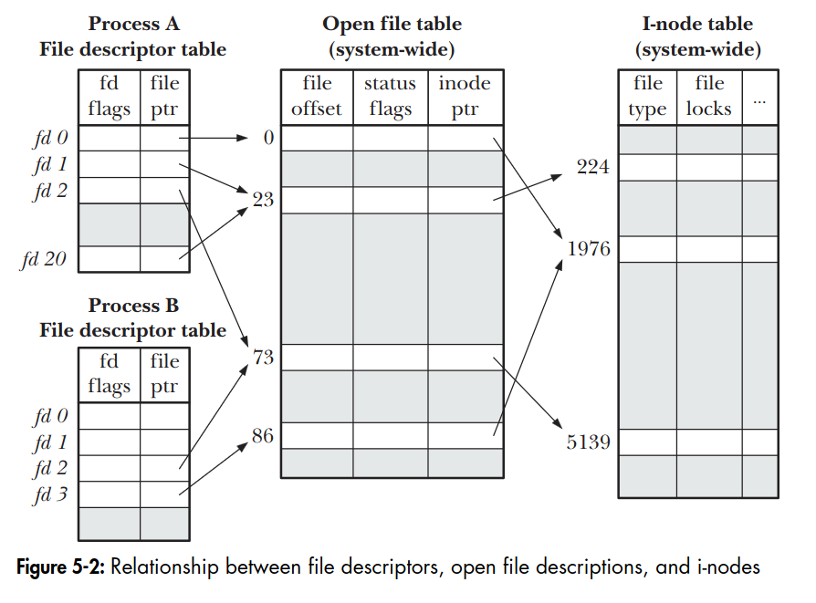

# Chapter 5: File I/O: Further details
## 5.4. Relationship between file descriptors and open files
It is possible and useful to have multiple descriptors (open in the same processs or in different process) referring to the same open file. 

3 data structures related to file descriptor:
- the per-process file descriptor table: Stores a process-specific list of file descriptors (integer indexes) that point to the corresponding open file structures in the system-wide table.
- the system-wide table of open file descriptions: Stores the active state of all open files across the entire system (such as the current file offset/position, file status flags, and the reference count of processes accessing them).
- the file system inode table: Stores a file's persistent metadata on disk (such as size, access permissions, owner, and locations of actual data blocks) regardless of whether the file is currently open.

The relationship between these 3 data structures is illustrated by:

In process A, descriptors 1 and 20 refer to the same open file description, this is a result of a call to dup(), dup2(), or fcntl().  
Descriptor 2 of A and descriptor 2 of B refer to a single open file description. This is a result of a call to fork().  
Descriptor 0 of process A and descriptor 3 of process B refer to different open file descriptions, but refer to the same i-node table entry - in other woeds, to the same file. This occurs because each process independently called open() for the same file (or a process opened the same file twice).