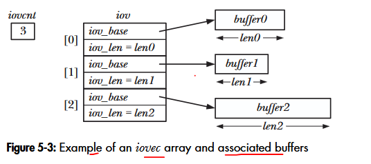

# Chapter 5: File I/O: Further details
## 5.4. Relationship between file descriptors and open files
It is possible and useful to have multiple descriptors (open in the same processs or in different process) referring to the same open file. 

3 data structures related to file descriptor:
- the per-process file descriptor table: Stores a process-specific list of file descriptors (integer indexes) that point to the corresponding open file structures in the system-wide table.
- the system-wide table of open file descriptions: Stores the active state of all open files across the entire system (such as the current file offset/position, file status flags, and the reference count of processes accessing them).
- the file system inode table: Stores a file's persistent metadata on disk (such as size, access permissions, owner, and locations of actual data blocks) regardless of whether the file is currently open.

The relationship between these 3 data structures is illustrated by:
<p align="center">

</p>

In process A, descriptors 1 and 20 refer to the same open file description, this is a result of a call to dup(), dup2(), or fcntl().  
Descriptor 2 of A and descriptor 2 of B refer to a single open file description. This is a result of a call to fork().  
Descriptor 0 of process A and descriptor 3 of process B refer to different open file descriptions, but refer to the same i-node table entry - in other woeds, to the same file. This occurs because each process independently called open() for the same file (or a process opened the same file twice).

## 5.5. Duplicating file descriptors
```
#include <unistd.h>
int dup(int oldfd);
Return (new) file descriptor on success, or -1 on error.
```
The dup() call takes oldfd, an open file descriptor, and return a new descriptor that refers to the same open file description. The new descriptor is guaranteed to be the lowest unused file descriptor.

-------------------------------------------------
```
#include <unistd.h>
int dup2(int oldfd, int newfd);
Return (new) file descriptor on success, or -1 on error.
```
The dup2() system call makes a duplicate of the file descriptor given in oldfd using the descriptor number supplied in newfd. If the file descriptor specified in newfd is already open, dup2() closes it first.
(Any error that occurs during this close is silently ignored), safer programming practice is to explicitly close() newfd if it is open before the call to dup2().

-------------------------------------------------
```
#include <fcntl.h>
newfd = fcntl(oldfd, F_DUPFD, startfd);
```
The fcntl() call with F_DUPFD flag make a duplicate of oldfd by using the lowest unused file descriptor greater than or equal to startfd.
This is useful if we want a guarantee that the new descriptor (newfd) falls in a certain range of values. 

-------------------------------------------------
```
#define _GNU_SOURCE
#include <unistd.h>
int dup3(int oldfd, int newfd, int flags);
```
The dup3() system call performs the same task as dup2(), but adds an additional argument, flags, that is a bit mask that modifies the behavior of the system call.
dup3() supports one flag, O_CLOEXEC which causes the kernel to enable the close-on-exec flag (FD_CLOEXEC) for the new file descriptor.

## 5.6. File I/O at a specified offset: pread() and pwrite()
The pread() and pwrite() system calls operate just like read() and write(), except that the file I/O is performed at the location specified by offsetl. The file offset is left unchanged by these calls.
```
#include <unistd.h>
ssize_t pread(int fd, void* buf, size_t count, off_t offset);
    Returns numnber of bytes read, 0 on EOF, or -1 on error.
ssize_t pwrite(int fd, const void *buf, size_t count, off_t offset);
    Returns number of bytes written, or -1 on error.
```
## 5.7. Scatter_Gather I/O: readv() and writev()
```
#include <sys/uio.h>

ssize_t readv(int fd, const struct iovec *iov, int iovcnt);
    Returns number of bytes read, 0 on EOF, or -1 on error
ssize_t writev(int fd, const struct iovec *iov, int iovcnt);
    Returns number of bytes written, or -1 on error
```
These fucntions transfer multiple buffers of data in a single system call. The set of buffers to be transferred is defined by the array iov. Count specifies the number of elements in iov. Each element of iov is a structure of the following form:
```
struct iovec {
    void* iov_base; // Start address of buffer
    size_t iov_len; // Number of bytes to transfer to/from buffer
}
```
<p align="center">

</p>

