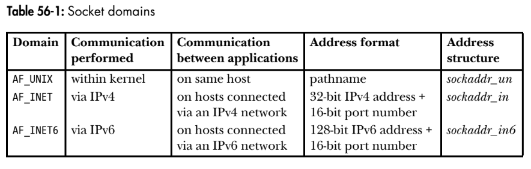
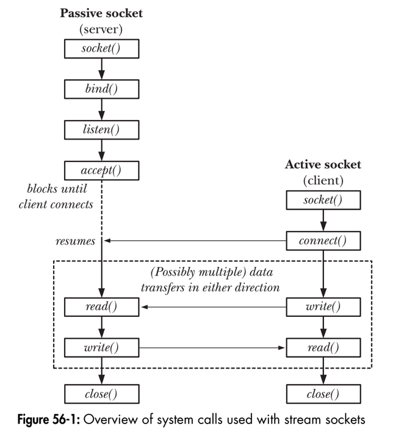
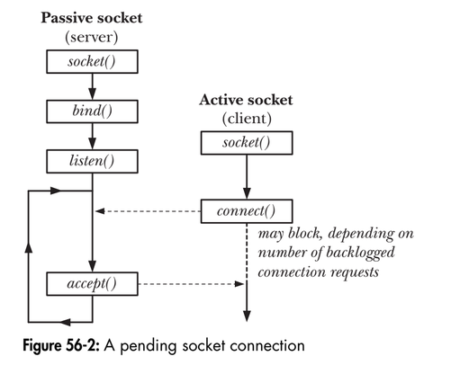
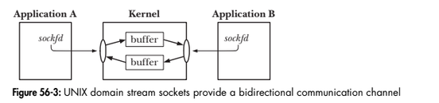
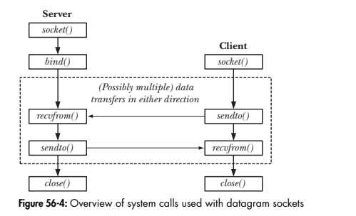

# Chapter 56: Sockets: Introduction
## 56.1. Overview
A socket is created using the socket() system call, which returns a file descriptor used to refer to the socket in subsequent system calls:
```
fd = socket(domain, type, protocol);
```
For all applications in this book, protocol is always specified as 0.
**`Communication domains`**  
Communication domain determines:
- the method of communication (ie.., the format of a socket "address")
- the range of communication(ie.., either betwwen applications on the same host or betwwen applications on different hosts connected via a network.)

Modern operation systems support at least the following domains:
- AF_UNIX: allow communication between applications on the same host.
- AF_INET: The IPv4 domain allows communication between applications running on hosts connected via IPv4 network.
- AF_INET6: The IPv6 domain allows communication between applications running on hosts connected via IPv6 network.
 
 The following table summarizes the characteristics of these socket domains:
<p align="center">

</p>
 
**`Socket types`**  
In the Internet domain, datagram sockets employ the User Datagram Protocol (UDP), and stream sockets (usually) employ the Transmission Control Protoccol (TCP). Instead of using the terms Internet domain datagram socket and Internet domain stream socket, we just use the term UDP socket and TCP socket, respectively.

**`Socket system calls`**  
- The socket() system call creates a new socket.
- The bind() system call binds a socket to an address. Usually, a server employs
this call to bind its socket to a well-known address so that clients can locate
the socket.
- The listen() system call allows a stream socket to accept incoming connections
from other sockets.

- The accept() system call accepts a connection from a peer application on a listening stream socket, and optionally returns the address of the peer socket.

- The connect() system call establishes a connection with another socket.

Socket I/O can be performed using the conventional read() and write() system calls, or using a range of socket-specific system calls (eg, send(), recv(), sendto(), recvfrom).

## 56.2. Creating a socket
The socket() system call creates a new socket:
```
#include <sys/socket.h>
int socket(int domain, int type, int protocol);
Returns file descriptor on success, or -1 on error.
```
The domain argument specifies the communication domain for the socket. The type argument specifies the socket type. This argument is usually specified as either SOCK_STREAM, to create a stream socket, or SOCK_DGRAM, to create a datagram socket.The protocol argument is always specified as 0 for the socket types we describe in
this book.

## 56.3. Binding a socket to an address
The bind() system call binds a socket to an address.
```
#include <sys/socket.h>

int bind(int sockfd, const struct sockaddr *addr, socklen_t addrlen);
Returns 0 on success, or -1 on error.
```
The sockfd argument is a file descriptor obtained from a previous call to socket(). The
addr argument is a pointer to a structure specifying the address to which this socket
is to be bound. The type of structure passed in this argument depends on the
socket domain. The addrlen argument specifies the size of the address structure.
The socklen_t data type used for the addrlen argument is an integer type specified
by SUSv3.  
Typically, we bind a server’s socket to a well-known address—that is, a fixed
address that is known in advance to client applications that need to communicate
with that server.

## 56.4. Generic socket address structures
The addr and addrlen arguments to bind() require some further explanation. Look-
ing at Table 56-1, we see that each socket domain uses a different address format.

For example, UNIX domain sockets use pathnames, while Internet domain sockets
use the combination of an IP address plus a port number. For each socket domain, a
different structure type is defined to store a socket address. However, because system
calls such as bind() are generic to all socket domains, they must be able to accept
address structures of any type. In order to permit this, the sockets API defines a
generic address structure, struct sockaddr. The only purpose for this type is to cast the
various domain-specific address structures to a single type for use as arguments in
the socket system calls. The sockaddr structure is typically defined as follows:
```
struct sockaddr {
sa_family_t sa_family; /* Address family (AF_* constant) */
char sa_data[14]; /* Socket address (size varies
according to socket domain) */
};
```
This structure serves as a template for all of the domain-specific address structures.
Each of these address structures begins with a family field corresponding to the
sa_family field of the sockaddr structure. (The sa_family_t data type is an integer type
specified in SUSv3.) The value in the family field is sufficient to determine the size
and format of the address stored in the remainder of the structure.

## 56.5. Stream sockets 
<p align="center">

</p>

The operation of stream sockets can be explained by analogy with the telephone
system:
1. The socket() system call, which creates a socket, is the equivalent of installing a
telephone. In order for two applications to communicate, each of them must
create a socket.

2. Communication via a stream socket is analogous to a telephone call. One applica-
tion must connect its socket to another application’s socket before communication can take place. Two sockets are connected as follows:
- a) One application calls bind() in order to bind the socket to a well-known
address, and then calls listen() to notify the kernel of its willingness to
accept incoming connections. This step is analogous to having a known
telephone number and ensuring that our telephone is turned on so that
people can call us.

- b) The other application establishes the connection by calling connect(), specifying the address of the socket to which the connection is to be made. This is analogous to dialing someone’s telephone number.
- c) The application that called listen() then accepts the connection using accept().
This is analogous to picking up the telephone when it rings. If the accept() is
performed before the peer application calls connect(), then the accept() blocks
(“waiting by the telephone”).

3. Once a connection has been established, data can be transmitted in both direc-
tions between the applications (analogous to a two-way telephone conversation) until one of them closes the connection using close(). Communication is performed using the conventional read() and write() system calls or via a number of socket-
specific system calls (such as send() and recv()) that provide additional functionality.

### 56.5.1. Listening for incoming connections
The listen() system call marks the stream socket referred to by the file descriptor sockfd as passive. The socket will subsequently be used to accept connections from other (active) sockets.
```
#include <sys/socket.h>
int listen(int sockfd, int backlog);
Return 0 on success, or -1 on error
```
We can't apply listen() to a connected socket - that is, a socket on which a connect() has been successfully performed or a socket returned by a call to accept().
<p align="center">

</p>
The backlog argument allows us to limit the number of pending connections. 

### 56.5.2. Accepting a connection
The accept() system call accepts an incoming connection on the listening stream socket reffered to by the file descriptor sockfd. If  there are no pending connections when accrpt() is called, the call blocks until a connection request arrives. 
```
#include <sys/socket.h>
int accept(int sockfd, struct sockadd *addr, socklen_t *addr);
Return file descriptor on success, or -1 on error
```
accept() creates a new socket, and it is this new socket that is connected to the peer socket that performed the connect(). A file descriptor for the connected socket is returned as the function result of the accept() call. The listening (sockfd) remains open, and can be used to accept further connections. A typical server application creates one listening socket, binds it to a well-known address, and then handles all client request by accepting connections via that socket.  

The remaining arguments to accept() return the address of the peer socket. The addr argument points to a structure that is used to return the socket address. The type of this argument depends on the socket domain(as for bind()).
The addrlen argument is a value-result argument. It points to an integer that,
prior to the call, must be initialized to the size of the buffer pointed to by addr, so
that the kernel knows how much space is available to return the socket address.
Upon return from accept(), this integer is set to indicate the number of bytes of data
actually copied into the buffer.  
If we are not interested in the address of the peer socket, then addr and addrlen
should be specified as NULL and 0, respectively. (If desired, we can retrieve the peer’s
address later using the getpeername() system call, as described in Section 61.5.)

### 56.5.3. Connecting to a peer socket
The connect() system call connects the active socket referred to by the file descritor sockfd to the listening socket whose address is specified by addr and addrlen:
```
#include <sys/socket.h>
int connect(int sockfd, const struct sockaddr *addr, socklen_t addrlen);
Returns 0 on success, or -1 on error
```
If connect() fails. The portable method of reattempt the connection is to close the socket, create a new socket and reattempt the connection with the new socket.

### 56.5.4. I/O on stream sockets
A pair of connected stream sockets provides a bidirectional communication channel between the two endpoins. Figure 56-3 shows what this looks like in the UNIX domain:
<p align="center">

</p>

### 56.5.5. Connection termination: close()
The usual way of terminating a stream socket connection is to call close(). If multiple file descriptors refer to the same socket, then the connection is terminated when all of the descriptors are closed. 

## 56.6. Datagram sockets
The operation of datagram sockets can be explained by analogy with the postal system:
1. The socket() system call is the equipvalent of setting up a mailbox. Each application that wants to send or receive datagrams creates a datagram socket using socket().
2. In order to allow another application to send it datagrams(letters), an application uses bind() to bind its socket to a well-known address. Typically, a server binds its socket to a well-known address, and a client initiates communication by sending a datagram to that address.
3. To send a datagram, an application calls sendto(), which takes as one of its arguments the address of the socket to which the datagram is to be sent. 
4. In order to receive a datagram, an application calls recvfrom(), which may block if no datagram has yet arrived. Because recvfrom() allows us to obtain the address of the sender, we can send a reply if desired. 
5. When the socket is no longer needed, the application closes it using close().
<p align="center">

</p>

### 56.6.1. Exchanging datagrams: recvfrom() and sendto()
The recvfrom() and sendto() system calls receive and send datagrams on a datagram socket.
```
#include <sys/socket.h>
ssize_t recvfrom(int sockfd, void *buffer, size_t length, int flags, struct sockaddr *src_addr, socklen_t *addrlen);

Returns number of bytes received, 0 on EOF, or –1 on error

ssize_t sendto(int sockfd, const void *buffer, size_t length, int flags, const struct sockaddr *dest_addr, socklen_t addrlen);

Returns number of bytes sent, or –1 on error

```
The return value and the first three arguments to these system calls are the same as
for read() and write(). The fourth argument, flags, is a bit mask controlling socket-specific I/O features. For recvfrom(), the src_addr and addrlen arguments return the address of the
remote socket used to send the datagram. Prior to the call, addrlen should be initialized to the size of the structure pointed to by src_addr; upon return, it contains the number of bytes actually written to this structure.

### 56.6.2. Using conenct() with datagram sockets
Even though datagram sockets are connectionless, the connect() system call serves a
purpose when applied to datagram sockets. Calling connect() on a datagram socket
causes the kernel to record a particular address as this socket’s peer. The term
connected datagram socket is applied to such a socket. The term unconnected datagram
socket is applied to a datagram socket on which connect() has not been called (i.e.,
the default for a new datagram socket).